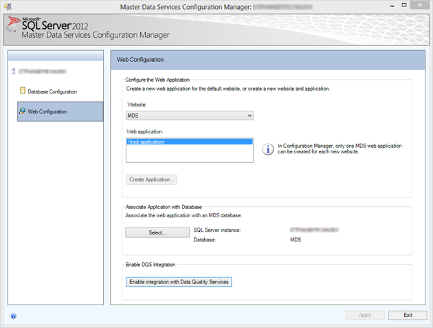
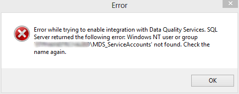
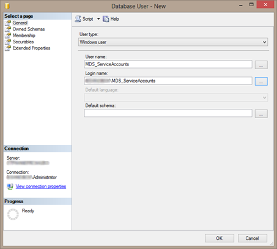
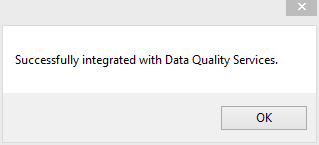

Normally I would never advice you installing anything on a domain controller, let alone SQL, MDS and DQS. However if you have BI demo machine you will probably have all this (and more) running on the same box. At least I do J

If you do you will probably get this error message when you try to enable the DQS integration from Master Data Services Configuration Manager after you successfully installed DQS and MDS.

When clicking the button 'Enable integration with Data Quality Services' an error will pop-up:

Here is where it gets a bit confusing. If you read the error message closely, it seems that MDS is looking for a local account on your machine instead of a domain account. However, with it being a domain controller, you cannot create local accounts…

To make this work you need to do the following:
<ol>
	<li>

Add a Windows User Login into SQL Server for [YourDomain]\MDS_ServiceAccounts.

&nbsp;</li>
	<li>Then run the following query against your DQS_MAIN database, which creates a user on the DQS_MAIN database which maps to the login you just created and adds the user to the DQS_Administrator role. Of course you can also do this using the UI. Make sure to enter your DOMAIN in the query below before executing.

use [DQS_MAIN]
GO
IF NOT EXISTS (SELECT * FROM SYS.SYSUSERS WHERE NAME = 'MDS_ServiceAccounts')
CREATE USER [MDS_ServiceAccounts] FOR LOGIN [<strong>YourDomain</strong>\MDS_ServiceAccounts]
exec sp_addrolemember @rolename=N'dqs_administrator',@membername=N'MDS_ServiceAccounts'</li>
	<li>

When done go back to the Master Data Services configuration manager and hit the button again. Now it should come back with:

</li>
</ol>
Victory ! J

&nbsp;