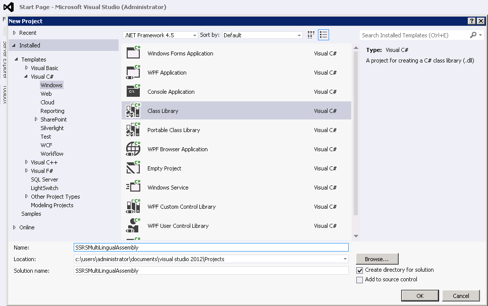
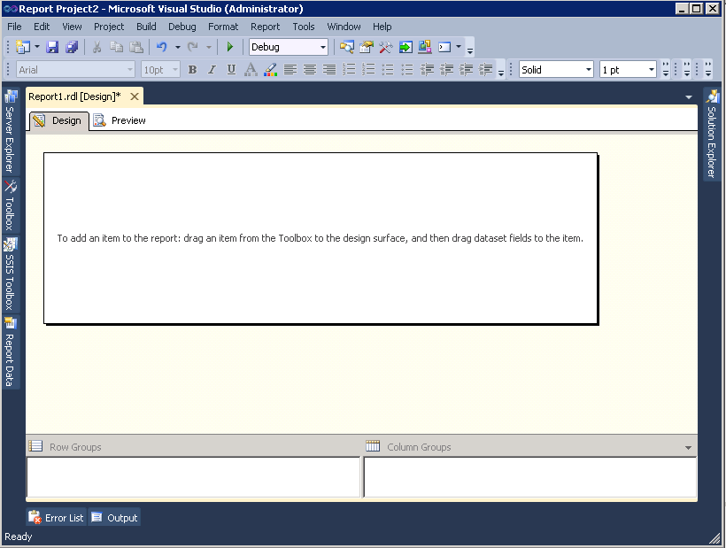
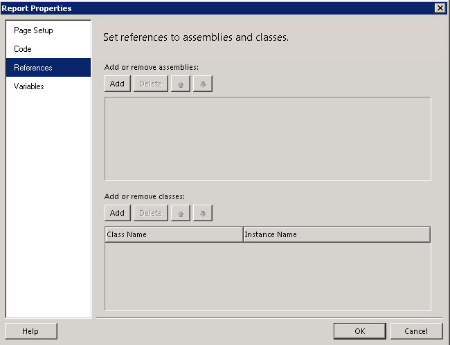
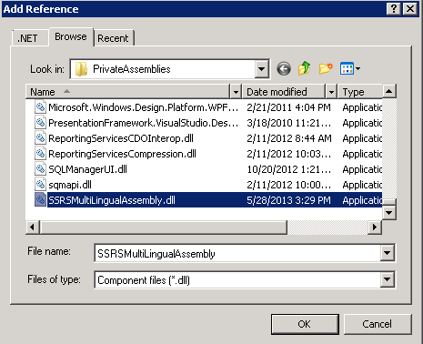
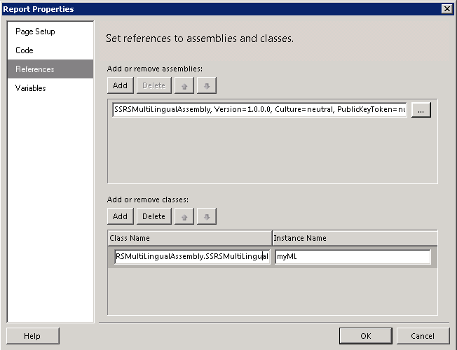
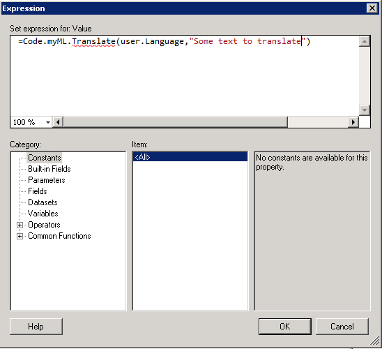
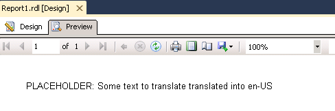
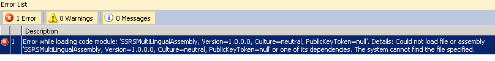
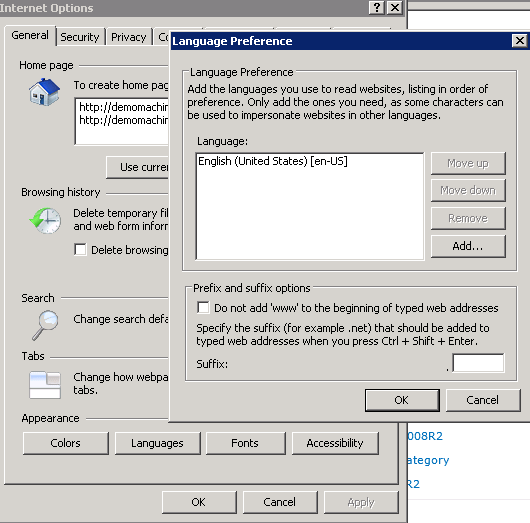

This is the second post in my series about making SSRS report multilingual. You just missed the first post, <a href="http://www.dutchdatadude.com/multilingual-ssrs-reports">the introduction and comparison of the solution scenarios</a>.

This solution consists of an assembly registered in each report that should support multiple languages / localization. The assembly retrieves translation from a source, such as a data source, resource file, web service or online translation service. Anything is possible here.

This solution is limited in the fact that it will not translate dataset results nor parameter prompts. In addition there is an impact on the report creation process as you will see down the line. The upsides are that it is a relatively straightforward solution that has only little impact on report rendering performance.

<strong>1. Creating the assembly
</strong>To implement this solution we first need the assembly that will do the actual translation / localization. To build this assembly fire up Visual Studio and create a new Class library project. I will use C# here (and in all my samples on this blog, but another language would work just as well). I named the project SSRSMultiLingualAssembly.

When the new solution and project has been created, rename Class1 to something that makes more sense. I renamed it to SSRSMultiLingual. 

Open the class and add the following method to it:
<pre>public string Translate(String cultureInfo, String item)
        {
            //Put logic here
            //return the translated string
            return "PLACEHOLDER: " + item +" translated into "+ cultureInfo;
        }</pre>
What you would need to do is implement the class and translate the item using the cultureInfo and return the translated result. This is very dependent on your actual situation and also fairly independent on the actual scenario you choose to implement.

For now, let's continue to the SSRS side of things to tie things together. Later we can deal with actually making it do something.

After you have added the code, build the solution and make sure there are no errors.

<strong>2. Copy assembly to the SSRS folders</strong>

To make the assembly you have just built assessable from reports, you will need to copy it over to the SSRS directories, including any resource files or whatever your assembly needs to work. Of course you could make this part of a custom build action and kind of automate this action, but for now here is the manual method.

Copy the assembly into the Report Server path: C:\Program Files\Microsoft SQL Server\MSRS11.MSSQLSERVER\Reporting Services\ReportServer\bin
(this path may change based on installation location and version of SQL you have installed). This will register the assembly with the report server, which is strictly only required after deployment of the reports to the server and not during design / development time.

In order to make it accessible during design time, the assembly also needs to be copied to the report designer folder. Copy and paste the assembly to C:\Program Files (x86)\Microsoft Visual Studio 10.0\Common7\IDE\PrivateAssemblies (again, this path may change based on installation location and version of SQL / Visual Studio you are working with). Note the (x86) in C:\Program Files (x86), since the same directory also exists in C:\Program Files if you are working on a x64 system (which I assume you are).

By the way, if you use reporting services in native mode (i.e. not integrated with SharePoint) you also might have to copy the same assembly to C:\Program Files\Microsoft SQL Server\MSRS11.MSSQLSERVER\Reporting Services\ReportManager\bin. I have not tried this since I am running SSRS in SharePoint integrated mode.

Note that you could also add the assembly to the global assembly cache (GAC).

<strong>3. Add the assembly to your reports
</strong>In order for your reports to successfully use the assembly to translate text open a report in Report Designer (your Visual Studio environment).

From the <strong>report</strong> menu select <strong>report properties</strong>. In the dialog box click <strong>references</strong>.

Click <strong>add</strong> and then click on the ellipsis button (…) at the end of the newly added row. In the next dialog box (<strong>add reference</strong>) click <strong>browse</strong>, locate the assembly and click <strong>ok</strong>.

Verify that your assembly has been added. In the bottom part of the dialog enter your class name (assemblyname.classname) and set up an instance name. Note that the class name is case sensitive. Your instance name can be anything, I chose to set my instance name to 'myML'.

Close the dialog by clicking <strong>ok</strong>.

Now that we have added the custom assembly to the report it is time to call the translate function to translate text!

<strong>4. Calling the Translate function
</strong>Now that the report has a reference to the custom assembly, let's wire up the last part to actually translate text. Start by either adding a textbox to your report or selecting a textbox (or any other label for that matter). Right-click the textbox and select <strong>expression…</strong> (Expressions allow you to do some limited programming that gets executed when the report renders). In the <strong>expression </strong>dialog box, enter the following code:
<pre class="lang:c# highlight:0 decode:true">=Code.&lt;your instance name&gt;.Translate(user.Language,"&lt;your text to translate&gt;")</pre>
For example, with the settings I made the expression dialog box looks like this:

Click <strong>ok</strong> to close this dialog. Never mind the red squiggly line.

Now, the big moment is there! In report designer click <strong>preview</strong> and see the results of your labor!

Come on, pat yourself on your back, you have successfully registered a custom assembly and used it in a report. That wasn't too hard now was it?

Note that you will have to set up this expression with the correct parameter value for every single text on the report that you want to translate. This is very laborious and error prone. Also, this is the reason why this solution does not translate parameters.

<strong>5. Change Reporting Services configuration and deploy report
</strong>Once you have completed the report and am certain it works OK it is time to deploy the report to the report server. For the assembly to work there you will need to have the assembly in the appropriate places (see above) make some configuration changes and you will have to restart your Report Server after any change in the assembly, including first registration.

If you do not make the required configuration changes you will get the following error when deploying:

Assuming you have already copied the assembly to the correct directories as indicated above, let's make the required configuration changes. You will have to open the rssvPolicy.config file located in C:\Program Files\Microsoft SQL Server\MSRS11.MSSQLSERVER\Reporting Services\ReportServer. Open the file and find the &lt;CodeGroup&gt; tags. There will be a bunch of them. Basically what we need to do is add one of our own after the last &lt;CodeGroup&gt; tag. This is what you will have to add:
<pre class="lang:c# decode:true">&lt;IMembershipCondition Version="1" Url="C:\Program Files\Microsoft SQL Server\MSRS11.MSSQLSERVER\Reporting Services\ReportServer\bin\SSRSMultiLingualAssembly.dll" /&gt;</pre>
Change the Url value to match your situation. This code group gives the assembly (your assembly in the directory specified above (which you will have to change based on your installation) full trust permissions. For testing purposes you could get rid of the SSRSMultiLingualAssembly.dll part and give any assembly in the directory full trust, however in production you will have to set up the code group as specific as above, so why not do it right from the start?

Now it is time to restart the Reporting Services service. To do this either use services.msc or use SQL Configuration Manager.

Now, deploy the report and render the report. You can test different languages by switching your Internet Explorer to another language (Settings à Internet Options à Languages).

Rejoice! You have successfully implemented this scenario of localization of SSRS reports. It may be time to check out the other implementation scenarios.

&nbsp;

&nbsp;

&nbsp;

&nbsp;

<strong>
</strong>