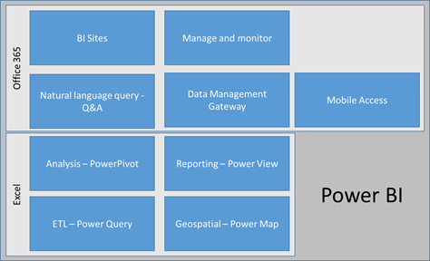
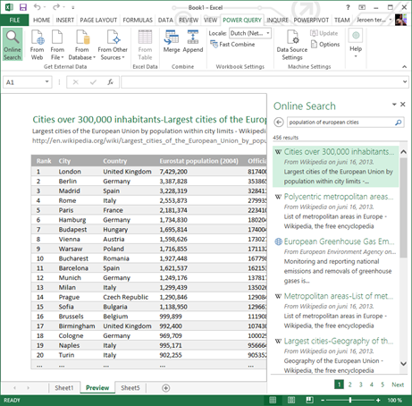
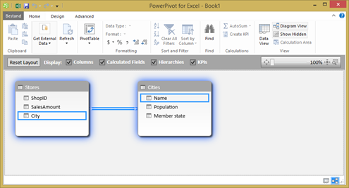
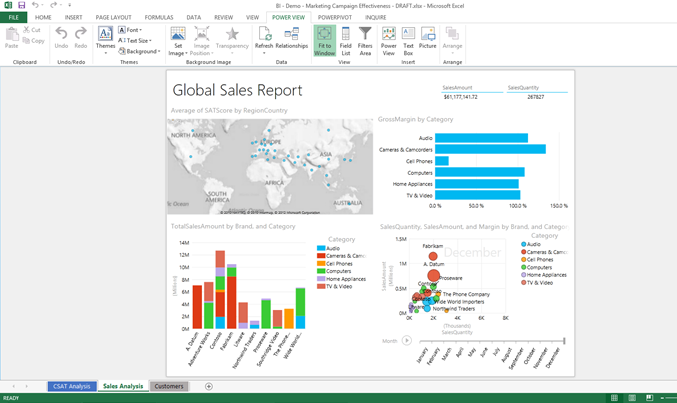
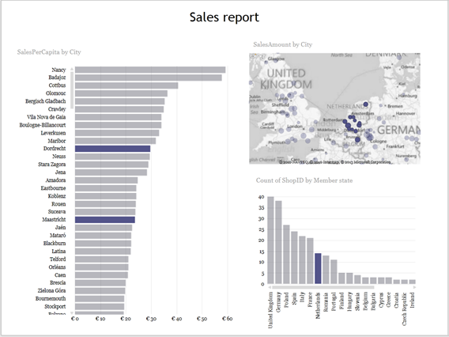
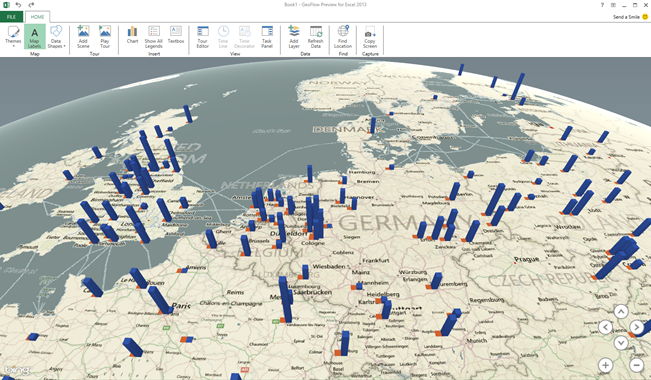
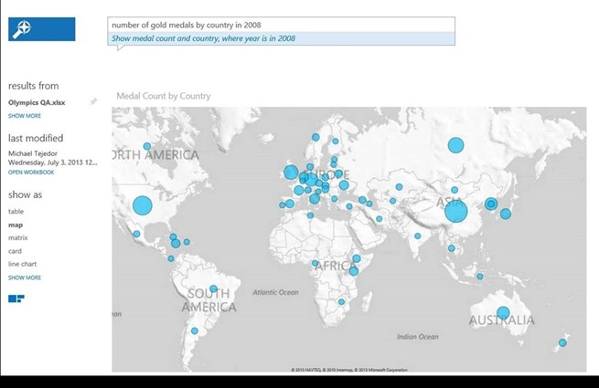
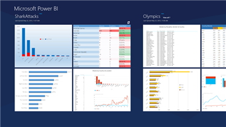

Yesterday Microsoft announced <a href="http://blogs.technet.com/b/dataplatforminsider/archive/2013/07/08/introducing-power-bi-for-office-365.aspx">Power BI for Office 365</a>: a self-service Business Intelligence solution delivered through Excel and Office 365. Power BI ties together the various bits and pieces we already had (Power View, PowerPivot, GeoFlow, Data Explorer) and also introduces some exciting new functionality. In this post I will introduce you to Power BI and discuss the various capabilities. Future blog posts will deal with the components more in-depth.

(By the way, do not let the tag "for Office 365" set you back; Geoflow Power Map and Data Explorer Power Query are available as add-in for Excel regardless of whether you use Office 365 or not).

<strong>Power BI
</strong>The image below shows the Power BI platform. I have broken it down in two segments: Excel and Office 365.

&nbsp;

With Power BI we take the next step to making Excel a true BI tool. BI developers used to smile when I talked about Excel and told me Excel helped end users create non-transparent, spaghetti like BI solutions. I have to admit, that is true. Now with Power BI anything you do with data in Excel, from loading and cleansing using Power Query, modelling and enriching it using PowerPivot and finally displaying using Power View and Power Map is structured and traced. No more page long formulas. No more copy-paste, hidden sheets, linked formulas and other nightmares for us BI folk.

&nbsp;

<strong>ETL – Power Query
</strong>Previously named Data Explorer, Power Query is our self-service ETL tool in Excel. Power Query can connect to just about any data source you throw at it and it enables you to load data, cleanse it and then use it in your Power Pivot model. It even includes a natural language search function that helps you find information in your organization or on the web if you do not actually know where the info could be at. Imagine have loaded something from your corporate data warehouse and then adding relevant external information (such as weather or population info) from the web without having to leave Excel! Once you have loaded data you can add and drop columns, change data types, split columns, combine tables, filter data, remove duplicates, etc. Power Query not only connects to "standard" databases and files, but also includes a connection to Facebook, Hadoop (HDFS and Azure HDInsight), SharePoint and any OData Feed. All steps you do in Power Query are stored in a script so it is clear where data came from, what happened to it along the way and where it got displayed. See my screenshot below: I did a web search for 'population of European cities' and clicked on a Wikipedia page to get the data in Excel.

&nbsp;

<strong>Analysis – PowerPivot
</strong>PowerPivot has been out for a while and has gotten quite some attention. PowerPivot allows you to do data modelling with massive amounts of data in Excel. With massive, I mean huge. I keep repeating this as long as I keep meeting people who still think that Excel cannot handle 5 million records (that happened to me yesterday). With PowerPivot it is easy to load data from various sources, link them together (essentially creating a data model) and apply formulas. Using PowerPivot you create a structured model for your data in Excel. And it is fast. (Did I already mention it can handle lots of data?).

Continuing on from the example I started above, I added an Excel sheet with stores per city and their sales to the data model (the Excel sheet has just one sheet, which contains a simple table listing StoreID, SalesAmount and City). Then I related the two tables by dragging City from my Excel sheet to the Name column of the Wikipedia data I loaded using Power Query. The resulting data model is shown here:

Now I can do interesting stuff, such as add a calculation to figure out sales per inhabitant (Sales per Capita), by adding a column to the Stores tables with the following formula: =[SalesAmount]/RELATED(Cities[Population]) . (Dividing SalesAmount by the related cities' population).

&nbsp;

<strong>Reporting – Power View
</strong>Ah yes, Power View. The tool that is so easy to use that even my mom can use it (and its true). Power View enables you to create great looking, interactive reports with just a few mouse clicks right there in Excel. Just select what you need, decide how to show it and you're done. Power View includes all the standard things: tables, matrixes, column charts, bar charts, pie charts. It also includes some great features that introduce time as a factor in your analysis by allowing you to create scatter plots with a play axis (think bouncing bubbles). Moreover, Power View can display images right there in your report and includes 2D mapping functionality.

&nbsp;

In my example, with just a few clicks I created this report (I selected the Netherlands as country in the bottom right graph to show the highlighting capabilities in the other graphs). Also note the texts above each item to understand what is displayed here.

&nbsp;

<strong>Geospatial – Power Map
</strong>Power Map (previously known as GeoFlow) is a very powerful 3D mapping tool. It allows you to plot any data on a map, as long as it makes sense. For example, just trying to plot your products on a map might not make sense. However, plotting your stores on a map makes a lot of sense. You do not need to specify longitude and latitude or other fancy stuff. Just some text is enough and the tool will go out and try to plot it on a map. Just try it, enter some city or venue names in Excel and click Insert à Map. Two more clicks and you have plotted the information on a map!

In my example, here is what I created using Power Map. Again, this took me just two minutes:

(Above shows total sales amount and sales per capita per city, plotted on the 3D map).

&nbsp;

<strong>BI Sites
</strong>A BI site is an optimized workspace dedicated to BI. You might call this a data marketplace: it is a one-stop shop where you go to get anything related to BI. You go there to consume a report, create a new analysis, share an analysis, discover some new insights using the items provided and find information.

&nbsp;

<strong>Natural language query – Q&amp;A
</strong>This is a feature I particularly love! It gets us closer to Minority report: just type what you're looking for and we'll find it and display it. Once information is published to the BI Site (for example through the Data Management Gateway (below) but also just by uploading an Excel sheet), you can search through all that information just by typing a question. In my example this might look like 'sum of sales amount by country'. You can change the way the information is displayed by including 'as map' or 'as bar chart' to your question. I do not have a demo available right now, so I'll just include a screenshot here. Here the user just typed 'number of gold medals by country in 2008' and the information is retrieved from an Excel sheet (note that the user has not explicitly asked to get data from that particular sheet) and shows it as a map (since we know this is geospatial information).

&nbsp;

<strong>Manage and monitor
</strong>Power BI empowers data stewards; business users can grant access to published data sets based and track who is accessing the data and how often. This brings to mind the PowerPivot management dashboard we know and love.

&nbsp;

<strong>Data Management Gateway
</strong>The data management gateway allows IT to build connections to internal data sources (think your data warehouse or other LOB information source) so reports that are published to BI sites can get that data easily.

&nbsp;

<strong>Mobile Access
</strong>Last but not least: mobile access (woohoo!). Users can access their reports through a HTML5 enabled browser or through a mobile application on Windows or iPad. This means that Silverlight is no longer a requirement for accessing Power View reports. Other platforms might be added later.

&nbsp;

<strong>And this is relevant…how?
</strong>So you have read this and maybe read some other blogs as well. You're thinking to yourself: why should I care?

My question then is: do you use Excel? Well yes, any person who has ever worked with a PC has used Excel.

Exactly. That's why you should care. You should care because the good old Excel which you though you knew so well has suddenly transformed into a cool kid on the block with lots of great and really easy to use features.

Those features enable you to find any data, work your magic and then gain insight from that data. Just think about that. How could you use this in your business? And in your personal life? (I myself am looking to buy a house. Power BI has allowed me to understand which neighborhoods I would like to live and which not, just by finding and visualizing data). I know there are specialized, paid, services for that (involves sending a text and paying for the info). I did it myself in half an hour, paid zero and learned a lot more about the question at hand.

Try out connecting to Facebook for example, and plot your friends on a map! Or find out who has not disclosed their gender to Facebook… J

This might be a revolution: Power BI brings the might of information analysis tools to anyone to consume any data for any scenario. The possibilities are endless. It is just a matter of using your creativity.

Since you are human, using your creativity is probably what you really want to do. Power BI: be creative with data.