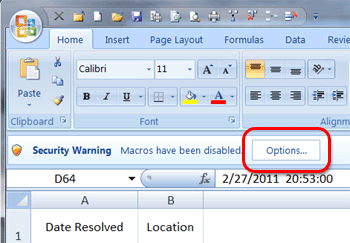

Macros are dead. Or soon will be. Think about it: in Office 2003 when you opened a file with a macro the macro was automatically enabled and ready to run.
Then with the arrival of Office 2007 things turned bad for macros and macro creators. Macros were treated as security risk:

As a user you explicitly have to choose to run the macro.
Then, Office 2010 came along and the security warnings became bigger (and I believe you had to click twice to enable them instead of once). The same goes for Office 2013.

&nbsp;

Also, along the way this warning was introduced:

Look at those first lines: 'might contain viruses or other security hazards'. That kind of says it all: macros are dead. With the extra focus on security this makes sense. Also, eliminiating macros helps you to deal with spaghetti code lurking around in your documents. I feel you should not be creating any new files with macros and files with macros should be checked and migrated to something "better".

Do not use macros if you want your document to be opened without security warnings. Also, know that macros do not run on all mobile devices (For example, Office RT does not run macros). 

So, what do you need to do if you need to program in your Office documents? Well, if you're using Office 2007 or 2010 you should be developing a VSTO (Visual Studio Tools for Office) add-in, which is a piece of managed code built using Visual Studio, which is essentially an add-in with the big difference that the code is not sitting in the document itself, but outside of it. If done well, this code can be centrally managed and be treated as what it actually is: application code.
See: <a href="http://msdn.microsoft.com/en-us/magazine/cc163292.aspx">http://msdn.microsoft.com/en-us/magazine/cc163292.aspx</a>.

Now, for Office 2013 you should be building apps: <a href="http://msdn.microsoft.com/en-us/office/apps/fp160950.aspx">http://msdn.microsoft.com/en-us/office/apps/fp160950.aspx</a>.