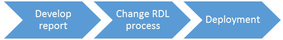

This is the third post in my series about multilingual SSRS reports. If you missed the introduction, you can find it <a href="http://www.dutchdatadude.com/multilingual-ssrs-reports">here</a>.

In this post we will talk about the second implementation scenario, which changes the RDL after creating it. The diagram below helps to understand this:

This means that developing the report is independent of making it available in multiple languages.
This means there is no impact on the process of creating a report, where with the first scenario (custom assembly) there was an impact (and a rather big one!).

The downside of this solution however is that there will be a separate process manipulating the RDL after it has been developed. This has a downside however: if the RDL language schema changes (and it does just about every new release of SQL) you will have to check if your code still works.

Now, the process that changes the RDL could do two things: 1) change the original RDL and add localization that will actually localize the report at run time or 2) change the original RDL and make a copy of it for every language (essentially you get the same report multiple times).

The first option here is just an automated version of scenario number 1 (the custom assembly) which we discussed earlier. It however eliminates the biggest issue with scenario 1: the fact that it is a manual process and has to be repeated for every label. However, what this option doesn't do is allow you to translate parameter prompts, which option 2 does. Downside of option 2 however is that multiple copies of the report get created (one for each language). Creating multiple copies of the report (one for each language) would have no impact on rendering the report and may be a good choice if you want to manage each language separately. You will need to decide for yourself what you want to do, the basic architecture of this scenario stay the same.

In this post we will deal with the latter option (option 2).

I envision the process that changes the RDL as just a process that gets executed periodically. The process reads the RDL and translates any text it finds again using the translation table, resource file or whatever solution you picked for storing translations.

Implementing the process is out of scope for this blog because it is a matter of reading an XML file (RDL is XML structured) changing some items and writing it to disk. Any .NET developer could do it, for example using XPath.

The trick of course is knowing what to find in the RDL and what to change.

The simplified structure of RDL (SQL 2012) is the following (I stripped away all that is not related to localization):

&nbsp;
<pre class="lang:c# highlight:0 decode:true">&lt;?xml version="1.0" encoding="utf-8"?&gt;
&lt;Report&gt;
    &lt;DataSources/&gt;
    &lt;DataSets&gt;
        &lt;DataSet/&gt;
    &lt;/DataSets&gt;
    &lt;ReportSections&gt;
        &lt;ReportSection&gt;
            &lt;Body&gt;
                &lt;ReportItems&gt;
                    &lt;TextBox/&gt;
                    &lt;Tablix/&gt;
                    &lt;Chart/&gt;
                &lt;/ReportItems&gt;
            &lt;/Body&gt;
            &lt;Page&gt;
                &lt;PageHeader&gt;
                    &lt;ReportItems&gt;
                        &lt;TextBox/&gt;
                    &lt;/ReportItems&gt;
                &lt;/PageHeader&gt;
                &lt;PageFooter&gt;
                    &lt;ReportItems&gt;
                        &lt;TextBox/&gt;
                    &lt;/ReportItems&gt;
                &lt;/PageFooter&gt;
            &lt;/Page&gt;
        &lt;/ReportSection&gt;
    &lt;/ReportSections&gt;
    &lt;ReportParameters&gt;
        &lt;ReportParameter/&gt;
    &lt;/ReportParameters&gt;
    &lt;Language/&gt;
&lt;/Report&gt;</pre>
As you can see, there a just a couple of items we need to look for when scanning the RDL:
<ul>
	<li><strong>Report.DataSets.DataSet
</strong>DataSets define the queries to the source systems. If we want to localize result sets we need to manipulate the query here.</li>
	<li>

<strong>Report.ReportSections.ReportSection.Body.ReportItems / Report. ReportSections.ReportSection.Page.PageHeader.ReportItems / Report. ReportSections.ReportSection.Page.PageFooter.ReportItems
</strong>ReportItems can be TextBox, Chart, Tablix, which will be discussed in more detail later.
</li>
	<li><strong>Report.ReportParameters.ReportParameter
</strong>Parameter prompts can be localized here.<strong>
</strong></li>
</ul>
<strong>Localizing a DataSet
</strong>A dataset defines the &lt;CommandText&gt; which essentially is the query to the source system. When changing the RDL one can easily add a where-clause to the query indicating the language to render: 
<pre>Where translationtable.language='en-us'.</pre>
What you will be looking for is Report.DataSets.DataSet.CommandText to do this.

<strong>Localizing ReportItems
</strong>ReportItems can be TextBoxes, Charts, and Tablixes each of which carry one or more labels that need localization.
The structure of a <strong>TextBox</strong> looks like this:
<pre class="lang:c# decode:true">&lt;TextBox&gt;
    &lt;Paragraphs&gt;
        &lt;TextRuns&gt;
            &lt;TextRun&gt;
                &lt;Value/&gt;
            &lt;/TextRun&gt;
        &lt;/TextRuns&gt;
    &lt;/Paragraphs&gt;
&lt;/TextBox&gt;</pre>
You will be wanting to localize what is inside &lt;Value&gt;&lt;/Value&gt; tag.

For <strong>Tablixes</strong> you will also be looking for the &lt;Value&gt;&lt;/Value&gt; tags inside TextRuns on Cells, which are just TextBoxes. Here is the basic structure of a Tablix:
<pre class="lang:c# decode:true">&lt;Tablix&gt;
    &lt;TablixColumns/&gt;
    &lt;TablixRows&gt;
        &lt;TablixRow&gt;
            &lt;Height/&gt;
            &lt;TablixCells&gt;
                &lt;TablixCell&gt;
                    &lt;CellContents&gt;
                        &lt;TextBox/&gt;
                    &lt;/CellContents&gt;
                &lt;/TablixCell&gt;
            &lt;/TablixCells&gt;
        &lt;/TablixRow&gt;
    &lt;/TablixRows&gt;
&lt;/Tablix&gt;</pre>
You will want to change what is inside the &lt;Value&gt;&lt;/Value&gt; tag of each TextBox. The TextBox here has the same structure as above.

Finally, Charts are a bit different, their basic structure is like this:
<pre class="lang:c# decode:true">&lt;Chart&gt;
    &lt;ChartCategoryHierarchy/&gt;
    &lt;ChartSeriesHierarchy&gt;
        &lt;ChartMembers&gt;
            &lt;ChartMember&gt;
               &lt;Label/&gt;
            &lt;/ChartMember&gt;
        &lt;/ChartMembers&gt;
    &lt;/ChartSeriesHierarchy&gt;
    &lt;ChartData&gt;
        &lt;ChartSeriesCollection&gt;
            &lt;ChartSeries Name=""/&gt;
        &lt;/ChartSeriesCollection&gt;
    &lt;/ChartData&gt;
    &lt;ChartAreas&gt;
        &lt;ChartArea&gt;
            &lt;ChartCategoryAxes&gt;
                &lt;ChartAxis&gt;
                    &lt;ChartAxisTitle&gt;
                        &lt;Caption/&gt;
                    &lt;/ChartAxisTitle&gt;
                &lt;/ChartAxis&gt;
            &lt;/ChartCategoryAxes&gt;
            &lt;ChartValueAxes&gt;
                &lt;ChartAxis&gt;
                    &lt;ChartAxisTitle&gt;
                        &lt;Caption/&gt;
                    &lt;/ChartAxisTitle&gt;
                &lt;/ChartAxis&gt;
            &lt;/ChartValueAxes&gt;
        &lt;/ChartArea&gt;
     &lt;/ChartAreas&gt;
     &lt;ChartLegends&gt;
        &lt;ChartLegend&gt;
            &lt;ChartLegendTitle&gt;
                &lt;Caption/&gt;
            &lt;/ChartLegendTitle&gt;
        &lt;/ChartLegend&gt;
     &lt;/ChartLegends&gt;
     &lt;ChartNoDataMessage&gt;
         &lt;Caption/&gt;
     &lt;/ChartNoDataMessage&gt;
&lt;/Chart&gt;</pre>
You can localize the following items on charts:
<ul>
	<li><strong>Series name</strong>: Chart.Chartdata.ChartSeriesCollection.ChartSeries.Name</li>
	<li><strong>Axis Title</strong>: Chart.ChartAreas.ChartArea.ChartCategoryAxes.ChartAxis.ChartAxisTitle.Caption and ChartAreas.ChartArea.ChartValueAxes.ChartAxis.ChartAxisTitle.Caption</li>
	<li><strong>Chart legend title</strong>: Chart.ChartLegens.ChartLegend.ChartLegendTitle.Caption</li>
	<li><strong>No data message</strong>: Chart.ChartNodataMessage.Caption</li>
</ul>
<strong>Localizing Report Parameters
</strong>ReportParameters define data types, default values, valid values and also the prompts. The last one you will be wanting to localize.

The basic structure of the ReportParameter definition is:
<pre class="lang:c# decode:true">&lt;ReportParameter&gt;
   &lt;DataType/&gt;
   &lt;DefaultValue/&gt;
        &lt;Prompt/&gt;
   &lt;ValidValues/&gt;
   &lt;MultiValue/&gt;
&lt;/ReportParameter&gt;</pre>
You will be looking for the ReportParameter.Prompt tag.

That concludes our overview of changing the RDL to implement localization. I agree it is not the most elegant solution as it increases dependency and complexity in your environment, however it is fairly simple to implement and provides a complete localization opportunity, from datasets to report items and even parameter prompts.

Stay tuned for the next implementation scenario!