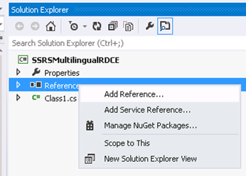
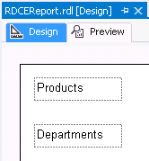
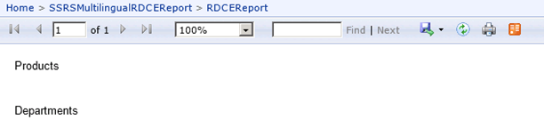
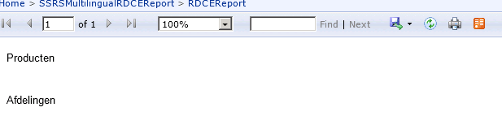

This is the third post in my series about multilingual SSRS reports. If you missed the introduction, you can find it <a href="http://www.dutchdatadude.com/multilingual-ssrs-reports">here</a>.

<strong>I am looking for feedback! Please let me know what you think!
</strong>

The full code of the solution I describe here is <a href="https://github.com/jeroenterheerdt/dutchdatadude/tree/master/Multilingual-SSRS-report-definition-customization-extension">available on Github</a>.

What we will be doing in this post is developing something which called a Report Definition Customization Extension (RDCE), which is available since SQL Server 2008. The MSDN page is here: <a href="http://msdn.microsoft.com/en-us/library/dn296363.aspx">http://msdn.microsoft.com/en-us/library/dn296363.aspx</a>

<strong>Let's first start with the basics: what is a RDCE and what can it be used for?</strong>
Simply put a RDCE transforms an existing report definition (RDL) and modifies it just before the SSRS rendering engine renders the report. In other words building an RDCE allows you to interfere with the report rendering process and make some last minute changes just before rendering starts. In a schema it looks like this:

As this post is about making reports multilingual you might already have guessed that one of the uses of an RDCE is doing translations. However, you can also change the report's look by hiding elements and even change the data set returned. This is useful if you not only need to translate labels in your report but also want to actually return text strings from your dataset in a different language. Another option would be for example to deal with right-to-left languages by changing your report's layout.

<strong>Developing a RDCE
</strong>An RDCE is a .NET class library, where you will have to select .NET framework 3.5 as the target framework. This class library will need a reference to Microsoft.ReportingServices.Interfaces.dll. This contains the interface you will need to implement (see below). So let's get started.

First off, start Visual Studio and create a new class library project (targeting .NET framework 3.5).

Include a reference to the aforementioned Microsoft.ReportingServices.Interfaces.dll file by right clicking 'References' in your Solution Explorer and choosing 'Add Reference…'

The file is located under your SSRS installation directory. In my case the file was in C:\Program Files\Microsoft SQL Server\MSRS11.MSSQLSERVER\Reporting Services\ReportServer\bin.

Now open your class file (I renamed it to MyRDCE.cs) and add the following line:
<pre class="lang:c# decode:true">using Microsoft.ReportingServices.Interfaces;</pre>
Then, implement IReportDefinitionCustomizationExtension by changing your class declaration to:
<pre class="lang:c# decode:true">public class MyRDCE: IReportDefinitionCustomizationExtension</pre>
You can explicitly implement this interface to get an idea of the methods you will need to implement by right-clicking the interface name and choosing 'Implement Interface Explicitly'.

Your code should now look like this:
<pre class="lang:c# decode:true">using System;
using System.Collections.Generic;
using System.Linq;
using System.Text;
using Microsoft.ReportingServices.Interfaces;

namespace SSRSMultilingualRDCE
{
    public class MyRDCE: IReportDefinitionCustomizationExtension
    {
        bool IReportDefinitionCustomizationExtension.ProcessReportDefinition(byte[] reportDefinition, IReportContext reportContext, IUserContext userContext, out byte[] reportDefinitionProcessed, out IEnumerable&lt;RdceCustomizableElementId&gt; customizedElementIds)
        {
            throw new NotImplementedException();
        }

        string IExtension.LocalizedName
        {
            get { throw new NotImplementedException(); }
        }

        void IExtension.SetConfiguration(string configuration)
        {
            throw new NotImplementedException();
        }
    }
}</pre>

Let's start with the easiest method: IExtension.LocalizedName, which just returns the name for your RDCE. I replaced the line in this method with:
<pre class="lang:c# decode:true">get { return "SSRSMultilingualRDCE"; }</pre>
Yes, I know I should not have hardcoded the name here, but for demonstration purposes this will do.

As developing an RDCE is as hard as it is (never mind the debugging, testing, logging and deployment challenges you will have to deal with) I suggest adopting <a href="https://www.simple-talk.com/sql/reporting-services/developing-a-report-definition-customization-extension-for-multi-language-reports/">the framework Holger Schmeling introduced in his blog on RDCE's</a>. This framework allows you to componentize your transformations into smaller transformations instead of one lengthy bit of code. By doing so the RDCE can be more easily managed and understood. Notice that in this blog I will not deal with logging and error handling; however, in production that should be included. To use this framework we add an interface called ITransformation with one method named Transform. Just add a new Interface file to your solution, name it ITransform and copy paste the following code in (adapted from Holger's blog):
<pre class="lang:c# decode:true">using System;
using System.Collections.Generic;
using System.Linq;
using System.Text;
using System.Xml.Linq;
using Microsoft.ReportingServices.Interfaces;

namespace SSRSMultilingualRDCE
{

///&lt;summary&gt;
/// Interface to implement for one RDCE transformation step.
///&lt;/summary&gt;

public interface ITransformation
{
///&lt;summary&gt;
/// Receives an XML element and returns transformed element to the sender
///&lt;/summary&gt;
///&lt;param name="report"&gt;Report to convert.&lt;/param&gt;
///&lt;param name="reportContext"&gt;Report context as conveyed to the RDCE&lt;/param&gt;
///&lt;param name="userContext"&gt;User context as conveyed to the RDCE&lt;/param&gt;
///&lt;returns&gt;Transformed report&lt;/returns&gt;

 XElement Transform(XElement report, IReportContext reportContext, IUserContext userContext);
 }
}</pre>
The Transform() method takes a report definition in XML format and returns the modified version. The other two parameters provide the report and user context as returned from SSRS. This is handy to dynamically apply transforms based on these contexts.

Now it is time to add a list to hold all the transformations (Again thanks to Holger's blog). Add the following code directly under the class statement in your RDCE class:

&nbsp;
<pre class="lang:c# decode:true">//List holding all transformations
private IList&lt;ITransformation&gt; _transformations;</pre>
Also implement the ProcessReportDefinition() method that will be called by reporting services. This is the mother-transformation process. What we will do here is load the report and one-by-one call the registered transformations on the report. Find your ProcessReportDefinition() method and replace it with the following (you will need extra using statements).

<pre class="lang:c# decode:true">bool IReportDefinitionCustomizationExtension.ProcessReportDefinition(byte[] reportDefinition, IReportContext reportContext, IUserContext userContext, out byte[] reportDefinitionProcessed, out IEnumerable&lt;RdceCustomizableElementId&gt; customizedElementIds) {

 //load report from byte[]
 XmlDocument d = new XmlDocument();
 MemoryStream ms = null;
 using (ms = new MemoryStream(reportDefinition)) {
  d.Load(ms);
  ms.Position = 0;
 }
 XElement report = XElement.Load(new XmlNodeReader(d));

 //run all transformations
 if (_transformations != null)
 {
  foreach (ITransformation t in _transformations)
  {
   report = t.Transform(report, reportContext, userContext);
  }
 }

 //convert report to byte[] so it can be returned to SSRS
 System.Text.Encoding enc = new System.Text.UTF8Encoding();
 reportDefinitionProcessed = enc.GetBytes(report.ToString());

 //we have to inform SSRS about what we changed. In this sample we only change the body part of the report.
 //Other values are: DataSets, Page, PageHeader, PageFooter
 List&lt;RdceCustomizableElementId&gt; ids = new List&lt;RdceCustomizableElementId&gt;();
 customizedElementIds = new List&lt;RdceCustomizableElementId&gt;();
 (customizedElementIds as List&lt;RdceCustomizableElementId&gt;).Add(RdceCustomizableElementId.Body);

 return true;
}</pre>
This method first retrieves the report definition. Then all transformations are applied, after which the resulting report definition is returned and SSRS is informed about what we changed.

Following Holger's framework we use the SSRS config file to define transformations. This might not be the ideal solution for your scenario since it involves editing the SSRS config file. However, on the plus side this allows you to register new transformations as required without having to redeploy or change the RDCE. Basically we need to change the rsreportserver.config (mine was in C:\Program Files\Microsoft SQL Server\MSRS11.MSSQLSERVER\Reporting Services\ReportServer) file and add something along these lines (do not forget to make a backup first!) as last entry in the &lt;Extensions&gt; node:
<pre class="lang:xhtml decode:true">&lt;!-- RDCE --&gt;
&lt;ReportDefinitionCustomization&gt;
 &lt;Extension Name="SSRSMultilingualRDCE" Type="SSRSMultilingualRDCE.MyRDCE,SSRSMultilingualRDCE"&gt;
  &lt;Configuration&gt;
  &lt;!-- Transformations go here--&gt;
   &lt;Transformations&gt;
    &lt;Transformation Name="MyTranslator" Type="SSRSMultilingualRDCE.Transformations.MyTranslator,SSRSMultilingualRDCE"&gt;
     &lt;Property Name="SampleProperty" Value="c:\temp\myDictionary.txt"/&gt;
    &lt;/Transformation&gt;
   &lt;/Transformations&gt;
  &lt;/Configuration&gt;
 &lt;/Extension&gt;
&lt;/ReportDefinitionCustomization&gt;</pre>
You can specify multiple Transformations by repeating the Transformation node as necessary. Note that Name and Type specify the name of the class and the namespace. Also, each Transformation can have custom properties set (name, value pairs).

Now, we can use the SSRS SetConfiguration() methods to get to the configuration settings in the rsreportserver.config file. This enables us to read the list of transformations registered and fill the list created earlier. We will do this by implementing our final function of the IReportDefinitionCustomizationExtension: SetConfiguration() (you will need another using statement at the top of your class).

&nbsp;
<pre class="lang:c# decode:true">void IExtension.SetConfiguration(string configuration) {
 if (string.IsNullOrEmpty(configuration)) {
  return;
 }
 _transformations = new List&lt;ITransformation&gt;();
 //load the configuration
 XElement config = XElement.Parse(configuration);
 //retrieve the transformations
 if (config.Name.LocalName == "Transformations")
 {
  //get the transformations
  var trans = from transformation in config.Descendants("Transformation")select new {
  Name = transformation.Attribute("Name").Value,
  Transformator = transformation.Attribute("Type").Value.Split(',')[0],
  CodeBase = transformation.Attribute("Type").Value.Split(',')[1],
  Properties = transformation.Descendants("Property")
  };
  //lets add a transformation step for each transformation found
  foreach (var t in trans)
  {
   ITransformation transformation = (Activator.CreateInstance(t.CodeBase, t.transformator).Unwrap() as ITransformation);
   //if we specified additional properties, set them now
   if(t.Properties!=null) {
    foreach(var p in t.Properties) {
     string propName = p.Attribute("Name").Value;
     string propValue = p.Attribute("Value").Value;
     PropertyInfo propertyInfo = transformation.GetType().GetProperty(propName);
     if(propertyInfo!=null) {
      propertyInfo.SetValue(transformation, propValue,null);
     }
    }
    //add the transformer to the list
    _transformations.Add(transformation);
   }
  }
 }
}</pre>
Now that we have a functioning RDCE framework it is time to put it to work. In this sample I will build a simple translator transformation which will translate some texts in a report by looking them up in a database table. I added a new class to my solution, named it MyTranslator and put it in the SSRSMultilingualRDCE.Transformations namespace as configured in the reportserver.config file above. The code pretty much speaks for itself. It implements the Transform method from the ITransformation interface, retrieves the user language preference setting and retrieves the translation from the database:
<pre class="lang:c# decode:true">using System;
using System.Collections.Generic;
using System.Linq;
using System.Text;
using Microsoft.ReportingServices.Interfaces;
using System.Xml.Linq;
using System.Data;
using System.Data.SqlClient;

namespace SSRSMultilingualRDCE.Transformations
{
    class MyTranslator : ITransformation
    {
        private SqlConnection _sqlConn;

        public MyTranslator()
        {
            _sqlConn = new SqlConnection("server=.;Database=SSRSMultiLingual;Trusted_Connection=True");
        }

        public XElement Transform(XElement report, IReportContext reportContext, IUserContext userContext)
        {
            if(reportContext == null)
            {
                throw new ArgumentException("ReportContext not initialized");
            }

            if(!(_sqlConn.State == ConnectionState.Open)){
               _sqlConn.Open(); 
            }

            //get the users userName and look up the preferred language.
            SqlCommand cmd = new SqlCommand("SELECT Language from UserConfiguration where UserName='" + userContext.UserName + "'",_sqlConn);
            SqlDataReader sdr = cmd.ExecuteReader();
            sdr.Read();
            string language = (string) sdr["Language"];
            sdr.Close();

            //translate all textbox items (&lt;TextRun&gt;&lt;Value&gt;TEXT&lt;/Value&gt;&lt;/TextRun&gt;)
            //we will skip expressions (starting with =)
            report.Descendants().Where(x =&gt; x.Name.LocalName == "Value" &amp;&amp; x.Parent.Name.LocalName == "TextRun" &amp;&amp; (!x.Value.StartsWith("=")))
                .ToList()
                .ForEach(x =&gt; x.Value = Translate(x.Value, language));

            _sqlConn.Close();
            return report;
        }

        private string Translate(string p, string language)
        {
            if (string.IsNullOrEmpty(p))
            {
                return "";
            }

            string translated = p;
            //get translation from database
            SqlCommand cmd = new SqlCommand("SELECT T.Value from Translations T inner join Items I on T.Item=I.Id WHERE I.Name='"+p+"' AND T.Language='"+language+"'",_sqlConn);
            SqlDataReader sdr = cmd.ExecuteReader();
            sdr.Read();
            translated = (string)sdr["Value"];
            sdr.Close();

            //have we got a translation? Of not, fall back to Microsoft Translator
            if (string.IsNullOrEmpty(translated))
            {
                //connect to Microsoft Translator and return translation
            }
            return translated;
        }
    }
}</pre>
&nbsp;

&nbsp;

<strong>Deploying a RDCE
</strong>

Now that we have successfully built a translator we're done with development and are ready for deployment. To deploy your RDCE to the SSRS server follow these steps:

First, copy you RDCE assembly (.dll file, in my case SSRSMultilingualRDCE.dll) into the Reporting Services bin directory (which in my case was C:\Program Files\Microsoft SQL Server\MSRS11.MSSQLSERVER\Reporting Services\ReportServer\bin). If you have referenced any assemblies not in the Global Assembly Cache (maybe you implemented some logging framework) do not forget to copy them here as well.

Next we need to modify the SSRS configuration, starting with the rsreportserver.config file. It is located in C:\Program Files\Microsoft SQL Server\MSRS11.MSSQLSERVER\Reporting Services\ReportServer. Open it and lookup the &lt;Service&gt; element and add the following to that element (I added it to the bottom):

&nbsp;

&nbsp;

&nbsp;
<pre class="lang:xhtml decode:true">&lt;IsRdceEnabled&gt;True&lt;/IsRdceEnabled&gt;</pre>
&nbsp;

Next configuration change will be done in the rssrvpolicy.config file in the same directory as before. Open the file and add a CodeGroup in the PolicyLevel element for your RDCE assembly, like so:
<pre class="lang:xhtml decode:true">&lt;CodeGroup class="UnionCodeGroup" version="1" PermissionSetName="FullTrust" Name="SSRSMultilingualRDCE" Description="SSRSMultilingualRDCE"&gt;
 &lt;IMembershipCondition class="UrlMembershipCondition" version="1" Url="C:\Program Files\Microsoft SQL Server\MSRS11.MSSQLSERVER\Reporting Services\ReportServer\bin\SSRSMultilingualRDCE.dll"/&gt;
&lt;/CodeGroup&gt;</pre>
You will need to specify the correct Name for the CodeGroup (just let it match the nam of your RDCE) and the correct location and name of the DLL you copied.

You may have to set up the permissions in the web.config file as Holger reports in his blog, although I have not had to do that.

To make your reports work with the RDCE there is a little thing we need to do; we need to link our reports with the RDCE deployed. The official way of doing this is using the Reporting Services Management Service. However, to use it you either need to have a deployment tool or be willing to write one. The unsupported way however is directly updating the report properties in the SSRS catalog. Please note that this is unsupported and I give no guarantees whatsoever regarding damage afflicted or the working of this on future versions. If you want to follow along take the following steps:

Open SQL Server Management Studio and execute the following query on your SSRS Service Database (not the TempDB) (you will have to adapt the where clause to match the name of your report):

&nbsp;
<pre class="lang:tsql decode:true">select ItemID,Path,Name,Description, cast(Property as xml) as Property, cast(Parameter as xml) as Parameter
from dbo.Catalog
where name like '%RDCE%'</pre>
&nbsp;

This returns among others the ItemID, which you will need for the next statement. What we need to do is add &lt;RDCE&gt;Name_Of_Your_RDCE&lt;/RDCE&gt; to the properties of the reports that need to use the RDCE.

Your will need to execute a query that looks like mine:
<pre class="lang:tsql decode:true">update dbo.Catalog set Property='&lt;Properties&gt; &lt;Language&gt;en-US&lt;/Language&gt;  &lt;HasUserProfileQueryDependencies&gt;False&lt;/HasUserProfileQueryDependencies&gt;
 &lt;HasUserProfileReportDependencies&gt;False&lt;/HasUserProfileReportDependencies&gt;
 &lt;PageHeight&gt;279.4&lt;/PageHeight&gt;
 &lt;PageWidth&gt;215.9&lt;/PageWidth&gt;
 &lt;TopMargin&gt;25.4&lt;/TopMargin&gt;
 &lt;BottomMargin&gt;25.4&lt;/BottomMargin&gt;
 &lt;LeftMargin&gt;25.4&lt;/LeftMargin&gt;
 &lt;RightMargin&gt;25.4&lt;/RightMargin&gt;
 &lt;RDCE&gt;SSRSMultilingualRDCE&lt;/RDCE&gt;
 &lt;/Properties&gt;'
where ItemID='BBA6EBDD-F094-4E10-892A-D9DF2834A787'</pre>
I have simply copied and pasted the ItemID in the where clause and also copied and pasted the value of property from the previous query into this query. I have appended the &lt;RDCE&gt; element just before the closing of the properties element. My report will now use the RDCE.

<strong>Debugging
</strong>

When rendering a report that uses a RDCE SSRS will display any errors thrown by your code. This helps in debugging. Also note that if you make any changes to the code you will have to recopy your assembly and restart the SSRS service for SSRS to pick up the new version.

&nbsp;

<strong>Putting it all together
</strong>

All that remains now is showing that this works. I have created a very simple report for this:

This report contains two textboxes with labels in them. These labels were defined in the database and the database contains a translation for it. As a result my RDCE will translate these labels, depending on the user's preferred language.

So, when a user with preference for English logs in this will be displayed:

And when a user with preference setting for Dutch opens the report it displays as follows:

My solution works with a configuration database setting for the user's preference. However, just as easily one could adapt the code to read the setting from the SharePoint profile (if using SSRS in SharePoint integrated mode) or for example from Active Directory.

That concludes my lengthy blog on RDCEs. <a href="https://github.com/jeroenterheerdt/dutchdatadude/tree/master/Multilingual-SSRS-report-definition-customization-extension">You can download my solution on Github</a>. It includes a database project that will create the simple database I used and enter some sample data. Also, it includes all code discussed and the sample report I used. The configuration changes are for security reasons not included.

<strong>I am looking for feedback! Please let me know what you think!</strong>