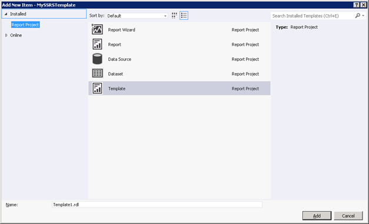

One of the most-heard questions related to SSRS is if it possible to somehow create SSRS report templates so reports get the same look and feel.

SSRS does not work with some kind of stylesheet or CSS sheet to change the layout of new and existing reports. However, with a bit of creativity we can create a template for new reports. Note that this does not solve the implicit requirement of the question: deployed reports will still require rework if the template changes.

To create your own template, simply create a report and save it in a folder in your Visual Studio installation. The folder you will be looking for is C:\Program Files (x86)\Microsoft Visual Studio 11.0\Common7\IDE\PrivateAssemblies\ProjectItems\ReportProject for Visual Studio 2012 and C:\Program Files (x86)\Microsoft Visual Studio 10.0\Common7\IDE\PrivateAssemblies\ProjectItems\ReportProject for Visual Studio 2010.

I created a simple template with a header with a logo and a footer and saved the report in the folder. Now when I add a new item I can choose my template to base my report on:

Again, this is a one-of template in the sense that it is not as flexible as a stylesheet. If you need to change the template after reports have been deployed you will need to re-do the reports.