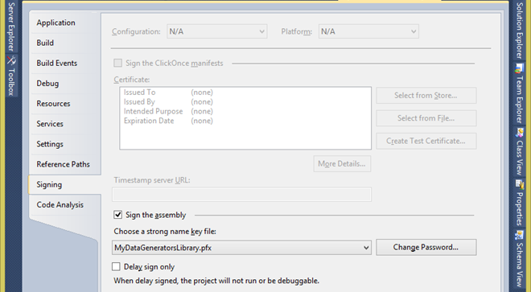
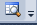
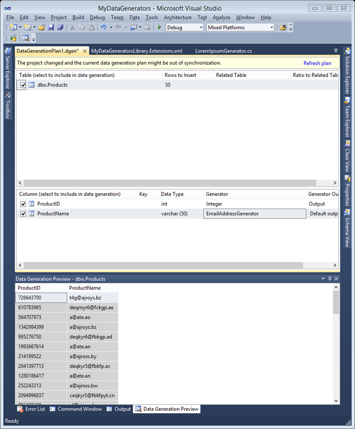
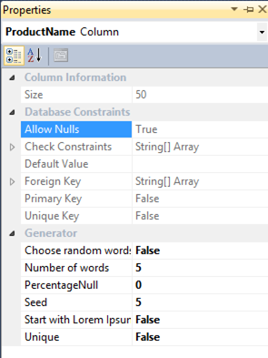

In many development projects the need arises to fill a database with some random data. With random data I do not mean mere gibberish, but actual data such as an email address, phone number, SSN, numeric value, dates, datetimes, etc.

With Visual Studio 2010 you can do this very easily. All you need is an edition of Visual Studio 2010 that includes the database projects (I think you will need Ultimate, but am not sure). And of course you will need a database, I used SQL Express in this example.

However, turns out that the data generators included in Visual Studio are somewhat limited. Visual Studio can generate data for many datatypes in SQL Server, but for example generating a phone number, SSN or email address is not possible.

However, one can easily create custom data generators, which is exactly what we will do. I will build custom data generators for email addresses and one that generators Lorem Ipsum text.

<strong>Building the custom data generators
</strong>Start with creating a new class library project. In the solution explorer, right-click the project and click 'Add Reference'. Click the '.NET' tab and select the following components: Microsoft.Data.Schema, Microsoft.Data.Schema.SQL and Microsoft.Data.Schema.Tools. Click 'OK' to add these references.

Open your class (I renamed my class and class file to LoremIpsumGenerator) and add the following using statements:
<pre>using Microsoft.Data.Schema.Tools.DataGenerator;
using Microsoft.Data.Schema.Sql;
using Microsoft.Data.Schema.Extensibility;</pre>
Now we need to inherit the Generator class by changing our class definition to:
<pre>public class LoremIpsumGenerator: Generator</pre>
Also add the DatabaseSchemaProviderCompatibilityAttribute to your class declaration as so:
<pre>[DatabaseSchemaProviderCompatibility(typeof(SqlDatabaseSchemaProvider))]
public class LoremIpsumGenerator: Generator</pre>
Now we need to add an output property. This will be used to wire up the output of your generator to Visual Studio Data Generation Plans.
<pre>private string _output;

[Output(Description = " Default output ", Name = " Default output ")]
public string Output {
 get { return _output; }
}</pre>
Also, if you need to specify some parameters to your data generator we need to create some input properties. I have created three: one for the number of words to generate, one to indicate if the data needs to start with 'Lorem Ipsum…' every time and one to specify if just random words can be selected or if we are more interested in sentences. Also note the default settings at the bottom.
<pre>[Input(Description="The number of words to generate",Name="Number of words")]
public int NumberOfWords
 {
  set { _numberOfWords = value;}
  get { return _numberOfWords;}
 }

[Input(Description = "Start with Lorem Ipsum?", Name = "Start with Lorem Ipsum")]
public bool StartWithLoremIpsum
 {
  set { _startwithLoremIpsum = value; }
  get { return _startwithLoremIpsum; }
 }

[Input(Description = "Choose random words (true) or follow sentences (false)", Name = "Choose random words")]
public bool ChooseRandomWords
 {
  set { _chooseRandomWords = value; }
  get { return _chooseRandomWords; }
 }

private int _numberOfWords = 50;
private bool _startwithLoremIpsum = true;
private bool _chooseRandomWords = false;</pre>
Then all we need to do is override the OnGenerateNextValues() method. Since I wanted to Unit test my generator I have just one line in this method, which class a public void method (which my testing command line project can call). In this function (called Generate) I built the output based on Lorem Ipsum and set my Output property.
<pre>protected override void OnGenerateNextValues()
 {
 Generate();
 }

public void Generate()
 {
StringBuilder sb = new StringBuilder();
if (_chooseRandomWords)
 {
  for (int i = 0; i &lt; NumberOfWords; i++)
  {
   sb.Append(_myList.getRandom() + " ");
  }
  _output = sb.ToString();
 }
else
{
 _output = _myList.GetText(NumberOfWords, StartWithLoremIpsum);
}
_output = char.ToUpper(_output[0]) + _output.Substring(1);
}</pre>
I will not discuss how exactly I managed to get the Lorem Ipsum words returned. If you want to know you can download the source code. Also, my email address generator follows the same structure of output, inputs (in this case none) and a generate function that creates the email address string and sets the output property.

<strong>Registering the data generators
</strong>If your data generators build successfully, we need to sing the generators with a strong name. To do this, right-click your project's name and choose properties. Go to the Signing tab and select the 'Sign the assembly' check box and under 'Choose a strong name key file' choose 'New…'. Follow the wizard and enter a password. Your screen now looks like this:

Now save all, and rebuild your solution.

Next we will need to create an XML file to accompany your DLL. Just add a XML file to your project and name it [YourProjectsName].Extensions.xml. My project (and thus my dll) is named MyDataGeneratorsLibrary, so the filename of the XML is: MyDataGeneratorsLibrary.Extensions.xml

Open the XML and replace the contents with this (you will have to fill in your own values).
<pre><!--?xml version="1.0" encoding="utf-8"?-->
xmlns="urn:Microsoft.Data.Schema.Extensions"
xmlns:xsi="http://www.w3.org/2001/XMLSchema-instance"
xsi:schemaLocation="urn:Microsoft.Data.Schema.Extensions Microsoft.Data.Schema.Extensions.xsd"&gt;</pre>
As you can see, we need an Extension element for each generator. In my library I have created two generators (one for Lorem Ipsum text, and one for email addresses). Also you will have to specify the correct type (which is your classname and namespace) and the assembly (which again is your DLL file / project name). Last item to enter is the public key token. To get it open your Visual Studio Command prompt and use
<pre>sn.exe -T assembly_name.dll</pre>
to get the public key token returned to you. You will need to enter the correct path and file name. Copy paste the public key token into the XML.

One last thing I did is right click the XML and chose Properties. I changed the 'Build Action' to 'Content' and the 'Copy to Output Directory' property to 'Copy always'. It does not matter in any way but it makes the next step just a bit easier.

Now, build your solution and navigate to your solutions directory. In there go to the bin\Debug folder, and copy your DLL and XML file.

Now it is time to register the data generators with Visual Studio. Be sure your Visual Studio 2010 instance is closed and navigate to the following folder: C:\Program Files (x86)\Microsoft Visual Studio 10.0\VSTSDB\Extensions . It is good practice to keep your own extensions in a separate folder, so I created a folder 'CustomGenerators' and I advise you do the same. Next, paste your DLL and XML files into this folder.

Start Visual Studio.

<strong>Using the data generators to generate data
</strong>In Visual Studio, add a new project to your solution or create a new solution. Select SQL Server Database Project as the project type and enter a fancy name. I assume you already have built your database schema. Right click on your project name and choose 'Import Objects and Settings' and follow the wizard to get your database schema into your project. Next, add a new Data Generation Plan and open it. Select the table you want to use and specify the number of rows to insert.

You will see a list of the columns in the table. To the right (under 'Generator') you can specify which generator you want to use to generate data with. It should contain your custom generators now. Select it and click the preview button to test your generator: . Here is my screenshot:

If you have any input properties specified you can change the values by selecting the row and opening the properties window, see below screenshot for my Lorem Ipsum generator.

That concludes my introduction into custom data generators. <a href="https://github.com/jeroenterheerdt/dutchdatadude/tree/master/Generating-perfect-test-data-using-Visual-Studio-and-custom-data-generators">Download the source code (with the Lorem Ipsum and email address generators) on Github.</a>