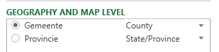
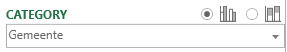
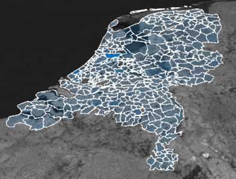
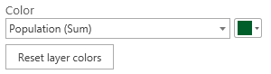

One of the most exciting tools in Excel has recently released a new version! Get the updated version of Power Map here: <a href="http://www.microsoft.com/en-us/download/details.aspx?id=38395">http://www.microsoft.com/en-us/download/details.aspx?id=38395</a> (Excel 2013 only).

This update comes with a ton of new features, including some of the most popular feature requests I have come across.

One of the first things that you will see when you add data to Power Map is that Power Map is now more intelligent and automatically suggests how to interpret columns. In the screenshot below it automatically mapped the 'Gemeente' (County / Municipalty) and 'Provincie' correctly. This goes to show that this automatic mapping not only works with English terms J

&nbsp;

The way you choose between types of column charts has changed. You just choose the 'Column' type and then on 'Category' you can change the chart sub type (clustered or stacked).

Power Map can now also use calculated columns and supports hidden fields. Annotations can now not only contain custom text or fields but can also display an image.

A new visualization type is 'Region', which is actually really cool. It provides shapes as available from Bing to overall items on the map. As far as I can see it not only works for the obvious countries, but also for example for provinces in the Netherlands and even the municipalities.

If you have chosen a category for this new type of visualization you can also change the way regions are shaded, for example by relative values in the same category or across all items.

Then, with a tick of a button you can change from a 3D map to a 2D / flat map (note the cool animation).

Also, it is now possible to save your tour to a video right in the tool. Video types can be optimized to presentations and HD displays, computers and tablets and for mobile devices.

One great new feature is that it is now possible to change the coloring of charts, regions and bubbles:

Here is a sample tour I created in 20 minutes based on population data that I loaded from CBS (Central Bureau of Statistics in the Netherlands) using Power Query (hint: make your selection in CBS' Stat line and use the "from web" option in Power Query to get the data in Excel).

[video width="1920" height="1080" mp4="../wp-content/uploads/2013/09/CBS-Power-Map.mp4"][/video]

&nbsp;