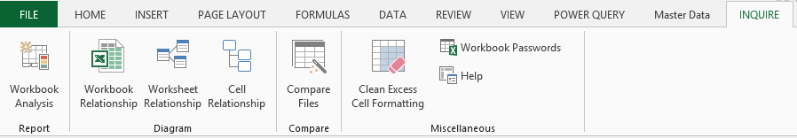
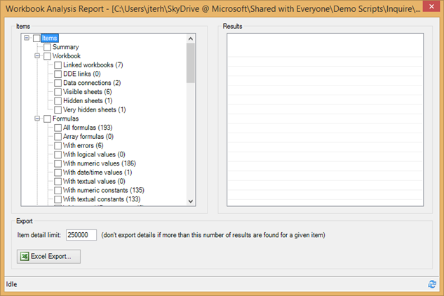
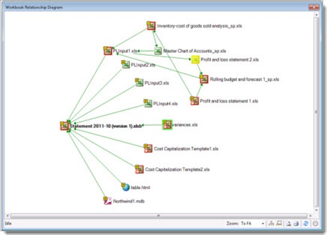
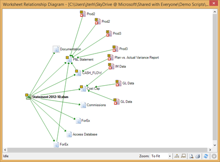
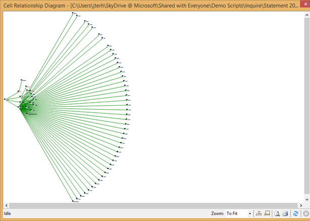
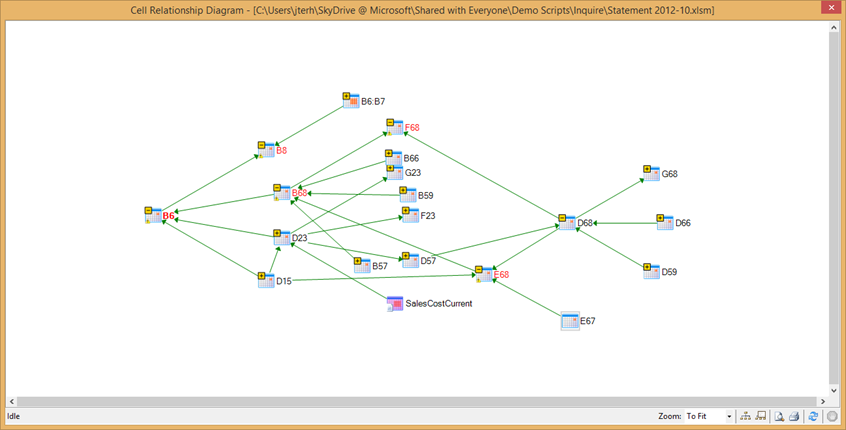
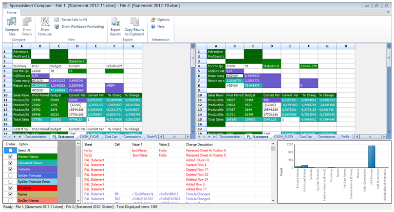
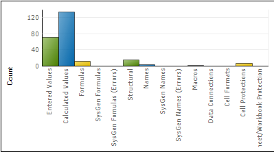
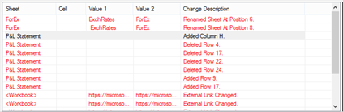

Excel sheets are notorious for their many formulas, references, cutting, pasting, macro's, hidden columns and sheets and overall complexity.

<a href="http://www.dutchdatadude.com/meet-paul/">My story about Paul</a> is an (very painful) example of what people can build using Excel and how organizations can become dependent on that without even knowing it, ending up in a so-called Excel Hell.

Those "magic Excel sheets" or end-user generated applications contain a lot of information and a lot of business knowledge. They are a bit like spaghetti-code: it is hard to understand how exactly how they are structured and what they do. Something goes in and a result comes out, but what happens in between is in many cases a black box. The reason for this is that they are the product of a long time of development by a non-developer; in the case of Paul this sheet was a product of a career and was built by someone with absolutely no idea about coding standards or even an understanding of what benefit methods in your code could bring.

The problem is however (as per the saying "people trust people, people do not trust data") that in many cases these exact same magic sheets are used to base decisions on. And I mean not only operational, small-scale decisions but strategic, sometimes life-threatening decisions (heck, even the Nasa is believed to use magic Excel sheets to do some last minute calculations while in mid-flight).

With Excel 2013 Microsoft has taken big steps in turning Excel into a trustworthy BI tool. Not only do we provide great and powerful visualization and analysis capabilities, but also we provide a way of getting data and transforming it that is both powerful and easy to use as well as completely traceable and auditable.

However, it would be silly to believe that from one day to the next everyone would re-build their Excel sheets. They are just to complex to do that or to important or there is simply no time or knowledge available.

In those cases the best we can do is try to understand what happened in those Excel sheets and make it visible in case anything breaks or comes out the wrong way. That's why Inquire was introduced in Excel 2013. It is an add-in in Excel 2013 which is disabled by default. Once it is activated, an "Inquire" tab is added to the ribbon.

Here we can start our research into understanding the Excel sheet.

&nbsp;

<strong>Workbook Analysis
</strong>

When the window opens we get a big list of information about your Excel file and what is in it.

Clicking any header on the left side gives you the exact items and locations in the worksheet. Rather ironically, you can export the results to an Excel file J

Some of the items I find most interesting are:
<ul>
	<li>linked workbooks</li>
	<li>data connections</li>
	<li>hidden sheets</li>
	<li>very hidden sheets (you can very hide a sheet by going to Visual Basic for Applications (ALT+F11) and change the property of the sheet to very hidden)</li>
	<li>Formulas with errors</li>
	<li>Formulas with numeric / textual constants</li>
	<li>Formulas without cell references</li>
	<li>Formulas referencing blank cells</li>
	<li>Formulas referencing hidden cells</li>
	<li>Formulas referencing external workbooks</li>
	<li>Duplicate formulas</li>
	<li>Inconsistent formulas</li>
	<li>Unused input cells</li>
	<li>Blank referenced cells</li>
	<li>Invisible cells</li>
	<li>Hidden rows and columns</li>
	<li>Named items with errors</li>
	<li>

Warnings

&nbsp;</li>
</ul>
<strong>Workbook relationship
</strong>

The workbook relationship function explores dependencies on other workbooks, for example through linked workbooks and data connections.

As you can see this sheet has 9 direct dependencies, 7 of which are Excel files, one HTML file and one Access database. The red indicates that the dependency is broken, i.e. the file is no longer accessible. You can right click and fix the relation or dive deeper into the tree of dependencies as I did in the screenshot above.

<strong>Worksheet relationship
</strong>

This provides a tree of how worksheets depend on each other. Sometimes you will see relationships between worksheets, which means that formulas on one worksheet reference the other. Additionally, dependencies to other worksheets are shown.

&nbsp;

<strong>Cell relationship
</strong>

By far the one of the two most powerful functions is the Cell Relationship Diagram, which you open by click 'Cell relationship'. It may take a while to generate, as it shows all relations the currently selected cell has with other items. In this example I clicked a cell that contained a formula which resulted in a division by zero error. The cell relationship diagram for this cell is humongous:

Not looking too good huh? Most of the lines however, point to one problem cell (D15). So I collapsed that for now and then the diagram looks much better:

Cells that are marked red have errors. If you hover over a cell in this diagram you get the formula in that cell as shown in the screenshot above. Also note that this tree shows another workbook being referenced. By clicking on the little + signs you can explore further down the tree. In this case I would like to understand why B6 is showing an error. Turns out that B6 references B68, which in turn references E68 (F68 is not referenced by B68 but rather references it, so that explains the error there). It seems like if I could figure out why E68 is erroring, I solve the B68 error and thus the error in B6 and F68. Going a little futher I suspect E67 to be the problem (it is used to divide value D68 in cell E68 but it does not return any value). Double clicking on E67 takes me to the cell in the worksheet. Immediately I see that this is an error: the cell is empty, which causes the chain of division by zero. Now the next step would be to actually change the formula definitions.

&nbsp;

<strong>Compare Files
</strong>

Compare files is an interesting function in that it compares not only for structure or content, but also for functions, macro's and even layout. To use it just open two Excel files and click on 'Compare Files'. After just a while a new window opens in which you can browse the comparison results (And again export them to Excel J).

This window is a great tool to understand just how big the differences between the sheets are and how big the potential problem is. On the bottom right we see that some entered values have been changed between these two versions of the same file, some calculated values have changed but the majority of the changes have been in formatting. Now that does not tell me a lot about a problem scenario (formatting normally does not introduce auditability and trust problems now does it?), so I removed it from the diagram by de-selecting it in the list on the left. Now, the diagram shows much more context of the problem:

We can now see that some formulas have changed and some structural changes have been made (renaming of sheets, deleting rows and columns). Additionally, one change in a macro has been made (among other things).

Clicking on the structural changes takes me to a list of the structural changes, which tells me exactly where what has been changed:

Then for the other problem area: the macro. Selecting the macro change from the list and double clicking on the item brings up another window and here we see the exact line in the macro where the change happened. Apparently somebody changed the 10200 to 10300. This could be a serious mistake!

&nbsp;

<strong>Clean Excess Cell Formatting
</strong>

This removes unused cell formatting information. Unused formatting information can dramatically increase the size of your workbook, so removing unused information is always a good idea.

<strong>Workbook Passwords
</strong>

Inquire needs to store workbook passwords if you want to analyze and compare workbooks that are password protected. Using this button you can safely store the workbook passwords so Inquire can open the workbooks on your behalf.

<strong>Help
</strong>

The header says it all: this opens the help file…

&nbsp;

In summary: Inquire is a great tool to analyze individual Excel sheets or compare versions of Excel sheets. However, you will need to go through every single Excel sheet one by one. To implement are more automatic check of your Excel (and Access!) files the Audit and Control Management Server is available. ACM Server monitors file shares or SharePoint libraries and automatically tracks versions and changes between versions. I will introduce it and discuss how to set it up and work with it in future blog posts.

More info on Inquire is available at <a href="http://office.microsoft.com/en-us/excel-help/what-you-can-do-with-spreadsheet-inquire-HA102835926.aspx?CTT=1/">http://office.microsoft.com/en-us/excel-help/what-you-can-do-with-spreadsheet-inquire-HA102835926.aspx?CTT=1/</a>

&nbsp;