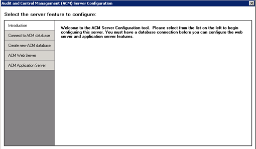
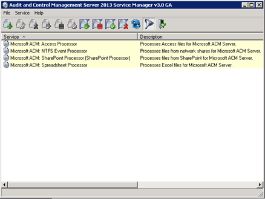

In my previous <a href="http://www.dutchdatadude.com/investigate-excel-sheets-using-inquire">post I introduced the Inquire add-in for Excel and discussed it at length</a>. In this blog post will we look at Microsoft Office Audit and Control Management Server 2013 (which I will call ACM from now on), which is in some sense the server equivalent of Inquire for Excel. Where Inquire analyses only Excel sheets and requires you to do so by hand, ACM automates this process by monitoring file shares and SharePoint libraries for changed files, both Excel and Access files.

Setting ACM up is pretty easy and I will walk you through the process in this post. A later post will then discuss how to use ACM.

First off you will need the software and install it. You will need to have .Net Framework 4.0 and Visual C++ 2005 Redistributable Package (x86) installed. Also you will need to have a SQL Server available. You could for example use an existing SQL server and store the database there or use SQL Express on the ACM Server itself.

Last requirement is having IIS configured on your machine. Take care to enable ASP.NET and required role services as well as Windows Authentication and Management Tools and all options under there (including IIS 6 Management Compatibility). Make sure the following gets installed:
<ul>
	<li>

<strong>Web Server</strong>

<ul>
	<li>

Common HTTP Features

<ul>
	<li>Static Content</li>
	<li>Default Document</li>
	<li>Directory Browsing</li>
	<li>HTTP Errors</li>
</ul>
</li>
	<li>

Application Development

<ul>
	<li>ASP.NET</li>
	<li>.NET Extensibility</li>
	<li>ISAPI Extensions</li>
	<li>ISAPI Filters</li>
</ul>
</li>
	<li>

Health and Diagnostics

<ul>
	<li>HTTP Logging</li>
	<li>Request Monitor</li>
</ul>
</li>
</ul>
</li>
	<li>

<strong>Security</strong>

<ul>
	<li>Windows Authentication</li>
	<li>Request Filtering</li>
</ul>
</li>
	<li><strong>Performance</strong></li>
	<li><strong>Static Content Compression</strong></li>
	<li>

<strong>Management Tools</strong>

<ul>
	<li>IIS Management Console</li>
	<li>IIS Management Scripts and Tools</li>
	<li>Management Service</li>
	<li>

IIS Management Compatibility

<ul>
	<li>IIS 6 Metabase Compatibility</li>
	<li>IIS 6 WMI Compatibility</li>
	<li>IIS 6 Scripting Tools</li>
	<li>IIS 6 Management Console</li>
</ul>
</li>
</ul>
</li>
</ul>
When you have successfully installed ACM, you will have two new programs available: Microsoft Office ACM Configuration Utility and Microsoft Office ACM Service Manager.

You will need to setup ACM using the Configuration Utility first, so start it.

Once the Utility opens you will see this screen:

Let's start by creating a new ACM database. Click 'Create new ACM database', enter the database server\instance name and the name of the database to create. Finally, click 'Create' and wait.

When done, click 'Connect to ACM database' to verify that the connection info for the database has been successfully stored there. If required set up the connection here and hit 'Save'.

Now that we have configured the database and the connection to the database, we need to setup the ACM Web Server and ACM Application Server.

Click 'ACM Web Server' to get started and choose where you will create the Web Site. Since I had an empty IIS install, I chose Default Web Site. I entered a new for the web application and made sure to use correct credentials for the Application Pool Identity. Also, specify an initial Central Administrator account and click 'Create'.

Then we can continue to the ACM Application Server configuration; click 'ACM Application Server' to get started. Here we will need to specify the URL of the Web Server you have just configured (in my case it was just <a href="http://localhost/ACM">http://localhost/ACM</a>). Optionally you can specify users whose file saves you would like to ignore. When done do not forget to click 'Save'. Now you can click on 'Show Service Manager' to jump to the other tool we will need (Microsoft Office ACM Service Manager).

When the ACM Service Manager opens it should show you four services (see screenshot below).

You will need to configure the services correctly. In my experience it works best if you first stop the service (right-click, Stop) before editing them (right-click, Edit). You will need to specify a logon account and password for each service on the Settings tap of the properties dialog box. Also I chose to change the start-up mode for each service to Automatic. Once done your services should all be started (you can check the status in the service manager). If not you may have to start them by hand.

Note that you do not have to run all services. For example if you do not want to monitor SharePoint libraries, you do not have to configure this service. Also, if you do not want to monitor Access files, you do not have to configure the Access Processor service. The NTFS Event Processor service is required is you want to monitor file shares. The Spreadsheet Processor service is require for monitoring Excel files.

Now open up your browser and navigate to your ACM Web Server (in my case http://localhost/ACM).

You will see a page titled 'My Files' and it will be empty. Don't worry, we will fix that very soon.

Click on the little gear icon right next to your name in the top right and click 'Site Settings' to open the settings. You can always go here if you need to troubleshoot. Service Status and Event Log are two very helpful items to check out first if you are having problems.

For now, click on Processing Folder. Here, specify a UNC path where the Excel and Access processor can store files while processing. This folder will be emptied regularly, so don't worry too much about this. Anyway, I choose to create a file share on my local server for this purpose and entered the share name here. When done, click 'OK'.

Next up is the File Processor Aliases option. Here you can specify the aliases of processors to use to scan items. The default alias (AppSrvAlias) should already be added. If not, add it and return to the previous screen.

The last item we need to look at is Monitored Folders. Here you can set up the folders to monitor. I used a file share to monitor for files since I do not have SharePoint installed on this machine. You can add multiple folders to monitor and mix both types. When specifying a file share folder you will of course need to enter the UNC path and you could change the file types to monitor (although I recommend leaving it like it is). Also you can specify if you also want to monitor subfolders. The Change Tracking option specifies the tracking level for Excel files, which determines how deeply you want to investigate Excel files. I chose 'Functional, Formatting and Data Entry' but 'Functional' is recommended, since you will probably not be interested in formatting changes like colors and fonts. However, I found Data Entry to be interesting to track, so that is why I chose that level of tracking.

You can specify if you want to track changes each time the file is saved or once a day at a certain moment.

An important setting is the processing folder, which is used to store versions of monitored files. Enter a UNC path in here which is different from the processing folder and the monitored folders specified earlier. Also bear in mind that users should not be given access to this folder. The number of versions to store per file is configurable here also.

Finally, we need to specify folder manager and viewer permissions and click 'OK'.

Repeat this process for every folder you want to monitor and you're done configuring ACM.

If you now create a new file or edit any existing file in one of the monitored locations you should see it showing up on the My Files page. In the case of Excel files you will need to make a change that actually triggers the tracking level you specified. If you went with the 'Functional' setting and make a formatting change it will not be tracked.

In my next blog I will show what you can do with monitored files, so stay tuned!

&nbsp;