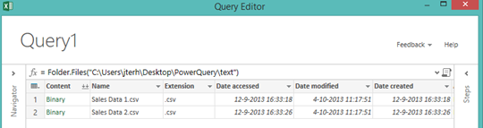
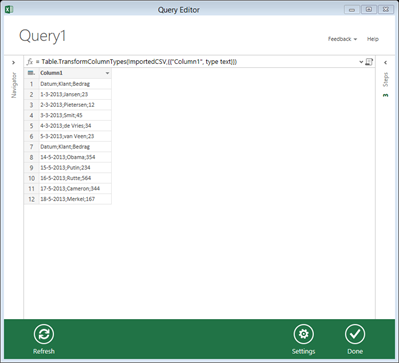
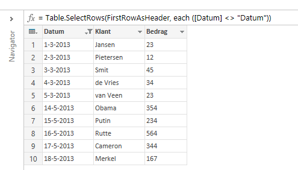

<em>For the information in this post I am heavily indebted to <a href="nl.linkedin.com/pub/michiel-rozema/0/987/85a">Michiel Rozema</a> who originally figured this out.
</em>

In this post we will have a look at how text (CSV) files in a folder can be combined using Power Query for Excel. In a later post will we extend this and load Excel files. Having this capability is very handy if you have files reporting on the same info (say sales figures) from different regions or multiple periods. You can keep the files as is but load them into Excel / Power Pivot as one table.

To start, load Excel and make sure Power Query is installed. Then on the Power Query tab click From File and then choose From Folder.

Next, specify the path where the text files are stored and choose Ok. What you will get is a list of files in the folder:

In this sample I have two csv files in the folder. The columns contain information about the file, such as date modified and file name. Some columns are special however and the column we are interested in is the first column (Content). Clicking on 'Binary' in that column in any row gets you to the content of the file you clicked. That is nice, but what we really want is to load all content of the two files. To do that we need to click the little icon next to the Content column header that looks a bit like two downward pointing arrows: . Click it and the contents of the files is combined together and shown in a new column (Column1):

The information from all files in the folder is now present, but all in one column. We need to split it by right-clicking the column, and choosing 'Split Column' and 'By Delimiter'. I chose 'Semicolumn' as delimiter and clicked 'OK'.

Now we still have the column headers from the CSV files in our set. In order to use the first row as column headers click the little table icon in the top left () and choose 'Use First Row As Headers'.

Now we need to filter out the column headers from the second CSV file. I did this by filtering the first column just like you would in Excel. The result I ended up with is this:

Click 'Done' and your data will load into Excel, ready to be used!