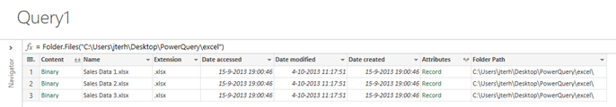
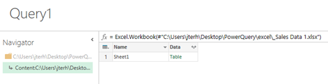
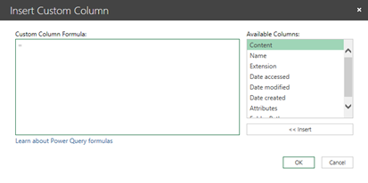
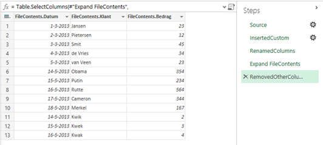
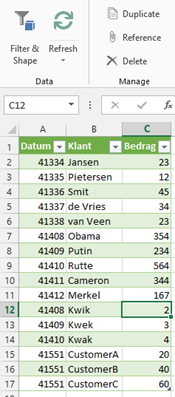

<em>For the information in this post I am heavily indebted to <a href="https://microsoft-my.sharepoint.com/personal/jterh_microsoft_com/Documents/Blog/nl.linkedin.com/pub/michiel-rozema/0/987/85a">Michiel Rozema</a> who originally figured this out.</em>

This post is an extension to <a href="http://www.dutchdatadude.com/combining-text-csv-files-using-power-query-for-excel">my previous post on combining text (CSV) files using Power Query for Excel</a>. In this post we will go through the same steps again, but this time for Excel sheets. Combining Excel sheets is a bit harder than text files however.

Being able to do this is very handy if you have multiple Excel sheets reporting on different periods, regions or products and you want to combine the data from those sheets into one table to use in your reporting.

First we need to make sure that 'Advanced Query Editing' is enabled. To do this, open Excel, go to the Power Query tab and choose Options. Then make sure the checkmark for 'Advanced Query Editing' is enabled. In order to successfully combine multiple Excel sheets we will need to modify the query's script.

Just like with combining text files using Power Query, get started by clicking 'From File' and then 'From Folder'.

Specify the folder where your Excel files are located and choose 'OK'.

As before Power Query returns the list of Excel files in the folder:

Lets click on the first cell of the first row to get the sheets of the Excel workbook:

If you now click on 'Table' in 'Data' column of the Sheet1 row you will get the contents of the sheet itself:

Let's first fix the headers. Right-click on the little table icon in the top left and choose 'Use First Row As Headers'.

Now, in order to load the rest of the Excel files we need to modify the code a bit. To do this click on the little script icon just above the table:

&nbsp;

&nbsp;

The query editor opens and shows the M-script you have generated in the previous steps. Here is mine:
<pre>let
Source = Folder.Files("C:\Users\jterh\Desktop\PowerQuery\excel"),
#"C:\Users\jterh\Desktop\PowerQuery\excel\_Sales Data 1.xlsx" = Source{[#"Folder Path"="C:\Users\jterh\Desktop\PowerQuery\excel\",Name="Sales Data 1.xlsx"]}[Content],
ImportedExcel = Excel.Workbook(#"C:\Users\jterh\Desktop\PowerQuery\excel\_Sales Data 1.xlsx"),
Sheet1 = ImportedExcel{[Name="Sheet1"]}[Data],
FirstRowAsHeader = Table.PromoteHeaders(Sheet1)
in
FirstRowAsHeader</pre>
If we take a closer look at this M-script we see the following structure:
<pre>let
 A = f(x),
 B = f(A),
 C = f(B)
 in C</pre>
What happens is that we define A and then in steps apply functions on A. In each step we take as input the output of the previous step. In the end we return the result of the last function.

The M-script above is quite static in the sense that it applies only to the Excel sheet we selected (in this case 'Sales Data 1.xlsx'). What we need to do is find a way to provide a parameter to this code and execute the code for every Excel sheet in the directory.

To make this work we will need to define a function based on the M-script we currently have. To do that we need to change the M-script to:
<pre class="lang:sh decode:true">let ExcelFile = (FilePath, FileName) =&gt;
let
    Source = Folder.Files(FilePath),
    File = Source{[#"Folder Path"=FilePath,Name=FileName]}[Content],
    ImportedExcel = Excel.Workbook(File),
    Sheet1 = ImportedExcel{[Name="Sheet1"]}[Data],
    FirstRowAsHeader = Table.PromoteHeaders(Sheet1)
in
    FirstRowAsHeader
in
    ExcelFile</pre>
What we do here is defining a function with two parameters (the path to the files and a filename). Make sure you match the casing of 'in' and 'let' correctly! Do not use any capitals. Change your M-script accordingly and click 'Done'.

Your Query Editor should now look like this:

Now, let's make sure we understand what this query does by changing the name from 'Query1' to something like 'GetExcel' by double clicking on 'Query1' in this screen and entering the new name. We will use this name to invoke the function.

Click 'Done'. We will invoke this function in a just a little while.

On the Power Query tab click 'From File' and choose 'From Folder' again. Re-enter the folder where your Excel files are stored and click 'OK'. Now right-click a colum header and choose 'Insert Column' and choose 'Custom…'. A formula editing screen opens:

Here we will need to invoke the function we defined earlier by entering the following:
<pre>GetExcel([Folder Path],[Name])</pre>
Click 'OK' and rename the column by right-clicking the column name and choosing 'Rename'. I renamed the column to 'FileContents':

Now click the  icon to select the columns to expand from your Excel sheet and click 'OK'.

Now we have the contents of the files combined with information about the files in one table. To get rid of all columns except for the contents select the three contents columns, right-click and select 'Remove Other Columns':

Optionally you can rename the columns. When done click 'Done' to get the data in Excel.

The best part is that if you add a sheet to the directory and click 'Refresh' in the Query tab of the ribbon, the data will get added to the result set:

So, if you have set this up and new data needs to be added as long as the structure of your Excel sheets does not change you can just click 'Refresh' and it works! This is the amazing power of Power Query.

&nbsp;

&nbsp;

&nbsp;

&nbsp;