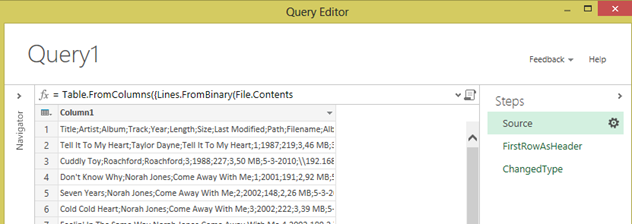
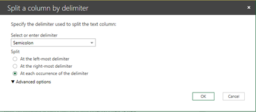
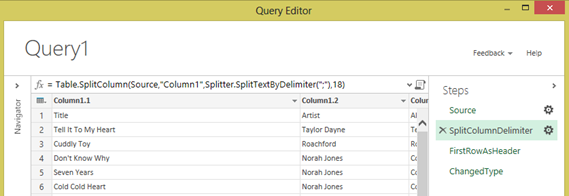
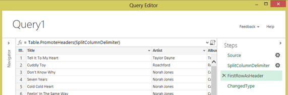
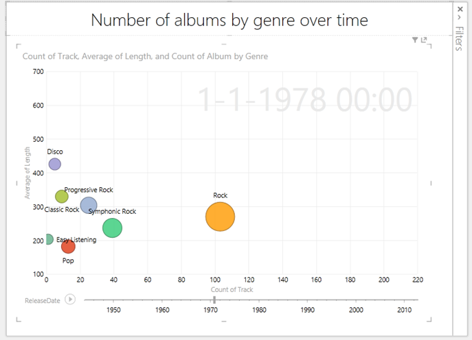

<strong>Disclaimer: this post was written before I learned that pie charts are bad.</strong>
As some of you might recall, I have been talking about visualizing digital music collections using Microsoft tools. It all started back in the days of Pivot Viewer (At some point I was even part of a lustrous duo called 'the Pivot Brothers').
Now, with Power BI being just around the corner I started thinking about taking on this old habit again. Here it goes…

If you are like me you have a digital music collection all nice and tidy complete with ID3 tags. A lot of tools exist that enable you to work with these tags and fix them. I particularly like Mp3tag (<a href="http://www.mp3tag.de/en/">http://www.mp3tag.de/en/</a>) which is free and is extensible. It also comes with an export function to CSV, although it does not export enough to my taste. I created my own export file and I suggest you do too. Keep reading if you want to know how and maybe rip mine.

Of course you can use any other tool that has an export function, as long as you end up with something like a CSV. If you want to follow along in my step-by-step scenario I suggest installing Mp3tag.

<strong>Creating the export
</strong>

<em>Again, please note that you do not have to follow these steps exactly. If you use another tool (not Mp3tag) or already have an export file you would like to use skip to the next step.
</em>

To create the export with Mp3tag, open the program and navigate to where you music is stored (my collection sits on &#92;192.168.1.9\Music, which is a folder on my server). Once Mp3tag has listed all your files (might take a while if you have a large collection), select all files (EditàSelect all files or CTRL+A) and then choose File à Export (CTRL+E). You will get the Export dialog. Now, hit the first button on the right (the little page with a star to create a new export configuration and give it a name (I named mine "My CSV Export") and click OK. Notepad will open and allow you to edit the export configuration.

At this point you can copy and paste the code below into Notepad and hit save.

<pre>$filename(csv,utf-16)Title;Artist;Album;Track;Year;Length;Size;Last Modified;Path;Filename;AlbumArtist;DiscNumber;Genre;Composer;BPM;Codec;Bitrate;
$loop(%_filename_ext%)%title%;%artist%;%album%;%track%;%year%;%_length_seconds%;%_file_size%;%_file_mod_date%;%_folderpath%;%_filename_ext%;%albumartist%;%discnumber%;%genre%;%composer%;%bpm%;%_codec%;%_bitrate%;
$loopend()</pre>

Then, return to Mp3tag, select your export configuration, set up the export file name and click OK. Wait for a while and then click No to not display the export file.

<strong>Loading the file
</strong>

<em>If you followed along you will have a CSV file that contains the export of your music collection delimited by semicolons. Your delimiter may be different. As a consequence the steps you need to take to get the data loaded may vary.
</em>

Open up Excel 2013, click on Power Query in the ribbon and select From File à From CSV. Select the CSV file you just created and click OK. Now Power Query will do its best to give you what you want but as you can see it is not very successful (with the build available at the time of this writing).

All is not lost however, because now we get to work with the magic of Power Query!

First off, we need to get rid of all the errors we get in the data rows. Click open the steps fly-out on the right and click the first step (Source) and click the icon right next to it. Then in the 'Open file as' drop down box select 'Text File' instead of 'CSV Document' and click OK. This already looks a lot better, doesn't it?

Now we need to split the column in by the semicolon delimiter. Make sure the 'Source' step is still selected and then right click on the 'Column1' header and choose 'Split Column' à 'By Delimiter…'

Make sure to select the correct delimiter (semicolon in my case) and make sure that 'At each occurrence of the delimiter' under 'Split' and click OK.

Then you screen should look like this:

Now select the 'FirstRowAsHeader' step and check the output.

We now need to delete the last step (we will redo it ourselves later on). To do this mouse over and click on the little cross icon in front 'ChangedType'.

<strong>Transforming the data
</strong>

<ol>
    <li><em>Change data types
</em></li>
</ol>

Now we need to change some data types but right clicking on the header of the column and choosing 'Change Type' and choosing the type you want to change to.

Change these columns to the indicated types:

<table style="border-collapse: collapse;" border="0"><colgroup> <col style="width: 313px;" /> <col style="width: 313px;" /></colgroup>
<tbody valign="top">
<tr style="background: white;">
<td style="padding-right: 7px; padding-left: 7px; border-top-color: currentColor; border-right-color: currentColor; border-bottom-color: #9cc2e5; border-top-width: medium; border-right-width: medium; border-bottom-width: 1.5pt; border-top-style: none; border-right-style: none; border-bottom-style: solid;"><strong>Column</strong></td>
<td style="padding-right: 7px; padding-left: 7px; border-top-color: currentColor; border-bottom-color: #9cc2e5; border-left-color: currentColor; border-top-width: medium; border-bottom-width: 1.5pt; border-left-width: medium; border-top-style: none; border-bottom-style: solid; border-left-style: none;"><strong>Change to type</strong></td>
</tr>
<tr style="background: #deeaf6;">
<td style="padding-right: 7px; padding-left: 7px; border-top-color: currentColor; border-right-color: #9cc2e5; border-bottom-color: #9cc2e5; border-top-width: medium; border-right-width: 0.25pt; border-bottom-width: 0.25pt; border-top-style: none; border-right-style: solid; border-bottom-style: solid;"><strong>Last Modified</strong></td>
<td style="padding-right: 7px; padding-left: 7px; border-top-color: currentColor; border-bottom-color: #9cc2e5; border-left-color: currentColor; border-top-width: medium; border-bottom-width: 0.25pt; border-left-width: medium; border-top-style: none; border-bottom-style: solid; border-left-style: none;">Date</td>
</tr>
<tr>
<td style="padding-right: 7px; padding-left: 7px; border-top-color: currentColor; border-right-color: #9cc2e5; border-bottom-color: #9cc2e5; border-top-width: medium; border-right-width: 0.25pt; border-bottom-width: 0.25pt; border-top-style: none; border-right-style: solid; border-bottom-style: solid;"><strong>BPM</strong></td>
<td style="padding-right: 7px; padding-left: 7px; border-top-color: currentColor; border-bottom-color: #9cc2e5; border-left-color: currentColor; border-top-width: medium; border-bottom-width: 0.25pt; border-left-width: medium; border-top-style: none; border-bottom-style: solid; border-left-style: none;">Number (select 'Using locale' first and then select 'Number' and 'English (United States)' if your country does not use a . as decimal separator.</td>
</tr>
<tr style="background: #deeaf6;">
<td style="padding-right: 7px; padding-left: 7px; border-top-color: currentColor; border-right-color: #9cc2e5; border-bottom-color: #9cc2e5; border-top-width: medium; border-right-width: 0.25pt; border-bottom-width: 0.25pt; border-top-style: none; border-right-style: solid; border-bottom-style: solid;"><strong>Bitrate</strong></td>
<td style="padding-right: 7px; padding-left: 7px; border-top-color: currentColor; border-bottom-color: #9cc2e5; border-left-color: currentColor; border-top-width: medium; border-bottom-width: 0.25pt; border-left-width: medium; border-top-style: none; border-bottom-style: solid; border-left-style: none;">Number</td>
</tr>
<tr>
<td style="padding-right: 7px; padding-left: 7px; border-top-color: currentColor; border-right-color: #9cc2e5; border-bottom-color: #9cc2e5; border-top-width: medium; border-right-width: 0.25pt; border-bottom-width: 0.25pt; border-top-style: none; border-right-style: solid; border-bottom-style: solid;"><strong>Year</strong></td>
<td style="padding-right: 7px; padding-left: 7px; border-top-color: currentColor; border-bottom-color: #9cc2e5; border-left-color: currentColor; border-top-width: medium; border-bottom-width: 0.25pt; border-left-width: medium; border-top-style: none; border-bottom-style: solid; border-left-style: none;">Number</td>
</tr>
</tbody>
</table>

<ol>
    <li><em>Fix the Size column
</em></li>
</ol>

Now, split the Size column by right clicking on the 'Size' column header and selecting 'Split Column' and then 'By Delimiter…'. Select 'Space' as delimiter and select 'At the left-most delimiter' as split option and click OK.

You will now get two size columns: Size.1 which contains the numerical value and Size.2 which contains MB or KB.

First, change Size.1 to a number (right click on header, Change Type à Number). Then insert a new column (right click on a column header, Insert Column à Custom…) and enter the following custom column formula:

<pre>if [Size.2] = "MB" then [Size.1]*1024 else [Size.1]</pre>

Rename the Custom column by right-clicking the header and choosing 'Rename…'. Enter 'Size' as your column name and hit enter. You now have got a single column that reports the size of the song in Kb.

To wrap things up right click 'Size.1' and click 'Remove'. Do the same for 'Size.2'.

<ol>
    <li><em>Add cover art
</em></li>
</ol>

One of the nicest things of albums is the cover art. Luckily Windows stores the cover art in the same directory as your music files as a hidden file named 'Folder.jpg. Let's add this by adding another column (right click on a column header, choose Insert Column à Custom…) and entering the following custom formula:

<pre class="lang:sh decode:true">[Path]&amp; "Folder.jpg"</pre>

Rename the column to Cover.

Now we're done transforming the data. The steps you performed form a script, which you can see by clicking on the title scroll icon at the formula bar. Here is my script:



let
Source = Table.FromColumns({Lines.FromBinary(File.Contents("C:\mp3tag.csv"))}),
SplitColumnDelimiter = Table.SplitColumn(Source,"Column1",Splitter.SplitTextByDelimiter(";"),18),
FirstRowAsHeader = Table.PromoteHeaders(SplitColumnDelimiter),
ChangedType = Table.TransformColumnTypes(FirstRowAsHeader,{{"Length", type number}, {"Last Modified", type date}}),
ChangedTypeWithLocale = Table.TransformColumnTypes(ChangedType, {{"BPM", type number}}, "en-US"),
ChangedType1 = Table.TransformColumnTypes(ChangedTypeWithLocale,{{"Bitrate", type number}}),
SplitColumnDelimiter1 = Table.SplitColumn(ChangedType1,"Size",Splitter.SplitTextByEachDelimiter({" "}, null, false),2),
ChangedType2 = Table.TransformColumnTypes(SplitColumnDelimiter1,{{"Size.1", type number}}),
InsertedCustom = Table.AddColumn(ChangedType2, "Custom", each if [Size.2] = "MB" then [Size.1]*1024 else [Size.1]),
RenamedColumns = Table.RenameColumns(InsertedCustom,{{"Custom", "Size"}}),
RemovedColumns = Table.RemoveColumns(RenamedColumns,{"Size.1", "Size.2"}),
InsertedCustom1 = Table.AddColumn(RemovedColumns, "Custom", each [Path]&amp; "Folder.jpg"),
RenamedColumns1 = Table.RenameColumns(InsertedCustom1,{{"Custom", "Cover"}}),
FilteredRows = Table.SelectRows(RenamedColumns1, each ([Artist] &lt;&gt; null)),
ChangedType3 = Table.TransformColumnTypes(FilteredRows,{{"Year", type number}})
in
ChangedType3



As you can see every little step we took is represented in the script.

Now click 'Done' to get the transformed data in Excel, where we will start on the visualization.

<strong>Fixing the covers using PowerPivot and adding release date
</strong>

Now we need to tell Power BI to read the cover column as a reference to an image. This is something we cannot do in Power Query at the moment, but we can in PowerPivot. In Excel, click PowerPivot à Manage to open up the PowerPivot window. In here, select your Cover column, go to Advanced and set the Data Category to be Image URL.

Also, add a new column (by clicking on the empty column at the right of your table) and enter the following formula:

<pre>=DATE([Year];1;1)</pre>

Hit enter and name this column ReleaseDate.

<strong>Building the visualization
</strong>

Back in Excel, click Insert à Power View and start building your visualizations. Here are some examples I built:

<ol>
    <li>

<em>Number of tracks per release year
</em>

Count of track by year in a line graph

Apparently most the tracks in my collection were released around 2000, while the oldest track I have has been released in 1930.

<em>
</em></li>
    <li>

<em>Number of tracks per genre over time
</em>

This clearly shows that in 1978 the rock genre was most popular (at least in the albums in my collection). However, the Disco songs were the longest on average.

The play axis at the bottom allows me to play through my collection over time.

<em>
</em></li>
    <li>

<em>Number of albums per genre per year</em>

In 1983 the most popular artist was Kajagoogoo and you also get an idea of what the popular genre was. (Yes, I am using a pie chart here, this was years ago.)

</li>
    <li>

<em>Albums by genre and artist of time
</em>

This shows the progressive rock genre and when it was popular. Also it shows which artists released albums categorized as progressive rock and which albums I have of that artist (I selected Yes).<em>
</em></li>
</ol>

<strong>That's it</strong>

I will revisit visualizing my music collection when I have access to a BI Site, so I can show the latest visualization live. For now, this it it. Enjoy!