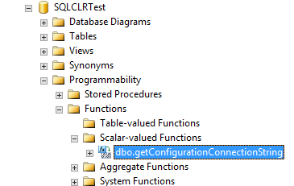
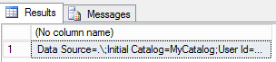

Config files (web.config, app.config) are a great way to store configuration settings outside of your programs' code. If the configuration changes (for example you move from development to test or from test to production) you do not need to go and change your code and re-compile. You simply change the config file and you are good to go. In SQL CLR you can also use this concept, however there are some gotcha's.

First create your SQL Server CLR project. Note that you will have to have the correct versions of SQL Server Data Tools. You can download what you need from here: <a href="http://msdn.microsoft.com/en-us/data/hh297027">http://msdn.microsoft.com/en-us/data/hh297027</a>. I have SQL 2012 installed and am using Visual Studio 2012, so I installed the SQL Server Data Tools for Visual Studio 2012 from the link above.

To start create a new database project and add a new SQL CLR C# User Defined Function (you can also use VB if you like). Add a reference to System.Configuration to your project. Make sure you include the following line in your cs file: 'using System.Configuration;'.

Now, the config file needs to be stored in the \Binn folder under the root path of the SQL Instance. To get the root folder run the following code in SQL Server Management Studio:

&nbsp;
<pre>declare @SQLRoot varchar(1024)
exec master.dbo.xp_instance_regread N'HKEY_LOCAL_MACHINE',N'SOFTWARE\Microsoft\MSSQLServer\Setup', N'SQLPath',@SQLRoot OUTPUT
select @SQLRoot</pre>
&nbsp;

Add '\Binn' to the result of this query. My path was: C:\Program Files\Microsoft SQL Server\MSSQL11.MSSQLSERVER\MSSQL\Binn. There create a file named 'sqlservr.exe.config' (make sure to get the name right!) You can use Visual Studio for this. A sample config file would be as follows:

&nbsp;
<pre><!--?xml version="1.0" encoding="utf-8" ?&gt;</pre>
Of course you can specify anything you want in the config file. To keep things simple I chose only to configure a sample connection string.

In your cs file all you need to do is create a function that retrieves your configuration for the config file (in my case just the connection string).

Here is the code you will need to put in your CS file:

&nbsp;
<pre>using System;
using System.Data;
using System.Data.SqlClient;
using System.Data.SqlTypes;
using Microsoft.SqlServer.Server;
using System.Configuration;

public partial class UserDefinedFunctions
{
    [Microsoft.SqlServer.Server.SqlFunction]
    public static SqlString getConfigurationConnectionString()
    {
        return new SqlString(ConfigurationManager.ConnectionStrings["MyConnString"].ToString());
    }
}</pre>
  

As you can see this code retrieves the value of the configuration value MyConnString from the config file.

If you, after the code has been deployed, made any changes to the configuration file that you would like to be picked up you will have to either restart the SQL Instance (not really an option in most cases) or free the system memory caches which will unload the CLR memory clerk by running the following in SQL Server Management Studio:

&nbsp;
<pre>DBCC FREESYSTEMCACHE('ALL')</pre>
This is unlike normal .NET applications where configuration file changes take effect immediately.

When done right-click your solution in the solution explorer and choose 'Publish' and publish your solution to the SQL Server. Then in Management Studio you should be able to find your function in the database you deployed to:

Now we can test our function by executing it:

&nbsp;
<pre>select dbo.getConfigurationConnectionString()</pre>
&nbsp;

Be sure to execute this against the database you deployed to.
Your connection string should be returned:

There you have it: you can now use configuration files from SQL Server CLR.

&nbsp;

