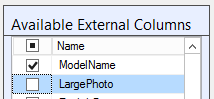
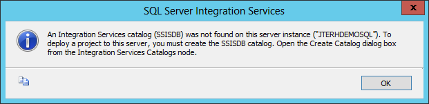
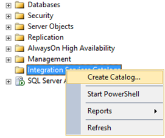
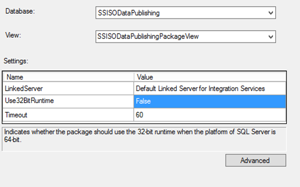
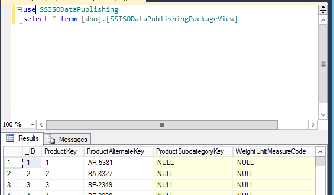

With the upcoming advent of Power BI on-premises data sources can be published as OData feeds to users. By default, you can only register SQL Server data sources here. With a clever trick you can register SSIS packages as data sources here, using the new Data Streaming Destination and Microsoft OLE DB Provider for SQL Server Integration Services (SSISOLEDB).

How it works is that you use a special destination (Data Streaming Destination) in the SSIS package. Then, we you publish the package to the SSIS Catalog you can run the SSIS Data Feed Publishing Wizard which enables you to create a view. That view can then be published as OData feed as can any other view.

In this post we will walk through an example. You will need SQL 2012 and the SSIS Data Feed Publishing Components, available here: <a href="http://www.microsoft.com/en-us/download/confirmation.aspx?id=39931">http://www.microsoft.com/en-us/download/confirmation.aspx?id=39931</a> (pre-release).
<ol>
	<li>

Install the SSIS Data Feed Publishing Components. After you installed it make sure it is successfully installed and configured by using SQL Server Management Studio. Connect to your SQL Server, expand Server Objects, Linked Servers, Providers and makes sure you see the SSISOLEDB provider. Double click SSISOLEDB here and enable 'Allow Inprocess' if it is not enabled and click OK.

&nbsp;

&nbsp;</li>
	<li>Create a new Integration Services project (or of course you can edit an existing one), I'll work with a new one just to keep it simple. I named my project SSISODataPublishing. Drop a Data Flow task onto the control flow and double-click it.</li>
	<li>In the data flow, define a source (I connected to an AdventureWorks database). Also specify the table you want to publish as OData feed (I used DimProduct).
</li>
	<li>

Now drag and drop the Data Streaming Destination to the data flow. Of course in real life the package would not be this simple: you would get the data from sources, transform it and then finally use the destination. For demonstration purposes I am keeping it simple here. Connect the OLE DB Source to the new Data Streaming Destination like so:

</li>
	<li>What I noticed is that the Data Streaming Destination does not support all data types. For example, LargePhoto is a varbinary and is not supported. To fix this we need to unselect it from our OLE DB source. Do this by editing the source. On the Columns page unselect LargePhoto and click OK:
</li>
	<li>

Now there is nothing else to do but to deploy the package. Right-click the project in the Solution Explorer and choose Deploy. Click Next and use browse to enter the destination SQL server name to publish the project to the Integration Services catalog. Then click browse to enter the path. If you run into this information message you have not correctly set up the SSISDB catalog yet:
&nbsp;

To fix this go to SQL Server Management Studio, connect to your SQL Server, right-click Integration Services Catalog and choose 'Create Catalog…'. In the next dialog enter a password for the encryption key protection and click OK.

After this return to your Integration Services Deployment Wizard and choose browse to enter the path again. Now you can create a new folder in the catalog and select it. Click OK to enter the path:

Click Next and choose Deploy to finish the deployment.

&nbsp;</li>
	<li>When the deployment finishes, make sure all items have resulted in Passed and no errors or warning exist. Then click Close.</li>
	<li>Now that the deployment has been done, we need to publish the package as view in a SQL Server database. To do that we need to use a new wizard called the SSIS Data Feed Publishing Wizard, which can be started by running the ISDataFeedPublishingWizard.exe from C:\Program Files\Microsoft SQL Server\110\DTS\Binn or just search for Data Feed Publishing Wizard in Windows.</li>
	<li>In the wizard, click Next on the welcome page.</li>
	<li>On the package settings page enter the name of the server where you deployed the package and enter the package. If you have any parameters configured you can enter values here or bind them to environment variables:
&nbsp;

When done click 'Next'.</li>
	<li>On the Publish Settings page select a database where you want the view for the SSIS package to be created and enter a name for the view. Make sure to choose a LinkedServer. If it does not exist already, the wizard will create it. Note you can also specify Use32BitRuntime and Timeout options here:
</li>
	<li>Before clicking 'Next', choose 'Advanced' and specify the Schema you want to use, if you want to use encryption to encrypt data before sending it over the network and what certificate you will use for the encryption. I left everything at the default (schema dbo, no encryption). Click 'Next'.</li>
	<li>On the validation page you will see a warning if no linked server exists yet. That is not a problem since the wizard will create the server automatically. Make sure that no other warnings exist or errors exist and click 'Next'.</li>
	<li>Review the selections you made and click 'Publish' to actually create the view.</li>
	<li>Review the progress and make sure no warnings or errors exist. Note that the query you will need to use to get the output data of the package is displayed at the bottom of this screen:
</li>
	<li>Click 'Finish'.</li>
	<li>Test the view by running the query above in SQL Server Management Studio:
</li>
</ol>
<ol>
	<li>So far all is OK. Last step is to create a data source and enable the OData feed in the PowerBI Admin center. You will have to have a working Data Management Gateway configured in order to do this. When done you can use the feed in Power Query. <a href="http://www.dutchdatadude.com/setup-and-register-a-data-management-gateway-for-power-bi/">See my post on how to configure the Data Management Gateway.</a></li>
</ol>