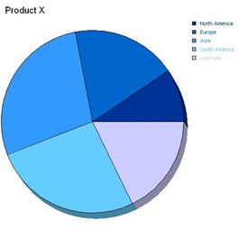
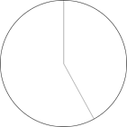
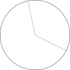
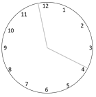
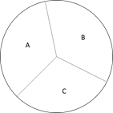
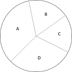
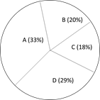
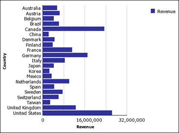
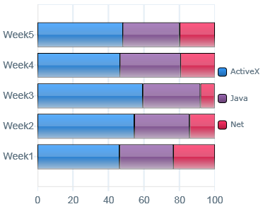

Pie charts. By far the most popular chart type among business users. Also the most unusable chart type. Every time a business users asks me for a pie chart a kitten a bit of me dies. In this post I explain why.

Let's start with the basics: what is a pie chart? A pie chart is a circular graph that is divided in parts (slices) by lines coming from the center. It is used for part-of-a-whole analysis, such as to compare product sales per product category. Here it is important to be able to spot small differences in size between slices. When multiple slices need to be shown it is often displayed in 3D (yuck!) because otherwise the smaller slices would not be visible.

To explain what is wrong with pie charts, let's imagine a clock. A normal clock is a circle with two hands to show time, such as the one below:

Look at the clock above: it quite clearly shows 5 o'clock right? It also divides the total circle into two segments, one obviously larger than the other. All is fine here.

Let's look at the same clock again:

Now the clock seems to show some minutes just before 4 o'clock, maybe 3:55? Here it already gets harder. That's why we added numbers along the circles perimeter to help you read time, like this:

Ok, let's now imagine a clock with three hands (often used to show seconds):

See how the clock divides the circle into three sections, all of almost equal size. Here, let me label them for you:

Care to tell me which one is bigger? A, B or C? Which one comes in second? Which slice is the smallest? Pretty hard right?

Let's add another hand and bring the number of slices to four:

Now, suppose you want to understand which one is the biggest and which one is the smallest. The biggest is obviously either A or D, but which one? The smallest is clearly B or C, but again, which one? You can't tell.

However, for a user, it is vital to know if Product A sold more than Product D and by how much. Also, if you want to understand which product is the worst-performer and why how much we need to be able to judge if B or C is the smallest and by how much.

Of course, we can come up with a work around and include data labels to help the user understand:

Now we can see that A is the best performing product while C is the worst performer. However, we had to add labels to be able to see it.

The point here is that as a species we humans are practically incapable to determining if a slice of a circle is bigger than the other. If only given a short glance some people will not see a 10% difference. If given more time most people with see differences as small as 5%. What if the difference is 1%? What is that 1% meant profit or loss for your entire company?

The examples above are very simple: I hardly come across pie charts with only four slices. Imagine what happens when there are more! What happens if one slice is really big (let's say 90%) and there are ten others dividing the remaining 10%?

There is something seriously wrong with pie charts. Data visualizations should be built to tell the story immediately and accurately. The user should not have to give it a minute or even 20 seconds to study the graph to understand what is going on. The user should be able to spot even the smallest of differences while still seeing the big picture. Pie charts may look pretty but are impossible to read quickly and accurately. (This holds true for most pie charts. It gets better if only two slices are shown, much like a clock).

For part-of-a-whole I prefer to use bar charts and depending on the data I go for a 100% stacked bar chart, like the ones below:

&nbsp;

So, please get rid of the dreaded pie charts. Tell users that they should not be looking at pies but eating them. Make this world a better place and eradicate the pie chart once and for all!

&nbsp;

&nbsp;