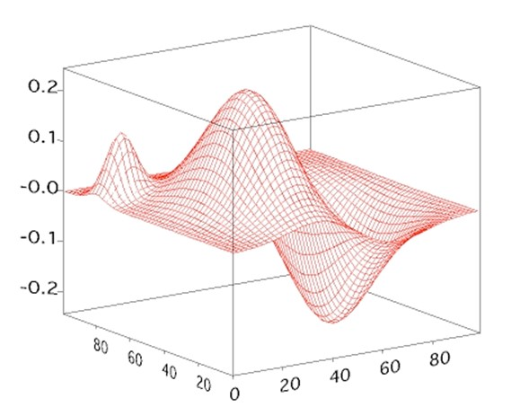
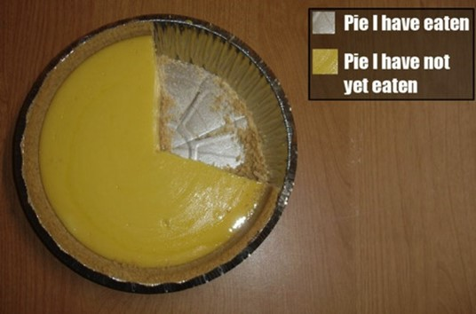

Personally I do not like the use of 3D in data visualization. Every time I see a 3D column chart I can't help thinking that who made it must have something to hide. The data might not be interesting enough so the graph needs to spice things up.

In my opinion 3D is pretty much useless and more a distraction than a help. There is one exception to this and that is the third dimension in a XYZ plot like the one below:

However the general usefulness of these plots (however sexy) is virtually none.

So, bottom line: I see no value in 3D in data visualization.

Or, better, I <em>saw</em> no value in 3D in data visualization. Because now we have 3D printing! Suddenly there <em>is</em> value in 3D with BI. How cool would it be to actually be able to print your 3D graph and have an actual model of the graph? If you make it from degradable substances you could even re-use the substance when you refresh your data and reprint your graph.

Think about it for a second! Let's for once assume that people will still be using pie charts (<a href="http://www.dutchdatadude.com/i-hate-pie-charts-and-so-should-you">despite my rant against them</a>). I see a business model here that finally makes the pie chart live up to its name and have some value (fill a stomach or two).

"Pie your data: your bring us data, we bring you pie". Or "eatable insight". What I mean is this: a company that delivers delicious pies that show your data. Let's imagine you plot your sales amount per region as a pie chart.

You order the pie and have it delivered to your sales meeting. Each will get the slice for their region.
How's that for direct feedback? "Feeling stuffed? That's because you have done so well!". "Hungry? Make sure you sell more and you will earn yourself a bigger slice of the pie!".

