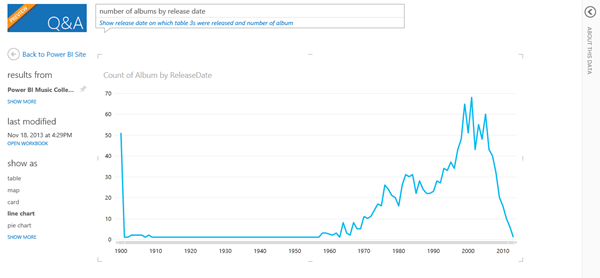
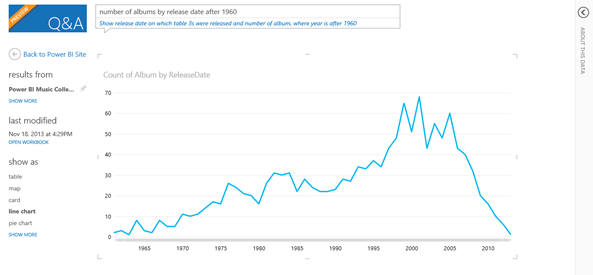
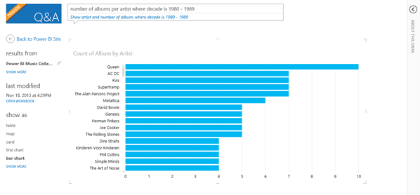
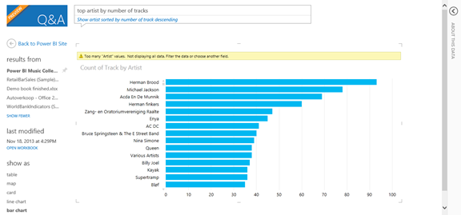
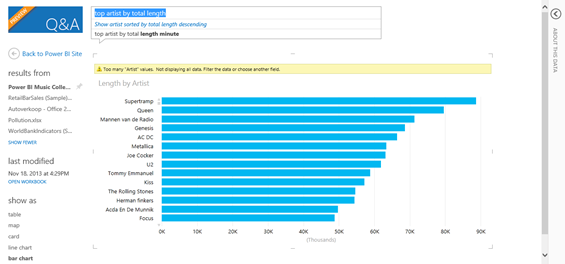

In an <a href="http://www.dutchdatadude.com/using-power-bi-to-visualize-your-music-collection/">earlier post I used Power BI (specifically Power Query, Power View and Power Pivot) to get insight into my music collection</a>. In this post I have a conversation with my music collection using Power BI Q&amp;A.

Q&amp;A enables you to "talk" to your datasets and ask questions in natural language. Q&amp;A gets the data, proposes a visualization and displays it. You can then change the question, get immediate feedback. This invites the user to do data exploration.

What I did to make this work is this: I uploaded the Excel sheet to SharePoint and enabled it for Power BI. Then I enabled the same sheet for Q&amp;A. Next step was to use Q&amp;A and ask questions.

The question I started with was: "number of albums by release date". Q&amp;A responds like this:

As you can see, it selected my Excel sheet and chose a line graph to display the number of albums by year. What is interesting is the spike to the left. It turns out this is a data quality issue: a lot of dates have been reported as being 31/12/1899 when there was no date in the tags in the first place.

Let's say I would like to focus more on recent data, such as albums since 1960. I refined my question to "number of albums by release date after 1960", which gives me this result:

Then I decided to look at one decade: "number of albums per artist where decade is 1980 – 1989". This is the result I got:

As you can see in this decade Queen is on the top. Let's dive a bit deeper into in which decades Queen released albums that I have in my collection: "number of albums by decade where artist is Queen". This is the result:

&nbsp;

As you can see I have got quite a few Queen albums spread over multiple decades. Now let's see if Queen is indeed as popular in my collection as it might look. I decided not to look at albums but at number of tracks. I refined my question to: "top artist by number of tracks". This is the result.

&nbsp;

Interestingly Queen is only in 10th place here (even after the choir which my mom is part of J). Based on the number of tracks Herman Brood is the most popular artist in my collection.

This got my wondering about the actual duration of the music (track length). Finally, I changed the question to: "top artist by total length". This gave me the following result:

When looking at the total track length of all songs Queen is back at place two and my all-time favorite band is on top (Supertramp).

Hope you enjoyed the tour of my music collection using Q&amp;A. Looking forward to feedback and your examples!

&nbsp;