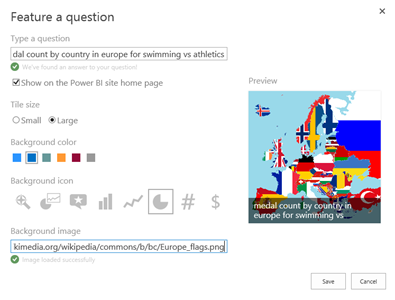

Those of you who have tried Power BI may have noticed the Featured Questions tiles:

(Those of you who have not yet tried Power BI: go to powerbi.com and build you own demo environments in minutes for free!)

The featured questions function as a sort of shortcut / favorite to an answer in Q&amp;A. What is cool is that you can actually add your own.

To do this start Q&amp;A and come up with the question you would like to feature. I used "medal count by country in europe for swimming vs athletics".

Now, copy that question (or remember it) and click on the fly-out on the right and then choose "featured questions". Next click on "add featured question".

In the next window type or paste your question and wait for Q&amp;A to validate it.

Be sure to enable 'show on the Power BI site home page' if you want your question to show up on the home page and continue setting up your tile. I used these settings (I used an image from Wikipedia to function as background. Not the prettiest but it works):

Next click 'save'. Next go back to the Power BI home page and there it is:

Pretty cool huh?

&nbsp;