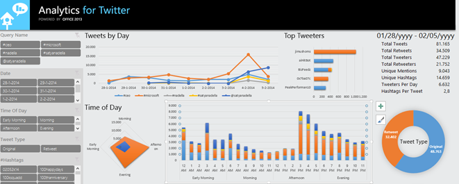
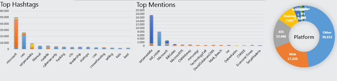
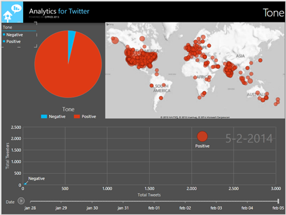
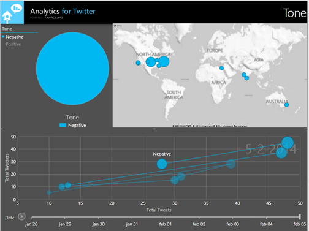

Last week Satya Nadella was announced as the new CEO of Microsoft (see <a href="http://www.microsoft.com/ceo">http://www.microsoft.com/ceo</a>). This was met with a lot of reaction in the world and also on the social networks. I decided to analyze the tweets on Twitter using my favourite tool Excel and a special Twitter Analysis add-in that we have made available through <a href="http://husting.com/twitter-analytics-for-excel/">http://husting.com/twitter-analytics-for-excel/</a> . I opened the twitter analytics sheet and did a new query. Here's what I searched on:

#ceo #nadella #microsoft #satyanadelle @satyanadella

There is really a lot of info that you can get from the Excel sheet. I cannot cover all of it, but I'll share some screenshots:

&nbsp;

What I found interesting is the hashtags and mentions. Of course #microsoft, #ceo and #satyanadella are the top three hashtags but #Manual is on fourth place. #cybersecurity and #hacking take sixth and seventh place respectively. Looking at the mentions I noticed @satyanadella, @billgates and @Microsoft, but also @bill_nizzle. Not sure what he is doing there J

In the top screenshot some slicers are shown that enable you to filter the data at will to slice and dice to more insight.

One thing I especially like is the tone map that displays whether a tweet was positive or negative. It also has a map so you can see where the tweet came from and allows you to play back the number of tweets over time:

Only a small amount of the tweets were negative and when I selected negative tweets only I saw the following:

It seems like in Europe we have not been tweeting negatively on this subject (at least in the timeframe I recorded). The US is most negative and also there were some negative reactions from Nadella's home country India, from Australia and Egypt.

This is a very easy way to do any kind of on the spot Twitter analysis using Excel. The Excel sheet used is freely available via the link above. Enjoy!