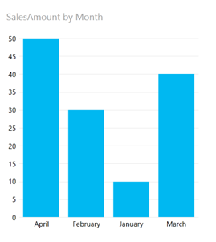
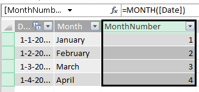
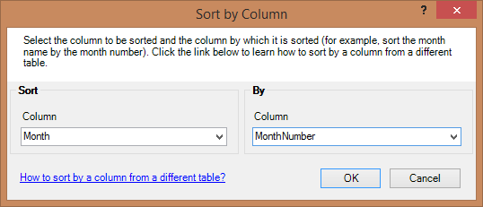
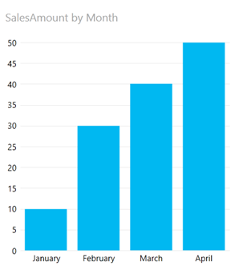

Here is an easy solution to a very common problem when making reports: how do I change the sort of some items from alphabetically to something else?

The most apparent sample of this is Months. Let's say you have to following (very simple) data model in Power Pivot:

That is, you have a Sales table that reports SalesAmount on a Date and related to that Sales table is a Date table (dimension) which stores dates and month name.

Now you create a PivotTable and provide a slicer to filter:

Or you create a Power View report:

What's wrong here? Your users probably want the months ordered correctly not alphabetically by month name as they are now in both the slicer and the Power View graph.

Of course you can give the months a numeric prefix like '01 – January', '02 – February', etc. This may work perfectly fine for you but I think this approach is impacting the user interface to much.

There is, naturally, a better way. And it is very easy to implement. All you need is two modifications to the date table.
<ol>
	<li>In Power Pivot go to the date table and add a calculated column with the following formula: =Month([Date]) :
</li>
	<li>Then click on the column that contains the Monthname (my second column) and choose Sort By Column:
</li>
	<li>In the dialog choose MonthNumber as your column to sort by and click OK:
</li>
	<li>Done.</li>
</ol>
&nbsp;

Now go back to Excel and look at the slicer and your Power View report. Both of them now sort correctly thanks to the power of Sort by Column. This of course is applicable to anything, not just months or dates.

&nbsp;

That's it for this Power BI Pro Tip. Until next time!