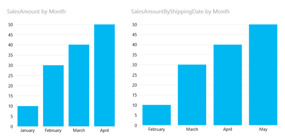

One frequent need in BI is something called a role playing dimension (see <a href="http://en.wikipedia.org/wiki/Dimension_(data_warehouse)#Role-playing_dimension">http://en.wikipedia.org/wiki/Dimension_(data_warehouse)#Role-playing_dimension</a> for a definition). The classic example of this is a Date dimension that is related to a Sales fact table and used either as date of order and date of shipping. One obvious solution would be to add the date table twice to your data model, but that would not only result in a larger data model but also in more work: if you add a calculated column to the date table (such as to <a href="http://www.dutchdatadude.com/power-bi-pro-tip-sort-by-column/">use the sort by column trick I explained earlier</a>) you would have to do that on every single date dimension in your model.

Luckily Power Pivot has a handy function called USERELATIONSHIP (explained here: <a href="http://technet.microsoft.com/en-us/library/hh230952.aspx)">http://technet.microsoft.com/en-us/library/hh230952.aspx)</a>). In this post I will walk you through an example.

Let's say you have this simple data model again:

This is a Date dimension related to a Sales fact, just like in my last Power BI pro tip.

The relationship between the two tables is on the Order Date:

Now, notice that the Sales table also has a column for Shipping Date. Let's create a relationship based on that column to the Date table. You can either drag and drop the columns or right click on ShippingDate and choose 'Create Relationship'.

Here are the settings I made:

&nbsp;

When you hit create you end up with two relationships between Sales and Date as expected, but one is a dotted line, which means it is inactive. This will be the relationship on shipping date.

No, create a report on this where you display SalesAmount per Month, like this:

The question now is which Date we are looking at. Is it Order Date or Shipping Date? It turns out that the active relationships is used, which is the one on order date.

Now, I would like to add a graph that shows the sales amount by shipping date. For this we will need to add a measure to our data model. Go to Power Pivot and add a measure to your Sales table by selecting a field in the bottom part of your Power Pivot window:

In the formula bar enter the following formula: SalesAmountByShippingDate:=CALCULATE(SUM(Sales[SalesAmount]);USERELATIONSHIP(Sales[ShippingDate];'Date'[Date]))

(Note that you might need to use comma's instead of semi colons to separate parameters).

Now add another graph to your Power View report where you use this measure and plot that against months:

Now the graph on the right shows the sales amount by month using the shipping date as the relationship, while the graph on the left still shows the sales amount by month using the active relationship, which is order date.

And that's how you use USERELATIONSHIP to show data when using a role playing dimension in Power BI.

That's it for this Power BI Pro Tip. Until next time!