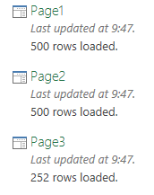
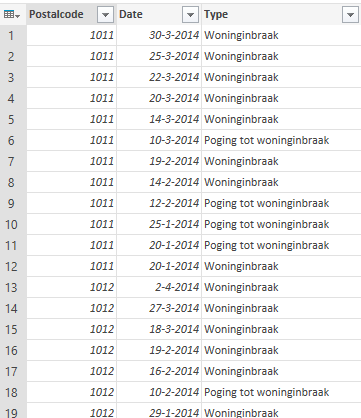

Here is another example of what can be done with Power BI. This time I attempted to analyze crime rates in Amsterdam.

I retrieved burglary and burglary attempts figures from the Dutch Police website: <a href="http://www.politie.nl/misdaad-in-kaart/lijst?geoquery=amsterdam&amp;categorie=1&amp;categorie=2&amp;pageSize=500&amp;page=1">http://www.politie.nl/misdaad-in-kaart/lijst?geoquery=amsterdam&amp;categorie=1&amp;categorie=2&amp;pageSize=500&amp;page=1</a>

There are three pages here, so I use Power Query to get all three pages into Excel and then appended them together in one big table. I did this using three 'from web' commands in Power Query, so I got the following queries:

Next step was to append the three tables together. I started with the 'append' command in Power Query which allowed me to append Page1 and Page 2 together. A quick edit of the code gave me the result I was looking for:
<pre>let
 Source = Table.Combine({Page1,Page2}),
 Source2 = Table.Combine({Source,Page3})
in Source2</pre>
And the resulting table:

Next, I loaded the table to PowerPivot, added a quick sum and then opened Power Map by going to InsertàMap in Excel.

In Power Map I created three layers, one using shapes, another one using a heat map and a third using a column graph. Then I created a tour using these layers. The resulting video is below.

<iframe width="560" height="315" src="https://www.youtube.com/embed/EKrE1_Pa3Gc" frameborder="0" allowfullscreen></iframe>

As you can see, it is really easy to visualize geographical data using Power BI in Excel! Pretty cool huh?