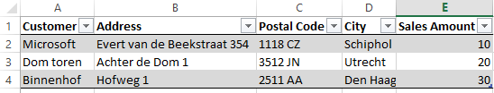
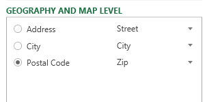
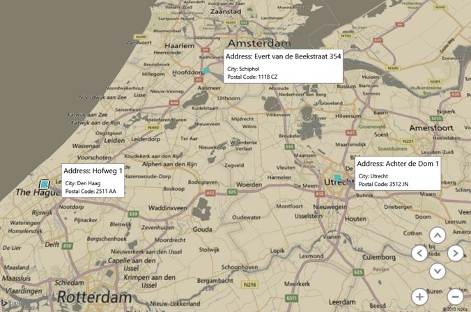
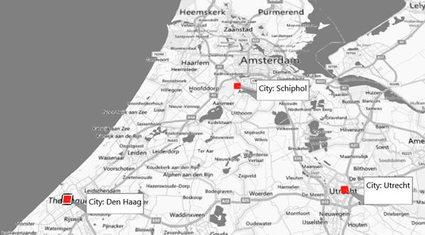
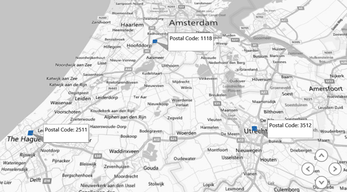

<em>Normally I blog in English, but since this post is specifically about support Dutch postal codes in Power Map, this post will be in Dutch. For those interested, the answer is: Dutch postal codes are supported in Power Map, but you need to use the first four digits and strip off the last two characters. Better stil: use the address (if you have it).</em>

Een veel gestelde vraag van mijn klanten is: is er ondersteuning in Power BI / Power Map (Geoflow) voor Nederlandse geografische informatie, zoals postcodes, steden en adressen? In deze post wil ik antwoord geven op deze vraag met de volgende dataset:

Met deze data kun je gemakkelijk een Power Map maken door in Excel op Insert / Invoegen te klikken en dan voor Map te kiezen. Als Power Map gestart is worden Address en City al automatisch op de kaart geplaatst. Klik op 'Postal Code' en kies 'Zip' om deze ook aan te zetten (zie onder):

Nu, als je Address aanklikt dan wordt de data perfect geplot op de gekozen locaties:

Dus: Nederlandse adressen werken prima.

Als we vervolgens overstappen naar City, dan ontstaat het volgende:

Opnieuw, klopt perfect.

Echter, als we nu 'Postal Code' kiezen dan krijgen we een lege kaart. Dit komt omdat Power Map op dit moment alleen de eerste vier getallen van een Nederlandse postcode kan ondersteunen en niet de volledige vier getallen plus twee karakters. Dus 1000 AA werkt niet, maar 1000 wel. Natuurlijk is dit minder specifiek dan 1000 AA. Als je dus de laatste twee karakters van de postcode afhaalt werkt de mapping weer:

Concluderend: Nederlandse geografische informatie wordt ondersteund en als je adressen hebt kun je zelfs heel specifiek plotten. Als je alleen postcodes hebt kun je op dit moment niet de volledige postcode gebruiken, maar alleen de eerste vier getallen. Overigens kun je met die vier getallen wel regions laten plotten op je kaart :)