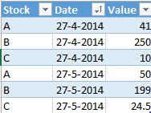
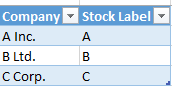
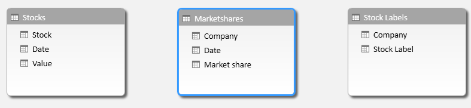
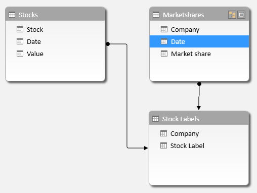
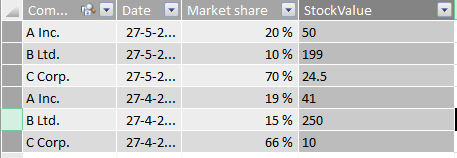

Power Pivot is a great way to do data modelling and analysis right in Excel. It works great for data that is dimensionally organized (facts and dimensions) as well as other forms of data. It even enables you to define relationships between datasets regardless of source. However, one thing that has been hard is the following: consider the scenario where you have stock values for certain stocks for certain days, like below:

&nbsp;

Let's also assume you have a table that shows marketshare (or something else) per company on a certain date, like this:

Finally, you have a third table that lists the stock label by company, like so:

Now, assume that you would like to add the stock value of a company on a certain date next to the market share for that company at that date so as to provide more context to a potential relationship between market share and stock value. Maybe a bigger market share has an impact on stock value?

Naturally, what you would do is load these tables into Power Pivot so you get the following:

Now, the next step would be to add relationships between these two tables. The relationships should be defined as follows:

I.E.: Stock labels and Market shares are related on the Company column, whereas Stock and Stock Labels are related on the Stock / Stock label column.

We can now try to get the stock value for the company at a certain date, but how? Just using RELATED() to get stock values will not work as it will return a table. You could use MAX or MIN to then get a maximum or minimum value, but that is not what we are after: we wanted to return the stock value for that company at exact that date. More generally, this problem occurs when a table is related "twice" to another table, such as monthly targets by person vs. actuals (the relationship between the actual and target table is double: both on month as well as person).

The solution is using LOOKUPVALUE() and here is how. In the Marketshares table I add a calculated column with the following definition:

&nbsp;
<pre class="lang:c# decode:true ">=LOOKUPVALUE(Stocks[Value];Stocks[Stock];RELATED('Stock Labels'[Stock Label]);Stocks[Date];Marketshares[Date])</pre>
&nbsp;

This might seem complex, so allow me to explain. What this does is the following:

Look up and return a value from

The Value column in the Stocks table (Stocks[Value])

For which

The stock label is equal to the stock label on record for the company (RELATED('Stock Labels'[Stock Label]))

And

The date equals the date of the market share information.

The result is:

Pretty nifty huh? Turns out that to use LOOKUPVALUE() this way you do not even have to be able to relate the lookup table to the data model at all. In my example the relationship between Stocks and Stock Labels is not even necessary, although I find it good practice to include all relationships just for clarity.