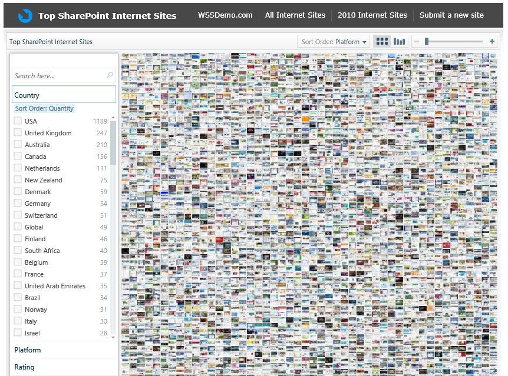
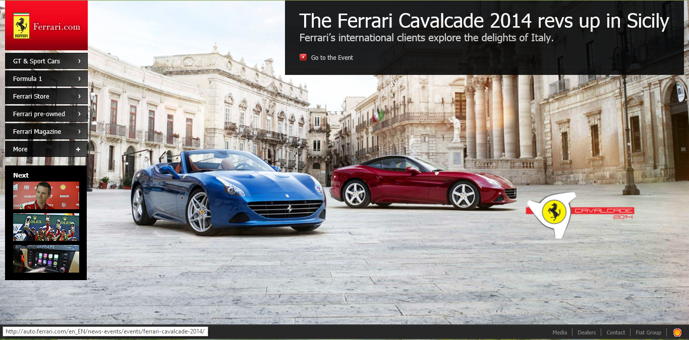

I get myself in many discussions about SharePoint as application platform for public / customer facing sites. The reason I end up in the discussion is because people are looking to use our great BI tooling to provide insight to their customers.

Most people do not believe that SharePoint is used to create internet sites (most people just know SharePoint as a collaboration platform).

Here is a great site that gives you an idea of what websites were created with SharePoint and it even features a great BI visualization of the data (PivotViewer). I encourage you to go check it out!

<a href="http://www.spsdemo.com/livepivot">http://www.spsdemo.com/livepivot</a>

My personal favorite is <a href="http://www.ferrari.com">http://www.ferrari.com</a>. Can you believe it has been built using SharePoint?

