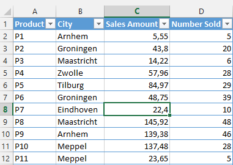
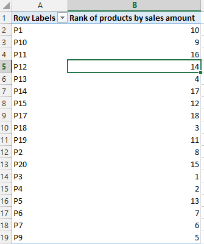
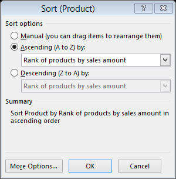
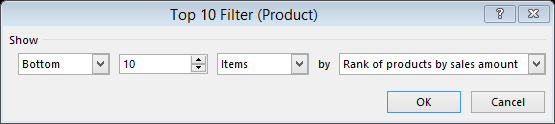
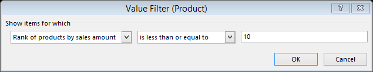
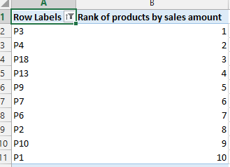
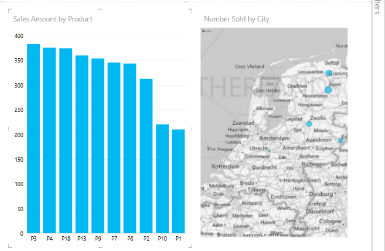
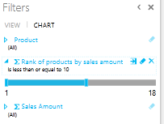

One of the more frequent scenarios is listing the top X results, such as most profitable products, biggest customers, top 10 best selling stores, etc. Also doing a top X selection helps reduce clutter in charts: a lot of data points can work as noise and obscure the data points that really matter and make the biggest impact.

In this post I describe an approach to implementing these scenarios using Power Pivot's RANKX() function.

Let's start with a simple dataset consisting of products (P1…P20 in my sample), Cities, Sales Amount and Number of products sold:

&nbsp;

After adding this table to the Power Pivot data model, we can use the RANKX() function to get the best selling products / cities etc. I added the following measures to my table:

Sum of Sales Amount:=SUM([Sales Amount])

Sum of Number Sold:=SUM([Number Sold])

Rank of products by sales amount:=RANKX(ALL(Sales[Product]);[Sum of Sales Amount])

Rank of city by number sold:=RANKX(ALL(Sales[City]);[Sum of Number Sold])

&nbsp;

These measures allow me to determine the top selling products by sales amount and best cities by number of products sold.

Only thing left to do is to use a Pivot Table / Pivot Graph or Power View / Power Map visualization and display the results.

&nbsp;

If you create a new Pivot Table and add the Product column and the 'Rank of product by sales amount' measure you get the following:

&nbsp;

So how do we get the top 10 selling products by sales amount is a nice ordered fashion? Very easy, just a matter of the right sorting and filtering. Click on the little downwards pointing triangle button at Row Labels and choose 'More Sort Options'. There I chose Ascending and then selected the rank measure:

&nbsp;

Now the Pivot Table is sorted by rank with the highest ranking product at the top. Now, to filter out only the top ten, we press the same button again and choose Value Filters and then Top 10. Here I made the following selections:

&nbsp;

This seems maybe a bit counter intuitive, but what this does is return the lowest ten ranks (which would be 1 to 10 or the highest ranking products). Alternatively I could have used a Lower Than or Equal To Value Filter with these settings to produce the same result:

And here it is: a top 10 of products by sales amount.

&nbsp;

Of course, you can also use Power View or Power Map to visualize these results. Here is a Power View based on the same information:

The trick here is to create the visualization just as normal (as above). Above displays the sales amount by product and the number sold by city. However, the catch here is that both the graph as well as the map have a filter on them that utilizes the rank measures I created. Here is the filter for the chart. The 'Rank of products by sales amount' measure is filtered to showing only values less than or equal to 10, i.e. the top 10.

What's best about this is that it is very easy to change from top 10 to top 15 to top 5 or anything you desire. Also, the Power View is fully interactive. For example, clicking on one of the cities on the right shows which products are sold in that city. Note that it does not show the top 10 products in that city however.

Hope you liked this Power BI Pro Tip!