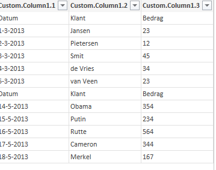

I have been getting quite a few responses <a href="http://www.dutchdatadude.com/combining-text-csv-files-using-power-query-for-excel/">on my original post on how to combine text (csv) files using Power Query</a>. One of the FAQs is how to keep the filename where the data came from in your result set. Said differently: what you want is the contents of all files in a folder plus the filename of the originating files all in one table. I thought it was simply a matter of adding a column, but Nicolas pointed out in a comment that adding a column would create a cross product of all data and all filenames. So, I needed to come up with another solution. The solution I present here might not be the best one, but it works. The magic trick here is knowing that the Csv.Document() function exists. Allow me to explain. First of all, I followed the "normal" approach to list files in the folder using Power Query. What you get is:  Now, it might be tempting to expand the 'Content' column (as I did in the original post). However, as in this scenario the goal is to get the contents as well as keep the originating filename, we need a different approach. What we need to do is add a custom column that equals the following:
<pre class="lang:c# decode:true ">Csv.Document([Content])</pre>
What this is doing is opening the contents in a single column and it expects CSV format. The custom column shows up like this:  Next step is to expand the table. The contents will be displayed in your custom column:  Then, I did a split on the CSV separator (semi-column in this case), so I ended up with three columns:  The only thing left to do is clean up (remove columns) and filter rows (since my CSVs had headers the header from the second CSV is still in my data). The end result is:  For your reference, here is my code:

  
<pre class="lang:c# decode:true ">let
Source = Folder.Files("[Path to the files]"),
#"Inserted Custom" = Table.AddColumn(Source, "Custom", each Csv.Document([Content])),
#"Expand Custom" = Table.ExpandTableColumn(#"Inserted Custom", "Custom", {"Column1"}, {"Custom.Column1"}),
#"Split Column by Delimiter" = Table.SplitColumn(#"Expand Custom","Custom.Column1",Splitter.SplitTextByDelimiter(";"),{"Custom.Column1.1", "Custom.Column1.2", "Custom.Column1.3"}),
#"Changed Type" = Table.TransformColumnTypes(#"Split Column by Delimiter",{{"Custom.Column1.1", type text}, {"Custom.Column1.2", type text}, {"Custom.Column1.3", type text}}),
#"Removed Columns" = Table.RemoveColumns(#"Changed Type",{"Content", "Extension", "Date accessed", "Date modified", "Date created", "Attributes", "Folder Path"}),
#"First Row as Header" = Table.PromoteHeaders(#"Removed Columns"),
#"Renamed Columns" = Table.RenameColumns(#"First Row as Header",{{"Sales Data 1.csv", "Source"}}),
#"Filtered Rows" = Table.SelectRows(#"Renamed Columns", each ([Datum] &lt;&gt; "Datum"))
in
#"Filtered Rows"</pre>

  

With this I hope <a href="http://gravatar.com/sunnysunflowers7">Sunflowers </a>and Nicolas are happy J