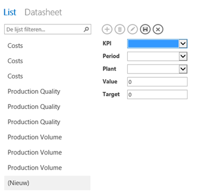
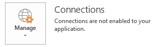
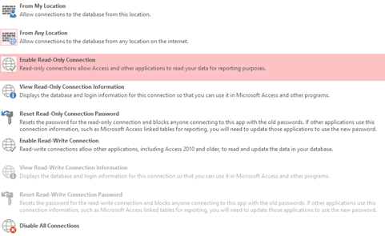
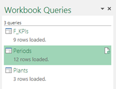
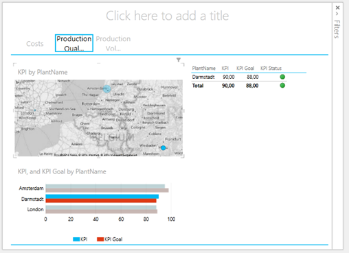

With powerful self-service BI tools such as Power BI comes the need for business user data entry; data does not exist in source systems or does need to be enhanced / enriched before going into the report, or the business user just wants to change the way the data is organized. In those cases (which are present more often than not) we need to find a way to give the business user an easy to use way to do data entry while keeping it robust: i.e. not use a tool the user could easily make mistakes in and hurt the reporting process. You could use Excel but you would have to secure it so no mistakes can be made. Also, SharePoint lists are a good option if you have less than 5000 data rows (that's the hard limit in SharePoint Online). If you need to store a lot of data and need a robust solution, Access Services or Access Online is a great tool for the job and the best part is it works perfectly with Power BI.

Perhaps the biggest change in Access 2013 is that it now stores that in SQL Server Databases rather than Access files. In this post I will show you how to build a sample application concerning reports on KPIs for production plants around the world. The data is entered by the business user using a web form generated by Access and the dashboard is created using Power BI. So here we go.

First step is to get the data. For that I created a simple Access 2013 application that I published on my SharePoint Online site. The Access application consists of three tables: KPIs, Periods, Plants and of course the actual facts: the KPI Values. On top of this sits a very basic data entry screen that enables the user to enter new actuals and targets for a KPI for a period for a given plant:

I entered some test data and saved the app. Imagine your business user just entering their data in here.

The next step is to get the data out of the SQL database Access Services will store it in and build a report / dashboard on top of it. For this, you will need to go to the Info pane of the File menu in Access. Look for the 'Manage' button next to Connections:

If you click it you get a big flyout presenting you with a lot of options. You will need to select the following:

-From My location or From Any location. I chose from Any.

-Enable Read Only connections.

See this screenshot:

Now, click on 'View Read-Only Connection Information' and leave it open for now. You will need to later.

Next step is to start Excel, go to Power Query, select From Database à SQL Server (and not Access since data is stored in SQL Server by default in Access 2013).

Copy paste the server and database name from the Connection information screen in Access and choose Ok. In next screen enter your credentials and passwords (again copy/paste from the connection information screen in Access). After a while you can select the table you are interested in and you can load the data into PowerPivot. I loaded my Plants, Periods and Values (I skipped KPIs since it was only the KPI label):

Next step is to create relationships between tables in PowerPivot, hide some columns as well as add a KPI definition. I ended up with this model:

Now, with Power View I created the following basic report (I did not give myself time to work on the layout, this is just quick and dirty):

&nbsp;

This concludes this Power BI Pro Tip!