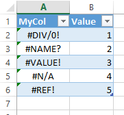
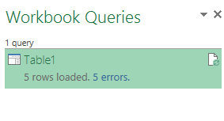
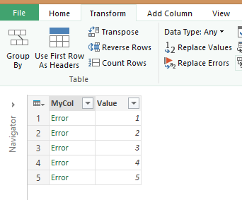
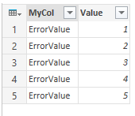

If you use Power Query to read an Excel file that has errors (such as #VALUE, #REF, #N/A, etc) the rows that contain the error will not be loaded into the data model but instead will be flagged as error rows. But what to do if you really want to keep the data rows with the errors with some replacement value for the error instead of skipping the error row altogether?

To demonstrate this I created this simple Excel table that contains only errors (actually all errors that Excel can generate that I am aware of):

How they are generated and what they mean is not the point here, but I am sure most of you have seen some if not all of them before.

On loading this table using Power Query all five rows will be marked as error rows:

As a result, no data is loaded into your data model. This is as expected since Power Query filters out the rows that have an error, which in this case are all of the input rows.

However, in some cases this is not what you want. Suppose this was a 50 column dataset and that in one column sometimes an error occurs. Then do you want to disregard the rows with errors and thus delete all possible valuable info in the rows or do you want to somehow fix the errors and flag them as problematic but still load them? The latter is sometimes the better choice.

This can easily be done by editing the Power Query and using the Replace Errors function (on the Transform tab):

Make sure you have the column with the errors in it selected, enter a valid value for the data type in the column (in my case it was Any since there is really no other data available in the MyCol) and hit OK.

Power Query will replace the error with the value you entered:

Now, on loading the rows with errors will end up in the data model and your data will be flagged with the label you chose.

Hope this helps! Until next time!