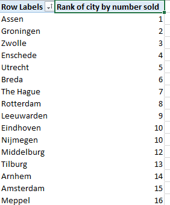

This post serves as a follow-up on <a href="http://www.dutchdatadude.com/power-bi-pro-tip-show-top-x-results-with-rankx-function/">my Power BI Pro Tip about using RANKX to show Top X results</a>. I am writing this because I discovered that there is a lot of confusion about the RANKX() versus the TOPN() function.

Let me try to explain what each function does. The RANKX() function ranks individual data rows according to a certain ranking attribute. It's result is a numerical value associated with each and every single row of the data table, as you can see below:

&nbsp;

Now, the TOPN() function sounds the same, right? That's were the confusion comes from. Also, the call to the function is really similar:

RANKX( ; )

TOPN( ; ; )

&nbsp;

However, TOPN does not return a value for each row in the data table. It returns a table that contains the top N items (N is the number you specified in the first argument) from the original data table according to the ranking attribute you specified.

In itself this is pretty useless, since you cannot display this data in any way. If you could it would be an alternative way to get a top N ranking to RANKX.

To make TOPN useful you need to wrap it in another function, such as SUMX or AVERAGEX. Let's see an example:

MyMeasure := SUMX(TOPN(10;Sales;Sales[Sales Amount]);Sales[Sales Amount])

&nbsp;

Now, MyMeasure equals <em>the sum of sales amount for the best performing cities</em><strong>. </strong>At this point I do not know which cities it were, and maybe that is not even important to you. The total sales amount for the top 10 performers is returned.

This comes in handy when benchmarking an individual or organization against a bigger population. You could do an AVERAGEX of the TOPN result and that would be the average score for the top 10 performers. A dashboard showing how an individual measures up against the top 10 is then quickly created.

&nbsp;

&nbsp;