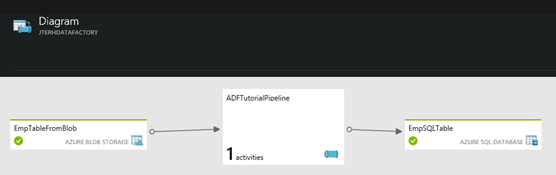

This is the first post of my new <em>first look</em> series. This series focusses on new products, recent announcements, previews or things I have not had the time to provide a first look at and serves as introduction to the subject.
First look posts are fairly short and high level.

Today in <em>first look</em>: <a href="http://azure.microsoft.com/en-us/services/data-factory/">Azure Data Factory</a>. This service was only recently announced as is available to all Azure customers in preview mode. To get a hold of it make sure you open the Azure preview portal. In your classic Azure portal click on your email address in the top right and choose 'Switch to new portal' or go directly to <a href="https://portal.azure.com">https://portal.azure.com</a>.

So what is Azure Data Factory? I may be downplaying it a bit, but essentially Data Factory gives you <a href="http://en.wikipedia.org/wiki/Extract,_transform,_load">ETL</a> in the cloud. It connects to both on premises as well as cloud data stores and enables you to read data from the stores, do transformations and publish data in stores, while at the same time providing rich analytics on how the data flow is doing. The paradigm here is a factory floor: pieces of data enter the factory floor as raw materials, they undergo some treatment (transformations) and go out the door at the other end of the floor as finished product. The canvas of Data Factory closely resembles this floor and shows an assembly line for data. Here is very simple example, which retrieves data in hourly batches from a table in Blob Storage and stores it in a SQL Azure table:

&nbsp;

More info is available on <a href="http://azure.microsoft.com/en-us/documentation/articles/data-factory-introduction/">http://azure.microsoft.com/en-us/documentation/articles/data-factory-introduction/</a>.

More to come!

&nbsp;