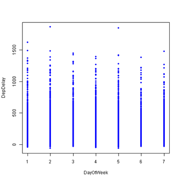
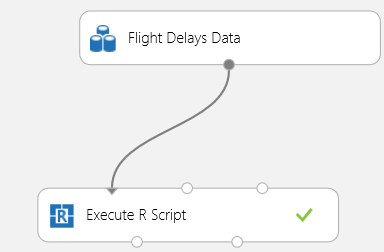
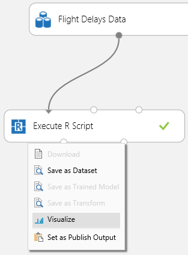

<a href="http://azure.microsoft.com/en-us/services/machine-learning/">Azure Machine Learning</a> is Microsoft's cloud data mining and machine learning solution. It features a studio that is fully web based. One of the best features is integration with R through the 'Execute R Script' component. One of the best things of R is the plotting capability and I recently decided to try to make R plots from Azure ML studio. It is amazing how easy this works and it really brings the power of Azure ML together with the great exploration, plotting and data manipulation capabilities of R.

Here is a very simple sample I made:

I used to Flight Delays sample dataset from Azure ML to make this. In the ML Studio you will need to create a new experiment and drag the 'Flight Delays Data' component to the canvas. The only other component you will need to drop on the canvas is 'Execute R Script' (I told you this was a very simple example). Drag a line from the data to the left most input port of the R script container like so:

Click on the R script component and edit the R script on the right. Here is my script:
<pre>dataset1 &lt;- maml.mapInputPort(1);
data.set = rbind(dataset1);
with(data.set,plot(DepDelay ~ DayOfWeek, col = "blue", pch = 20));
aml.mapOutputPort("data.set");</pre>
&nbsp;

This script gets the data from the input port and rbinds it into data.set. Then I executed a very simple plot using the plot base R package to create the plot shown above. The last line of this code is not even necessary but it was there by default.

After running the experiment the plot can be seen by selecting the right output port of the 'Execute R Script' container and selecting 'Visualize':

The plot will be at the bottom of this page.

Pretty cool huh? Stay tuned for more as I will continue experimenting with R integration in Azure ML as well as other ML things.