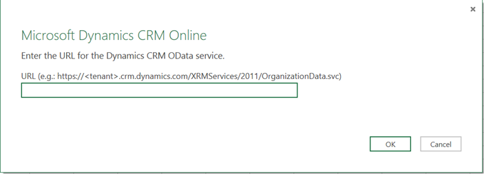
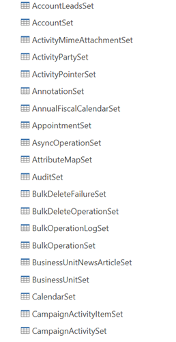
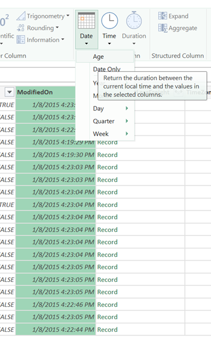
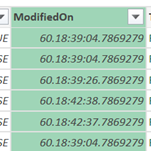

In this walkthrough I will step through the process of connecting to a Dynamics CRM Online instance with Power BI (specifically Power Query).

For this you will need to latest version of Power Query installed. After you launched Excel, navigate to the Power Query tab and choose From Other Sources à Dynamics CRM Online. You will need to enter the service URL in this window:

The OData service URL takes the following format: <a href="https://&lt;tenant&gt;.crm.dynamics.com/XRMServices/2011/OrganizationData.svc">https://.crm.dynamics.com/XRMServices/2011/OrganizationData.svc</a>.

Once you filled out your tenant name click OK. In the next screen you will be asked for your credentials. Since I use a demo environment I will need to use an organizational account. If your organization uses Dynamics CRM Online in production chances are you will be automatically authenticated or can use your Windows account.

Next step is to specify what tables I would like to load:

I chose OpportunitySet, since I wanted to get a list of the opportunities in the system. The opportunities have a modified date which I would like to show as an 'age' in days; meaning that I would like to show the number of days that have passed since the opportunity was last modified. I can easily do that using the Power Query editor (select the table and click Edit); select the ModifiedDate column and use Transform à Date à Age to calculate a rather exact age:

After the transformation the column looks like this:

This is awfully exact, I only wanted the age in number of days. To change this choose Duration à Days:

And now the column reports 60 days.

&nbsp;

As you can see, it is very easy to retrieve data from Dynamics CRM Online; we even did a typical 'age' or 'number of days passed since' type of calculation, because retrieving the data was so easy!