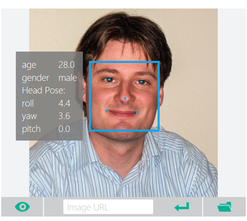
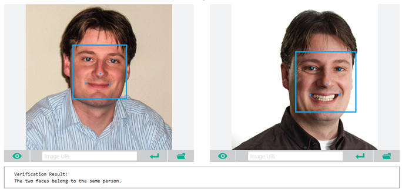

Just announced: Project Oxford (<a href="http://www.projectoxford.ai">http://www.projectoxford.ai</a>), a project that aims at providing powerful APIs for developers that are looking to use face, speech and language recognition capabilities to their applications. The site of Project Oxford provides a way to interact with the APIs currently available.

In this first look we will focus on the Face APIs that can be used for face detection (finding faces in photos, determining gender and age), age verification (checking that a person in two photos is the same), similar face searching, face grouping and face identification.

Here is a sample result of the Face Detection API (you can do this yourself too!) using a photo of me:

This is actually quite good, this picture was made a while ago and I was 29 at the time, so not too far off.

The Face Verification API allows you to check if the person in two photos is the same. Here is the result of my test (again, do this yourself!):

Have a look at that, I turn out to be the same person in both photos J

This is very powerful stuff, I am looking forward to start using this in projects. Will keep you posted on that.