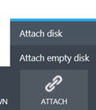
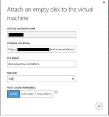
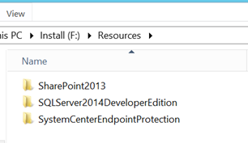

<em>This post is #2 in the series to automatically build a Microsoft BI machine using PowerShell – <a href="http://www.dutchdatadude.com/automatically-building-a-microsoft-bi-machine-using-powershell-start-of-series/">see the start of series</a>.
</em>

The first step in our preparation is making the install files available. I see two options for this, namely using VHD / disk and Azure File Service. In this post we will walk through how to make the install files available using a VHD / disk in Azure.

The way this works is making a new disk that you can store the installer files on. After you created your virtual machine that you would like to automatically you would attached that disk so the installer files are available to the machine and thus to the automatic installer script.

To create a new disk, log in into the Azure portal (either the production or the preview) and navigate to Virtual Machines. Select a machine you have created. This could be the one you will be setting up or any other VM. The disk you will create is re-usable across machines. Once you have a machine selected, click 'Attach' and select 'Attach empty disk' to create a new empty disk:

Enter a file name for the new disk and set up the size in GB you expect to be using. No need to change the host cache settings here. When done, click button at the bottom right:

After the disk has been created, login to the machine you attached the disk to using Remote Desktop. You can you download the install files and save them to the disk you have just attached. In the VM, Start 'Disk management' (for example by right-clicking the Windows button and selecting it from the list). You will see a notification to initialize the disk. Accept the defaults and click OK:

Once the initialization is done we need to create a partition on the disk. In Disk Management, right-click on the new disk and choose 'New Simple Volume'. Follow the steps of the wizard, taking note of the drive letter assigned. Also make sure to set a volume label and wait for the format to finish.

Once the formatting is done, you can download and store you install files to the disk. I created a folder in the root of the disk named 'Resources' and created a sub-folder per software item required. I saved the install files in these folders. The scripts we will create will point to these install files. The scripts I also store on the same install disk.

When you are done downloading the files (and later making the scripts) you can detach the disk from the VM and re-attach it to another machine by using the portal and select the VM that currently has the install disk attached and selecting 'detach disk' and choosing the disk to detach. You can then re-attach the disk to another VM.

This is an OK way to work with the install files. In the next post we will explore an alternative way using Azure File Service.

&nbsp;

&nbsp;

&nbsp;

&nbsp;

&nbsp;