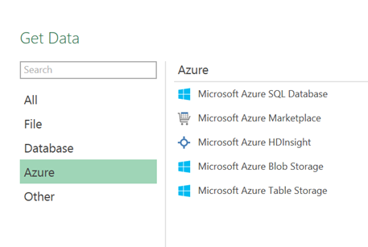
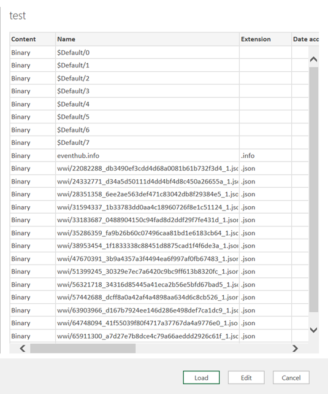
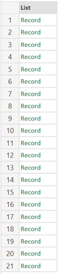
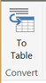
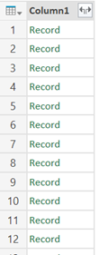
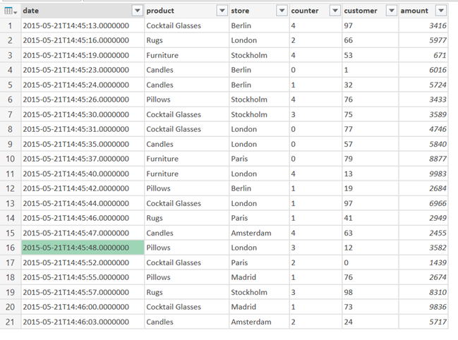
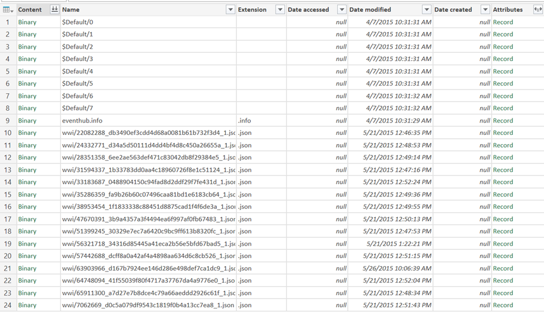
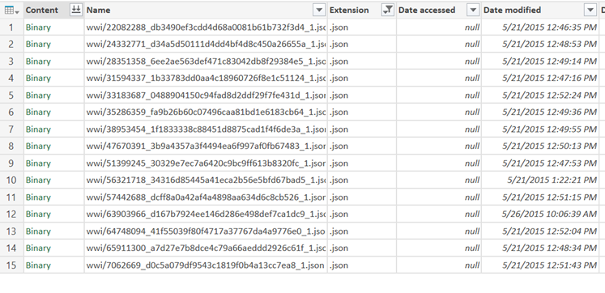
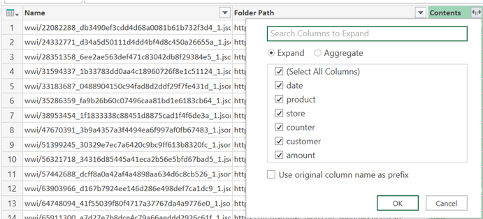

I had to figure out recently how to load multiple JSON files using Power Query. It turned out to be less easy than expected, so I figured it is worth blogging about…

The scenario: I have multiple JSON files sitting in a container in Azure Blob Storage; I would like to load them all into a data model for use in Power BI. I am assuming all the files you want to load are in one container. My solution will not work for multiple containers.

I will be using Power Query for this, from the Power BI Designer. You could do the same using Power Query in Excel.

First, let's connect to the blob storage. This part is easy. Just click Get Data à More in the Power BI Designer and then select 'Azure' and then choose Microsoft Azure Blob Storage and click Connect:

&nbsp;

In Excel, navigate to the Power Query tab, select From Azure à From Microsoft Azure Blob Storage:

&nbsp;

&nbsp;

You will need to enter your Azure Storage account name and key. Next, you will see a list of containers in the blob storage. Select the container the data is in and choose Edit:

&nbsp;

What we will need to do is create a function that loads the JSON files. To do this we use an approach similar to loading multiple Excel or CSV files (see <a href="http://www.dutchdatadude.com/combining-excel-files-using-power-query-for-excel/">here</a> and <a href="http://www.dutchdatadude.com/combining-text-csv-files-using-power-query-for-excel/">here</a> respectively): first we just load one file and then we convert it into a function which we will call for all files we want to load.

So first, click on 'Binary' in the first column for one of the rows representing a JSON file. You will a one column table listing all records in the JSON file (the exact number of rows changes with the length of the JSON file):

What you want to do is convert the records into a table by clicking on the button:

You will probably see a 'to Table' dialogue, allowing customization of the conversion; for JSON you normally should not have to change the defaults, so click OK.

Next step is to expand the resulting Column1 to see some actual data. To do this click the expand button to the right of the column header and click OK (I deselected the 'use original column name as prefix' option):

And voila: a nice looking table of the records in this JSON file:

We are not done however; this was the easy part. Remember we need to create a function that will enable us to iterate over multiple files.

To start editing the code hop over to the Advanced Editor (ViewàAdvanced Editor). Your code should look something like this: (Your last line will be different from mine since it is dependent on the contents of the JSON)
<pre class="lang:c# decode:true ">letSource = AzureStorage.Blobs("yourstorageaccount"),
container = Source{[Name="yourcontainer"]}[Data],
contents = container{[#"Folder Path"="https://yourstorageaccount.blob.core.windows.net/test/",Name="yourjsonfilename"]}[Content],
#"Imported JSON" = Json.Document(contents),
#"Table from List" = Table.FromList(#"Imported JSON", Splitter.SplitByNothing(), null, null, ExtraValues.Error),
#"Expand Column1" = Table.ExpandRecordColumn(#"Table from List", "Column1", {"date", "product", "store", "counter", "customer", "amount"}, {"date", "product", "store", "counter", "customer", "amount"})
in
] #"Expand Column1"</pre>
First, we will need to wrap this in a function, so add this line at the top:
<pre class="lang:c# decode:true ">let LoadJSON = (path,name) =&gt;</pre>
Then, add this at the bottom:
<pre class="lang:c# decode:true ">in LoadJSON</pre>
We need to edit the line that defines 'contents' to look like this:
<pre class="lang:c# decode:true ">Contents = container{[#"Folder Path"=path,Name=name]}[Content]</pre>
Your code should look like this:
<pre class="lang:c# decode:true">let LoadJson = (path,name) =&gt;
let Source = AzureStorage.Blobs("yourstorageaccount"),
container= Source{[Name="yourcontainer"]}[Data],
mysource = container{[#"Folder Path"=path,Name=name]}[Content],
#"Imported JSON" = Json.Document(mysource),
#"Table from List" = Table.FromList(#"Imported JSON", Splitter.SplitByNothing(), null, null, ExtraValues.Error),
#"Expand Column1" = Table.ExpandRecordColumn(#"Table from List", "Column1", {"date", "product", "store", "counter", "customer", "amount"}, {"date", "product", "store", "counter", "customer", "amount"})
in #"Expand Column1"
in LoadJson</pre>
Click 'Done' and give the query a descriptive name (I suggest naming it the same as the function: LoadJSON)… pfew, that was not too bad right? So now, let's use this function on all our JSON files. Let's do the same as we did at the start; connect to the blob and stop at the screen where you have a list of files in the container:

Since we only can apply the function to JSON files, my first step is to filter on the Extension being just '.json':

Then, we need to get rid of all the columns <em>except</em> Name and Folder Path. To do this, select the columns to keep and choose Remove Other Columns.

Now, let's call the function and pass in the path and name parameters. Insert a custom column (Add Column à Add Custom Column) with the following setting:
<pre class="lang:c# decode:true ">LoadJson([Folder Path],[Name])</pre>
Then, we need to expand the resulting custom column by clicking on the little expand button again:

Click 'OK'. Now you have all the contents visible. To clean up lets delete the Name and Folder Path column since we do not need them anymore. Since this is JSON you will probably want to fix data types before reporting on this.

And…. You're done, how cool is this?