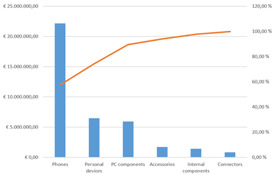
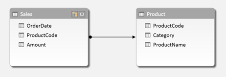
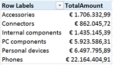
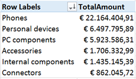
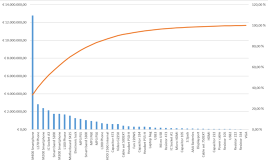
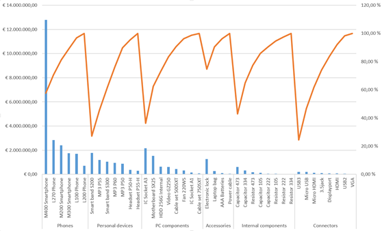

<em>Today's post is a guest post by Michiel Rozema (<a href="https://www.linkedin.com/in/michielrozema">https://www.linkedin.com/in/michielrozema</a>). Thanks Michiel!
</em>

Dutch Data Dude Jeroen approached me with the question whether it would be possible to create a Pareto chart from a Power Pivot model, using DAX. Doing a Pareto analysis using Excel is easy and numerous ways of doing it can be found online, but Jeroen wanted to use DAX formulas and could not find the solution online. I'm always in for a challenge, so here we go…

A Pareto chart (<a href="https://en.wikipedia.org/wiki/Pareto_chart">https://en.wikipedia.org/wiki/Pareto_chart</a>) is a combo chart containing a column chart for a certain value, sorted in descending order, and a line chart with the cumulative column values, expressed as a percentage. Like this:

The issue here is, of course, the cumulative percentage. It resembles a year-to-date total where we have months on the X-axis: for e.g. the month of May, the year-to-date total is the total for all months up to and including May. In the Pareto chart above, the percentage value for Accessories is the total of all product categories up to and including the Accessories category itself. There is no built-in DAX function for this, but as it turns out, a simple combination of a few DAX table functions does the trick; including a use of TOPN that I had not thought of before.

Let's start with the data model. I have created a simple model with two tables, one for sales numbers and one for products:

We want to create a Pareto chart based on product categories, which is actually the chart shown above. For the column values in the chart, I create a basic calculated field:
<pre class="lang:c# decode:true ">TotalAmount:=SUM(Sales[Amount])</pre>
For the cumulative percentage field, we need to calculate the cumulative total and divide that by the total amount for all categories. So let's first create a calculated field for the latter one:
<pre class="lang:c# decode:true ">AmountAllCategories:=CALCULATE([TotalAmount];ALL(Product[Category]))</pre>
In this formula, ALL(Product[Category]) removes an existing filter from the Category column, therefore returning the result [TotalAmount] for all categories instead of only one.

Now it's time to calculate the cumulative total. Let's take the Accessories category as an example. To calculate the cumulative total for Accessories, we need to somehow determine that there are three categories placed to the left of Accessories, calculate their values, and add up the whole thing.

Remember that in the chart, the results for [TotalAmount] are shown in descending order. So we can say that for Accessories, we need to sum all categories for which [TotalAmount] is larger than the result for Accessories. If we had a Category table in our model with [TotalAmount] as a column, we could have made this calculation in a calculated column with a formula like the following:
<pre class="lang:c# decode:true ">=SUMX(FILTER(Category;Category[TotalAmount]&gt;=EARLIER([TotalAmount]));[TotalAmount])</pre>
However, we don't have this column, [TotalAmount] cannot be a column either (we may want to add other tables to the model later on and to be able to filter the chart on customer segment, or year) and using calculated columns is not a good idea in general. So we need to take a different approach using calculated fields, and we cannot use EARLIER because we will not have a row context EARLIER can refer to.

To rephrase the cumulative total problem, we need to be able to pick some categories out of the whole list of categories based on the results of [TotalAmount]. There is a DAX function that can do this: TOPN. The obvious use of TOPN is to do calculation on for instance the top 10 customers, but in this case we will use a variable value of N in TOPN. Taking Accessories as an example again, we need to calculate the total amount for the top 4 categories. But to do that, we need to determine that Accessories is the number 4 category when it comes to [TotalAmount]. For this, we use another table function, RANKX. So we first create the calculated field below:
<pre class="lang:c# decode:true ">CategoryRank:=RANKX(ALL(Product[Category]);[TotalAmount])</pre>
What does RANKX do? To quote the Power Pivot tool tip, it 'Returns the rank of an expression in the current context in the list of values for the expression evaluated for each row in the specified table'. So, our calculation evaluates [TotalAmount] in the current context (in our example, the Accessories category), then loops through the rows of ALL(Product[Category]), which is a list of all categories (remember that ALL is a table function, and we need to use ALL because of the current context), and evaluates [TotalAmount] for each category. It then returns the rank of the result for Accessories in the list for all categories. Below is the list of results of [TotalAmount] for all categories:

When we sort the list in descending order, we can see that indeed, Accessories is the 4th category:

With the rank, we can now calculate the cumulative total using the TOPN function:
<pre class="lang:c# decode:true ">ParetoValueCategory:=SUMX(TOPN([CategoryRank];ALL(Product[Category]);[TotalAmount]);[TotalAmount])</pre>
The calculated table we use in this SUMX statement:
<pre class="lang:c# decode:true">TOPN([CategoryRank];ALL(Product[Category]);[TotalAmount])</pre>
returns, in our example Accessories category, the four categories with the largest value of [TotalAmount]. The SUMX itself sums the [TotalAmount] values of these four categories.

Now, the only thing left to do is to calculate the Pareto percentage:
<pre class="lang:c# decode:true ">Pareto%Category:=DIVIDE([ParetoValueCategory];[AmountAllCategories];BLANK())</pre>
In the chart, we sort on the [TotalAmount] field used for the columns, and put [Pareto%Category] as a line chart on the secondary axis.

Creating a Pareto analysis on the Product level works exactly the same, obviously, the only difference is that we have to take care of two columns that can filter the products, [ProductCode] and [ProductName]. The calculated fields are below:

&nbsp;
<pre class="lang:c# decode:true">AmountAllProduct:= CALCULATE([TotalAmount];ALL(Product[ProductCode];Product[ProductName]))
ProductRank:=RANKX(ALL(Product[ProductCode];Product[ProductName]);[TotalAmount])
ParetoValueProduct:=SUMX(TOPN([ProductRank]; ALL(Product[ProductCode];Product[ProductName]);[TotalAmount]);[TotalAmount])
Pareto%Product:=DIVIDE([ParetoValueProduct];[AmountAllProduct];BLANK())
</pre>
&nbsp;

Here's the Pareto chart with the large number of products:

&nbsp;

Just for fun, we can add categories to the X-axis and have many Pareto charts in one. I don't really think this makes sense, but it's nice that it works and returns the right percentages in each category. It works this way because we used the right ALL statement in our calculations.

So, creating a Pareto chart with mostly DAX can be done. And the combination of RANKX and TOPN turns out to be a very powerful one, which will certainly prove useful in other situations.