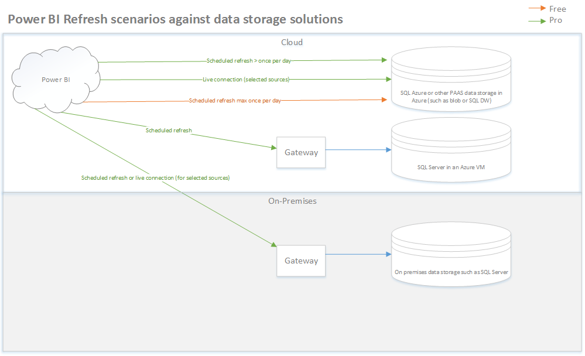

A recurring theme with customers and partners is Power BI data refresh. More specifically, there is some confusion on what refresh scenario requires a Pro version and what can be done with the Free version of Power BI. I made the diagram below to help explain this. It shows the refresh scenarios against data storage solutions, such as SQL Azure, SQL in a virtual machine in Azure or SQL server on premises. I used these as examples, there are other options as well. I think the overall time carries over to other data storage solutions. The diagram shows the refresh that can be done using a Power BI Free account as orange and the refresh scenarios that need Power BI Pro as green lines. As shown in the diagram, if  you want to refresh against on-premises sources or a database running in a VM in Azure you will need a gateway and Power BI Pro. This applies not only to the creator of the report and schedule but also to every consumer. If you use PAAS solutions for data storage in Azure such as SQL Azure, it becomes a bit more difficult and it is really dependent on the type of refresh required. If you need a refresh cycle higher than once a day (either max 8 times per 24 hours or live) you will need Power BI Pro. If you just want to refresh against such as SQL Azure and once a day is enough you can do that using Power BI Free. Again, the license requirement carries over from author to viewer; if the author of the report requires Pro, then the viewers also need Pro.

Hope this helps. If you have any questions or feedback, please comment below!