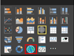

Esri is a leader in the GIS industry and ArcGIS is a very popular product to build great maps. Now, you can use ArcGIS maps in Power BI (in preview). See the official information here: <a href="https://powerbi.microsoft.com/en-us/blog/announcing-arcgis-maps-for-power-bi-by-esri-preview/">https://powerbi.microsoft.com/en-us/blog/announcing-arcgis-maps-for-power-bi-by-esri-preview/</a>. This is really cool, I know a lot of you have been asking for this for a long time!

You will find the option to enable this preview in PowerBI.com, not in the Power BI Desktop. Log in to PowerBI and open the settings. You can find the ArcGIS preview there and enable it by simply selecting the checkbox:

With that enabled, create a report with some geographical information (or edit an existing one). I used the Google Analytics data that keeps track of my blog. Google Analytics data can be loaded into Power BI simply by using the content pack. In edit mode in the report you will find the ArcGIS component in the Visualizations list:

Click it and create your map as you would with the normal map. I noticed it needs some time to build the map (probably due to the preview) but once it is done it is fully interactive with the other items on your report as you would expect:

You can change a lot of the ArcGIS options, such as switching out maps, changing symbol styles, adding reference layers, etc.

I love this – the awesome power of ArcGIS and Power BI combined! I cannot wait to see what you will create with this.