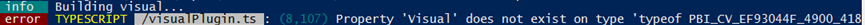

So here you are, creating your very own Power BI custom visual. You have read the documentation and ran the tutorial (<a href="https://github.com/Microsoft/PowerBI-visuals/blob/master/Readme.md">https://github.com/Microsoft/PowerBI-visuals/blob/master/Readme.md</a> and <a href="https://github.com/Microsoft/PowerBI-visuals-sampleBarChart">https://github.com/Microsoft/PowerBI-visuals-sampleBarChart</a>). You feel proud because you are done creating your awesome looking 3d-piechart-barchart-mashup visual. Then it happens. You run: pbiviz start to view your visual and….BAM:

Ouch. Now, before you starting banging your head against the wall until it hurts, here is the solution:

Most probably you have (as good practice dictates) changed the class name of your visual from the default 'Visual' to something more interesting, such as MyAwesome3DpieChartBarChartMashupTheDutchDataDudeIsSoGoingToHateThisVisual.

Well, you forgot to change the visualClassName as specified in pbiviz.json so the code can actually find the entry point for your awesome visual. So, quick fix: open pbiviz.json and change the visualClassName property into your class name (which is hopefully not alike the one above). Save the file, re-run pbiviz start and done!

(I know this is a very newbie / getting started type of error, but it took me more than 5 minutes searching for it when I first encountered it. I figured it is worthwhile saving everyone's time and log it for my own future reference ;))