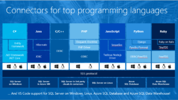

Hi all,

A month ago at the Connect event in New York Microsoft did some anouncements on SQL Server vNext and Azure Data Services.
It's good to see the traction it's getting!

I work with a lot of partners on implementing Microsoft stuff and the partners are very keen in getting the latest info on new capabilities.
Also they enlist in new online and in classroom courses on the new stuff. So let's take a quick look:
<ul>
 	<li>Azure Data Lake store and analytics went live in Novmeber, This is a no limits data lake with on-demand analytics that instantly scales to your needs. With petabyte size files and trillions of objects and parallel processing!</li>
 	<li>R Server for Azure HD Insight for Largest R compatible parallel analytics ML library with terabyte-scale machine learning!</li>
 	<li>SQL Server on Linux public preview is released. Check in out on a linux box!</li>
 	<li>Moving selected Enterprise Edition capabilities to SQL Server Standard like in memory and Polybase.</li>
</ul>
And last but not least: connectivity to all top programming languages!

&nbsp;