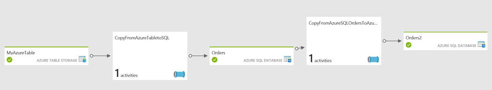
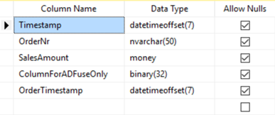

<a href="https://azure.microsoft.com/en-us/services/data-factory/">Azure Data Factory</a> is a fully managed data processing solution offered in Azure. It connects to many sources, both in the cloud as well as on-premises. One of the basic tasks it can do is copying data over from one source to another – for example from a table in Azure Table Storage to an Azure SQL Database table. To get the best performance and avoid unwanted duplicates in the target table, we need to include incremental data load or delta's. Also, we can build mechanisms to further avoid unwanted duplicates when a data pipeline is restarted.

In this post I will explain how to cover both scenario's using a pipeline that takes data from Azure Table Storage, copies it over into Azure SQL and finally brings a subset of the columns over to another Azure SQL table. The result looks like this:

The components are as follows:
<ul>
 	<li>MyAzureTable: the source table in Azure Table Storage</li>
 	<li>CopyFromAzureTableToSQL: the pipeline copying data over into the first SQL table</li>
 	<li>Orders: the first SQL Azure database table</li>
 	<li>CopyFromAzureSQLOrdersToAzureSQLOrders2: the pipeline copying data from the first SQL table to the second – leaving behind certain columns</li>
 	<li>Orders2: the second and last SQL Azure database table</li>
</ul>
Setting up the basics is relatively easy. The devil is in the details, however.
<ol>
 	<li>
<h2>The linked services</h2>
</li>
</ol>
Every data pipeline in Azure Data Factory begins with setting up linked services. In this case, we need two; one to the Azure Table storage and one to SQL Azure. The definition of the linked service to Azure Table Storage is as follows:
<pre class="lang:js decode:true">{
    "name": "MyAzureStorage",
    "properties": {
        "description": "",
        "hubName": "my_hub",
        "type": "AzureStorage",
        "typeProperties": {
            "connectionString": "DefaultEndpointsProtocol=https;AccountName=[yourstorageaccountname];AccountKey=[youraccountkey]"
        }
    }
}</pre>
The SQL Azure linked service definition looks like this:
<pre class="lang:js decode:true ">{
    "name": "MyAzureSQL",
    "properties": {
        "description": "",
        "hubName": "my_hub",
        "type": "AzureSqlDatabase",
        "typeProperties": {
            "connectionString": "Data Source=tcp:[yourdatabase].database.windows.net,1433;Initial Catalog=[yourdatabase];Integrated Security=False;User ID=[youruser]@[yourdatabase];Password=[yourpassword];Connect Timeout=30;Encrypt=True"
        }
    }
}</pre>
Note the name property – we will need to refer to it later.
<ol>
 	<li>
<h2>The datasets</h2>
</li>
</ol>
Datasets define tables or queries that return data that we will process in the pipeline. The first dataset we need to define is the source dataset (called MyAzureTable). The definition is as follows:
<pre class="lang:js decode:true ">{
    "$schema": "http://datafactories.schema.management.azure.com/schemas/2015-09-01/Microsoft.DataFactory.Table.json",
    "name": "MyAzureTable",
    "properties": {
        "type": "AzureTable",
        "typeProperties": {
            "tableName": "[yourtablename]"
        },
        "linkedServiceName": "MyAzureStorage",
        "availability": {
            "frequency": "Hour",
            "interval": 1
        },
		"external":true,
        "policy": { }
    }
}</pre>
Note that, again, this item has a name. We will use it in the pipeline later. Also, you will need to specify the name of your Azure Table in the "tablename" property. Note that the "LinkedServiceName" property is set to the name of the linked service we definied earlier. This way, Azure Data Factory knows where to find the table. Also, the "availability" property specifies the slices Azure Data Factory uses to process the data. This defines how long ADF waits before processing the data as it waits for the specified time to pass before processing. The settings above specify hourly slices, which means that data will be processed every hour. We will later set up the pipeline in such a way that ADF will just process the data that was added or changed in that hour, not all data available (as is the default behavior). Minimum slice size currently is 15 minutes. Also note that the dataset is specified as being external ("external":true). This means that ADF will not try to coördinate tasks for this table as assumes the data will be written from somewhere outside ADF (your application for example) and will be ready for pickup when the slice size is passed.

The target dataset in SQL Azure follows the same definition:
<pre class="lang:js decode:true ">{
    "$schema": "http://datafactories.schema.management.azure.com/schemas/2015-09-01/Microsoft.DataFactory.Table.json",
    "name": "Orders",
    "properties": {
        "type": "AzureSqlTable",
        "linkedServiceName": "MyAzureSQL",
        "structure": [
		{
			"name":"Timstamp",
			"type":"DateTimeOffset"
		},
		{
			"name":"OrderNr",
			"type":"String"
		},
		{
			"name":"SalesAmount",
			"type":"Decimal"
		},
		{
			"name":"ColumnForADFuseOnly",
			"type":"Byte[]"
		},
		{
			"name":"OrderTimestamp",
			"type":"DateTimeOffset"
		}
		],
        "typeProperties": {
            "tableName": "[dbo].[Orders]"
        },
        "availability": {
            "frequency": "Hour",
            "interval": 1
        }
    }
}</pre>
Important to note is that we defined the structure explicitly – it is not required for the working of the first pipeline, but it is for the second, which will use this same table as source. Also note that presence of the column 'ColumnForADuseOnly' in the table. This column is later used by ADF to make sure data that is already processed is not again appended to the target table. Of course, the SQL table itself will need to have (at least) the same columns and matching data types:

<ol>
 	<li>
<h2>The first pipeline (from Azure Table to SQL)</h2>
</li>
</ol>
The first pipeline takes the order data in the Azure table and copies it into the Orders table in SQL Azure. It does that incrementally and with repeatability – which means that a) each slice will only process a specific subset of the data and b) if a slice is restarted the same data will not be copied over twice. This results in a fast processing engine without duplication in the target table – data is copied over once, regardless of the number of restarts. Note that by default ADF copies all data over to the target so you would get so many rows in the table as there are orders in the Azure Table times the number of slices that ran (each slice bringing over the full Azure table). The definition is as follows:
<pre class="lang:js decode:true ">{
    "$schema": "http://datafactories.schema.management.azure.com/schemas/2015-09-01/Microsoft.DataFactory.Pipeline.json",
    "name": "CopyFromAzureTabletoSQL",
    "properties": {
        "description": "Copies data incrementally from Azure Table Orders to Azure SQL Orders table",
        "activities": [
            {
                "name": "CopyActivityTemplate",
                "type": "Copy",
                "inputs": [
                    {
                        "name": "MyAzureTable"
                    }
                ],
                "outputs": [
                    {
                        "name": "Orders"
                    }
                ],
                "typeProperties": {
                    "source": {
                        "type": "AzureTableSource",
						"azureTableSourceQuery": "$$Text.Format('OrderTimestamp ge datetime\\'{0:yyyy-MM-ddTHH:mm:ssZ}\\' and OrderTimestamp lt datetime\\'{1:yyyy-MM-ddTHH:mm:ssZ}\\'', SliceStart,SliceEnd)"
                    },
                    "sink": {
                        "type": "SqlSink",
						"sliceIdentifierColumnName": "ColumnForADFuseOnly"
                    }
                },
                "policy": {
                    "concurrency": 10,
                    "executionPriorityOrder": "OldestFirst",
                    "retry": 3,
                    "timeout": "01:00:00"
                },
                "scheduler": {
                    "frequency": "Hour",
                    "interval": 1
                }
            }
        ],
        "start": "2017-03-20T09:00:00Z",
        "end": "2017-03-22T09:00:00Z"
    }
}</pre>
Note that the pipeline consists of a single activity, which is a Copy activity. I could have specified another activity in the same pipeline – I have not done so for simplicity. The Copy activity takes as input the Azure Table (MyAzureTable) and outputs into the SQL Azure Table "Orders". The source Query is very important – as this is used to select just the data we want! We use the column 'OrderTimestamp' which and select only the orders from MyAzureTable where the OrderTimestamp is greater than or equal to the starting time of the slice and less than the end time of the slice. A sample query against the Azure Table executed in this way looks like this:

OrderTimestamp ge datetime'2017-03-20T13:00:00Z' and OrderTimestamp lt datetime'2017-03-20T15:00:00Z'

Also, look at the specification of the "sliceIdentifierColumnName" property on the target (sink) – this column is in the target SQL Azure table and is used by ADF to keep track of what data is already copied over so if the slice is restarted the same data is not copied over twice.

This pipeline will run each hour ("scheduler" properties), starting at 09:00:00 local clock ("specified by the "start" property) and can run 10 slices in parallel (specified by the "concurrency" property).
<ol>
 	<li>
<h2>The second pipeline (from SQL to SQL)</h2>
</li>
</ol>
The second pipeline is there to prove the mapping of specific columns to others as well as showing how to do an incremental load from SQL Azure to another target. Note that I use the same linked service so this exercise is not really useful – the same effect could be retrieved by creating a view. The definition is as follows:
<pre class="lang:js decode:true ">{
    "name": "CopyFromAzureSQLOrdersToAzureSQLOrders2",
    "properties": {
        "activities": [
            {
                "type": "Copy",
                "typeProperties": {
                    "source": {
                        "type": "SqlSource",
                        "sqlReaderQuery": "$$Text.Format('select * from [dbo].[Orders] where [OrderTimestamp] &gt;= \\'{0:yyyy-MM-dd HH:mm}\\' AND [OrderTimestamp] &lt; \\'{1:yyyy-MM-dd HH:mm}\\'', WindowStart, WindowEnd)"
                    },
                    "sink": {
                        "type": "SqlSink",
                        "sliceIdentifierColumnName": "ColumnForADFuseOnly2",
                        "writeBatchSize": 0,
                        "writeBatchTimeout": "00:00:00"
                    },
                    "translator": {
                        "type": "TabularTranslator",
                        "columnMappings": "SalesAmount:SalesAmount,OrderTimestamp:OrderTimestamp"
                    },
                    "parallelCopies": 10
                },
                "inputs": [
                    {
                        "name": "Orders"
                    }
                ],
                "outputs": [
                    {
                        "name": "Orders2"
                    }
                ],
                "policy": {
                    "timeout": "1.00:00:00",
                    "concurrency": 1,
                    "executionPriorityOrder": "NewestFirst",
                    "style": "StartOfInterval",
                    "retry": 3,
                    "longRetry": 0,
                    "longRetryInterval": "00:00:00"
                },
                "scheduler": {
                    "frequency": "Hour",
                    "interval": 1
                },
                "name": "Activity-0-[dbo]_[Orders]-&gt;[dbo]_[Orders2]"
            }
        ],
        "start": "2017-03-21T10:45:38.999Z",
        "end": "2099-12-30T23:00:00Z",
        "isPaused": false,
        "hubName": "my_hub",
        "pipelineMode": "Scheduled"
    }
}</pre>
Note that we specify a "sqlReaderQuery" this time which selects the right subset of data for the slice. We use WindowStart and WindowEnd this time instead of SliceStart and SliceEnd earlier. At this point is does not matter as ADF requires both to be the same. WindowStart and WindowEnd refer to the pipeline start and end times, while SliceStart and SliceEnd refer to the slice start and end times. Using the "translator" properties we specify which columns to map – note that we copy over SalesAmount and OrderTimestamp exclusively.

There you have it – a fully incremental, repeatable data pipeline in Azure Data Factory, thanks to setting up a smart source query and using the "sliceIdentifierColumnName" property. <a href="https://github.com/jeroenterheerdt/dutchdatadude/tree/master/Implementing-incremental-data-load-using-Azure-Data-Factory">The full source code is available on Github</a>. More info on how this works is<a href="https://docs.microsoft.com/en-us/azure/data-factory/data-factory-azure-table-connector"> available in the official documentation.</a>

Questions? Remarks? Let me know!