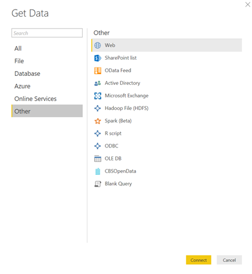
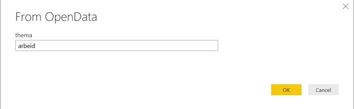
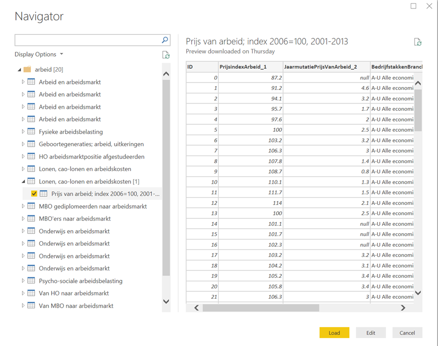
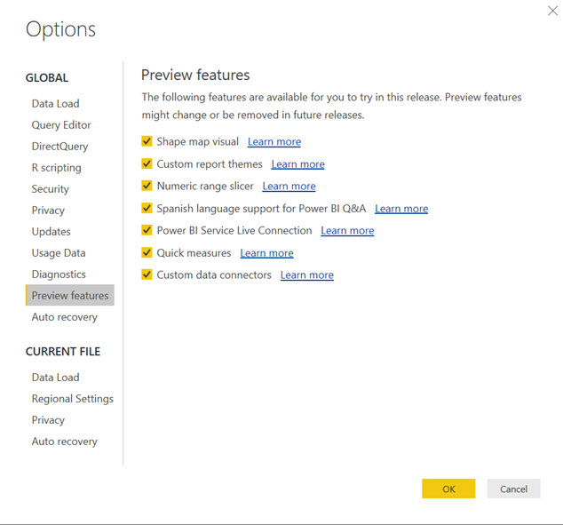

<em>Updated 7/10/2018: path updated below and new file on GitHub.</em>

<em>Since this post primarily concerns a Dutch data source, the rest of this post will be in Dutch. English summary below.
</em>

De open data die het Centraal Bureau voor de Statistiek (CBS) via Statline (<a href="http://statline.cbs.nl">http://statline.cbs.nl</a>) aanlevert is van onschatbare waarde voor analisten. Over diverse thema's wordt informatie gepubliceerd, zoals woning, demografie, inkomen en arbeid. Erg handig om je verkopen per provincie te vergelijken met de samenstelling van de bevolking bijvoorbeeld. De juiste informatie uit Statline halen was erg lastig, maar dankzij de Power BI Connector voor CBS Open Data / Statline is dat niet meer het geval.
<h3>Gebruik</h3>
Wanneer je de connector hebt geïnstalleerd (zie beneden) vind je de connector in de lijst met data bronnen in Power BI Desktop:

Klik op <strong>CBSOpenData</strong> en klik <strong>Connect</strong>. Vul één of meerdere zoekwoorden in (bijvoorbeeld arbeid) en klik <strong>OK</strong>:

De connector communiceert met de CBS Statline website en levert de thema's en eventueel bijbehorende tabellen. Dit kan een tijdje duren, afhankelijk van het aantal thema's en tabellen die horen bij de woorden die je ingevoerd hebt. Kies één of meerdere tabellen en je kunt ze laten of bewerken! Eenvoudiger wordt het niet!

<h2></h2>
<h2>Installatie</h2>
Omdat de custom connectors nog erg nieuw zijn is er op dit moment een omweg nodig om ze te kunnen gebruiken in Power BI Desktop. Volg deze stappen:
<ol>
 	<li>

Zet de <strong>Custom data connectors</strong> preview feature aan binnen Power BI Desktop via File à Options:

</li>
 	<li>Sluit Power BI Desktop.</li>
 	<li><a href="https://github.com/Microsoft/DataConnectors">Lees de documentatie op Github</a> om te zien welke directory je moet maken om Power BI de custom connectors te laten laden. Op dit moment is dat <strong>[My Documents]\Power BI Desktop\Custom Connectors.</strong></li>
 	<li>Download <a href="https://github.com/jeroenterheerdt/PowerBI-CBS-OpenData/blob/master/CBSOpenData/bin/Release/CBSOpenData.mez">het .mez bestand van de Github van de CBS Open Data connector</a> en sla het bestand op in de directory die je net gemaakt hebt. <a href="https://github.com/jeroenterheerdt/PowerBI-CBS-OpenData">Je kunt natuurlijk ook de source code helemaal bekijken</a>.</li>
 	<li>Start Power BI Desktop op. Als het goed is staat de connector nu onder 'Other' in de lijst (zie screenshot bovenaan in deze post). De snelheid van ophalen is niet hoog, omdat er gebruik wordt gemaakt van de publieke API, maar toch, met wat geduld moet het werken. Veel succes!</li>
</ol>
<h2>English</h2>
The CBS Open Data / Statline website (<a href="http://statline.cbs.nl">http://statline.cbs.nl</a>) is a very popular source of all types of statistical information about the Netherlands, provided by the government. In order to use this connector in Power BI, <a href="https://github.com/jeroenterheerdt/PowerBI-CBS-OpenData/blob/master/CBSOpenData/bin/Release/CBSOpenData.mez">download the .mez file from Github</a> and save the file in your custom connectors directory. <a href="https://github.com/Microsoft/DataConnectors">Please see the documentation to find which directory to use.</a> Enable the Custom Connectors preview feature in Power BI Desktop, restart Power BI and the connector should show up. <a href="https://github.com/jeroenterheerdt/PowerBI-CBS-OpenData">You can of course also look at the source code on Github</a>. Enjoy!