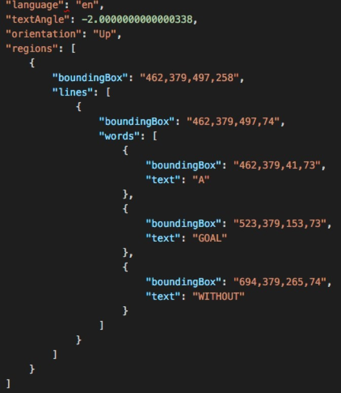
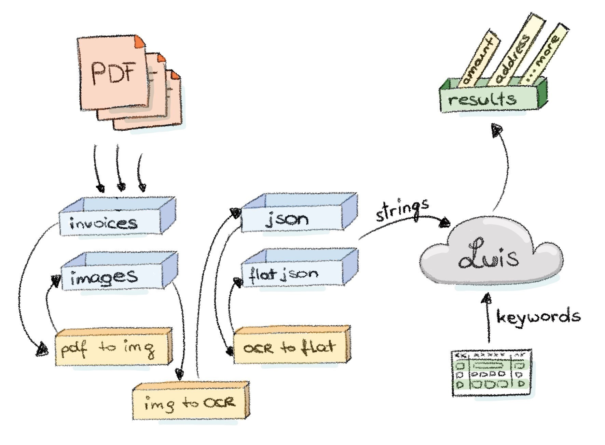

<em>Automating a data wrangling pipeline using chained Azure Functions.&nbsp;</em><i>This post and its code was co-authored with</i> <a href="https://medium.com/@codeprincess/">Codeprincess<em>.</em></a>

Machine Learning is all about data... and algorithms. But first and most importantly it's about data. And it's not just any data, we need <em>enough</em>, <em>high quality</em> and (and in many cases) "cleaned" data. When we talk about cleaning data, we normally use the word ‘wrangling’. Wrangling is like washing clothes: your dirty data goes in and clean, neatly ironed and folded data comes out. We know from experience and research that data scientists spend 80% of their time wrangling (=cleaning) data – no wonder people call them “data janitors” from time to time!

<em>Waste of talent
</em>OK, your data scientists are spending most of their time on janitor and wrangler tasks. So what? Well, it turns out you normally do not need actual data scientists to do wrangling. You can leave that to others and have data scientists do what they do best: casting obscure mathematical spells to teach data tricks.
Mostly wrangling data is a sequential process of certain steps which need to be executed. In many cases this is executed by hand either using visual tools or by creating scripts. It all starts with data exploration to get an grasp of the data before taking steps to wrangle it.

<em>Automating the data wrangling process
</em>To speed up the wrangling process on the one hand and make it less painful on the other hand, we can automate the process. A great technology to use is <a href="https://azure.microsoft.com/en-us/services/functions/">Azure Functions</a>. Azure Functions are stateless, serverless, short-running pieces of code. You can write them in many languages, we used C# and JavaScript in this situation. Each step on the wrangling process goes into its own Azure Function which then will chained to each other to form a pipeline where dirty data goes in and clean data goes out.

<em>The scenario
</em>Let's start and have a look at a real-life scenario on how we set up the "make life of data scientists"-process easier. But first let's look at the task which our process shall take care of.

A lovely customer of Microsoft Italy, wants to retrieve certain information from printed receipts like the total price, the sender and the receiver. Sounds easy enough, right? Well, think again. Receipts come in many different shapes and sizes. Some are taxi-like receipts or those little receipts you get from parking machines or handheld payment terminals. Other might meticulously designed hotel bills or even span multiple pages . In other words the receipts in question don't have nearly anything in common. What they did have in common though is that they were saved as PDFs.

<em>The approach
</em>Our approach - as we sat down together in Milan during a week of hacking -&nbsp; was the following. We first collected a big bunch of keywords which indicate that around this word the information we are looking for could be found. For example the keyword "Totale" was always near the total amount - which is info we want to retrieve from the receipt. In this manner we went on and tried to collect as many keywords which match patterns like this.

By having the idea of "the keyword indicates where our info is probably located" we started looking through different services which can give us location info of text on a document. The search was quite short though, because we remembered that the <a href="https://azure.microsoft.com/en-us/services/cognitive-services/">Cognitive Services toolbox</a> has something useful here: the <a href="https://westcentralus.dev.cognitive.microsoft.com/docs/services/56f91f2d778daf23d8ec6739/operations/56f91f2e778daf14a499e1fc">Computer Vision OCR API</a>. It returns OCRed text from a picture and gives additional info on the location of the text.

The location data of the text is structured in regions, which then have lines, which then have words. So we get not only location-identical text packed together - we might even get semantic info out of this if we assume that info which is close to each other just belongs to each other :)

So our first step then was to convert our input PDF receipts into images, because our Computer Vision OCR API just takes images as an input. Those images were then scanned by the service for text and returned with its location metadata in JSON format (remember the region-line-word trio). See image above for a sample result of the OCR API.

For further analysis the JSON format was not that practical yet. That's why we decided to flatten it. We cleaned out the detailed info about the regions and just packed all the text within one region together into a single string. The advantage of this was then to easily scan the strings for keywords. Imagine scanning the strings for the keyword "Totale" and if it fits have then a look for a number in that same string. The keyword "Totale" and if it fits have then a look for a number in that same string. The possibility is then quite high that we have found the total amount of the receipt. Victory!

That's the basic process for preparing the data for the later following Machine Learning, with which the data can be analyzed further and the algorithm even learns from the structure of the documents and can provide a better detection than just heuristics.

Technically we developed the entire process with just two different cloud components:

-&nbsp;&nbsp;&nbsp;&nbsp;&nbsp;&nbsp; Azure Functions

-&nbsp;&nbsp;&nbsp;&nbsp;&nbsp;&nbsp; Azure Blob Storage

For each processing step we created an Azure Function to host and run the logic. And the blob storage was put in place to save the result of each logic step. To make things complete we kick off the pipeline with a blob storage - because all the receipt PDFs were saved in a blob storage. When a new PDF is uploaded to that blob storage the pipeline kicks into action and processes the PDF.

<em>Final architecture
</em>The little illustration shall give a good overview of what we have done here.

But to be on the safe side let's look at the workflow in detail so that we don't miss anything essential.

-&nbsp;&nbsp;&nbsp;&nbsp;&nbsp;&nbsp; Suddenly! A wild document appears!

-&nbsp;&nbsp;&nbsp;&nbsp;&nbsp;&nbsp; The document is saved in a blob storage, let's say in folder "documents".

-&nbsp;&nbsp;&nbsp;&nbsp;&nbsp;&nbsp;&nbsp;&nbsp; The first Azure Function (called <em>PdfToPng</em>, written in C#) starts running. It is blob storage triggered and converts the PDF to an PNG to save it in the blob storage folder "images". This function depends on GhostScript to do the conversion. Have a look at <a href="http://lightswitchhelpwebsite.com/Blog/tabid/61/EntryId/3303/Convert-PDF-files-to-PNG-Images-using-Azure-Functions.aspx">this post</a> for a step by step process on how to set-up the dependencies.

-&nbsp;&nbsp;&nbsp;&nbsp;&nbsp;&nbsp;&nbsp;&nbsp; The creation of this PNG file triggers the next Azure Function (called <em>PngToOcr</em>, written in C#). This function takes the image through the OCR service to save the JSON result in the blob storage folder "json".

-&nbsp;&nbsp;&nbsp;&nbsp;&nbsp;&nbsp;&nbsp;&nbsp; By now it should be no surprise that another Azure Function is then triggered (called <em>OcrToFlat, </em>written in Node.js). It takes the JSON data and just creates a single string out of all the text within one detected OCR region to save it in the blob storage folder "flatjson".

Done! And the incredible thing is - Azure Functions are running "serverless" which means we had no overhead work with setting them up. All we did is "just" put our code in them, define the trigger and where the output should go. We even mixed and matched programming languages, using whatever suited best for that step and/or was the preference of the developer. Our chain was set up! Another big advantage is that Functions run in parallel - or better to say "scale out" -&nbsp; which saves us a lot of time. The chain is triggered for each document individually which is put into the "documents" folder. So there are no actual waiting times for each document to get processed.

In the illustration we have one additional component which was not mentioned by now, which is LUIS. LUIS is the <a href="https://azure.microsoft.com/en-us/services/cognitive-services/language-understanding-intelligent-service/">Language Understanding Service</a> from the same toolbox we're already using for the Computer Vision OCR API. But other than the OCR API, LUIS does not detect text from images, it detects <em>intent</em> and <em>meaning</em> from text. This is great for our data set because with LUIS we can find out what a flat string, which we are producing in the last step of our chain - is all about. So additionally to just plain keyword matching we can use this smart service to get higher hit rates on finding the info we want from our recipes.

<em>The Code
</em>All of the code is available on this <a href="https://github.com/ms-cse/digitalweekmilanML">Github repo</a>.

You must admit - it's a little bit awesome :) And technology just rocks :D What do you think?

&nbsp;