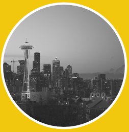
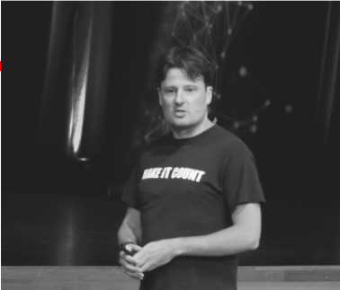

DUTCH DATA DUDE
FAREWELL TOUR

A CHANGE IS GONNA COME
Na bijna 10 jaar waag ik de grote stap. Ik verhuis naar Amerika en ga voor Microsoft in Seattle aan de slag. Daarmee komt er een einde aan mijn werk als Dutch Data Dude in Nederland (en daarbuiten). Werk dat ik met veel passie heb gedaan en heb kunnen doen dankzij en met jullie. Om dit deel gepast af te sluiten doe ik een FAREWELL TOUR: ik klim nog een laatste keer op het podium. Bij jullie, voor jullie. Want jullie hebben mij in staat gesteld te worden wie ik wilde zijn: het geluid van Microsoft rondom data en Artificial Intelligence. Dutch Data Dude signs off.

DE TOUR

Tijdens de FAREWELL TOUR geef ik in korte tijd een flink aantal presentaties.
Dit organiseer ik samen met partners in October / November 2018. Het onderwerp van de presentaties is Business Intelligence, Big Data, Machine Learning of Artificial Intelligence. Soms staat mijn presentatie op zich, soms is het onderdeel van een groter geheel. Alles in samenspraak met de organiserende partner. Ik hoop je te mogen begroeten tijdens de FAREWELL TOUR.

DE LOCATIES

Hieronder staan de locaties die ik aandoe tijdens mijn FAREWELL TOUR. Voor publieke evenementen kun je je direct inschrijven via de aangegeven link.

<table style="border: none; font-family: 'Raleway'; color: #666666; font-size: 14px; line-height: 150%; text-align: center;">
<thead>
<tr>
<th>Datum</th>
<th>Tijd</th>
<th>Plaats</th>
<th>Organisatie</th>
<th>Soort evenement</th>
<th>Inschrijven</th>
</tr>
</thead>
<tbody>
<tr>
<td>17 October</td>
<td>10:00</td>
<td>Bussum</td>
<td>CraniumConnect</td>
<td>Voor leden</td>
<td><a href="https://www.craniumconnect.com/events/roundtable-executive-community/">Website</a></td>
</tr>
<tr>
<td>17 October</td>
<td>17:00</td>
<td>Den Haag</td>
<td>TopBI</td>
<td>Intern</td>
<td>n.v.t.</td>
</tr>
<tr>
<td>18 October</td>
<td>17:00</td>
<td>Amsterdam</td>
<td>QNH</td>
<td>Intern</td>
<td>n.v.t.</td>
</tr>
<tr>
<td>23 October</td>
<td>16:00</td>
<td>Amsterdam</td>
<td>Datafied</td>
<td>Publiek</td>
<td><a href="https://www.eventbrite.com/e/datafied-people-analytics-meet-up-tickets-50950066019">Inschrijven</a></td>
</tr>
<tr>
<td>25 October</td>
<td>18:00</td>
<td>Rotterdam</td>
<td>Motion10</td>
<td>Publiek</td>
<td><a href="https://www.werkenbijmotion10.nl/evenement/a0O1n00000LsOE5EAN/becoming-a-data-driven-organization-2/">Inschrijven</a></td>
</tr>
<tr>
<td>29 October</td>
<td>16:30</td>
<td>Eindhoven</td>
<td>Valid</td>
<td>Publiek</td>
<td><a href="https://info.valid.nl/dutch-data-dude-farewell-tour?utm_content=78111060&amp;utm_medium=social&amp;utm_source=dutchdatadude">Inschrijven</a></td>
</tr>
<tr>
<td>30 October</td>
<td>13:30</td>
<td>Veenendaal</td>
<td>HSO</td>
<td>Op uitnodiging</td>
<td><a href="https://inspiratiedag.hso.com/nl">Website</a></td>
</tr>
<tr>
<td>30 October</td>
<td>16:00</td>
<td>Huizen</td>
<td>Sigma Data Consulting</td>
<td>Intern</td>
<td>n.v.t.</td>
</tr>
<tr>
<td>31 October</td>
<td>17:00</td>
<td>Vianen</td>
<td>Rubicon</td>
<td>Publiek</td>
<td><a href="https://werkenbijrubicon.nl/evenementen/big-data-meetup">Inschrijven</a></td>
</tr>
<tr>
<td>2 November</td>
<td>09:00</td>
<td>Amsterdam</td>
<td>Breinwave</td>
<td>Op uitnodiging</td>
<td>n.v.t.</td>
</tr>
<tr>
<td>6 November</td>
<td>13:30</td>
<td>Veenendaal</td>
<td>Hillstar</td>
<td>Publiek</td>
<td><a href="https://hillstar.nl/next-in-intelligence-farewell-tour-van-jeroen-ter-heerdt-welkom-in-nieuw-kantoor/">Inschrijven</a></td>
</tr>
<tr>
<td>7 November</td>
<td>19:00</td>
<td>Veenendaal</td>
<td>Infosupport</td>
<td>Publiek (beperkt aantal plaatsen)</td>
<td><a href="https://blogs.infosupport.com/event/dutch-data-dude-farewell-tour/">Inschrijven</a></td>
</tr>
<tr>
<td>8 November</td>
<td>14:30</td>
<td>Hoofddorp</td>
<td>Macaw</td>
<td>Publiek</td>
<td><a href="https://www.macaw.nl/inspiratie/events/macaw-data-update">Inschrijven</a></td>
</tr>
<tr>
<td>12 November</td>
<td>13:30</td>
<td>Utrecht</td>
<td>Axians</td>
<td>Intern</td>
<td>n.v.t.</td>
</tr>
<tr>
<td>13 November</td>
<td>17:30</td>
<td>Utrecht</td>
<td>Caesar Experts</td>
<td>Publiek</td>
<td><a href="https://www.eventbrite.nl/e/tickets-een-avond-met-jeroen-jeroen-hoera-een-data-gedreven-organisatie-51265592768?aff=ebdssbdestsearch">Inschrijven</a></td>
</tr>
<tr>
<td>14 November</td>
<td>10:00</td>
<td>Bussum</td>
<td>CraniumConnect</td>
<td>Voor leden</td>
<td><a href="https://www.craniumconnect.com/events/dynamics-experience-2018/">Website</a></td>
</tr>
<tr>
<td>14 November</td>
<td>18:00</td>
<td>Vianen</td>
<td>Sogeti</td>
<td>Intern</td>
<td>n.v.t.</td>
</tr>
<tr>
<td>15 November</td>
<td>15:00</td>
<td>Amsterdam</td>
<td>Ireckonu</td>
<td>Op uitnodiging</td>
<td>n.v.t.</td>
</tr>
<tr>
<td>29 November</td>
<td>17:00</td>
<td>Den Bosch</td>
<td>Power BI Gebruikersgroep</td>
<td>Publiek</td>
<td><a href="http://pbig.nl/events/dutch-data-dude-farewell-tour/">Inschrijven</a></td>
</tr>
</tbody>
</table>

