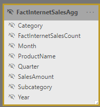
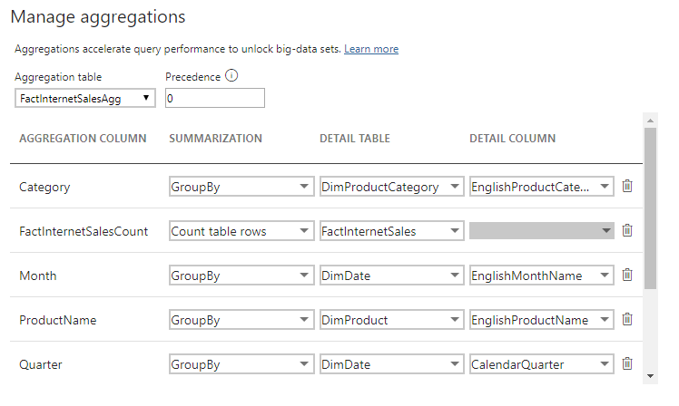
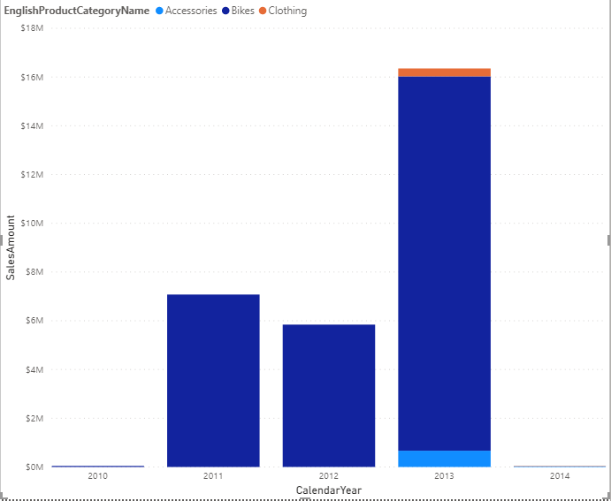
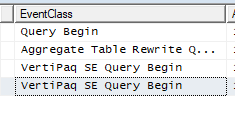
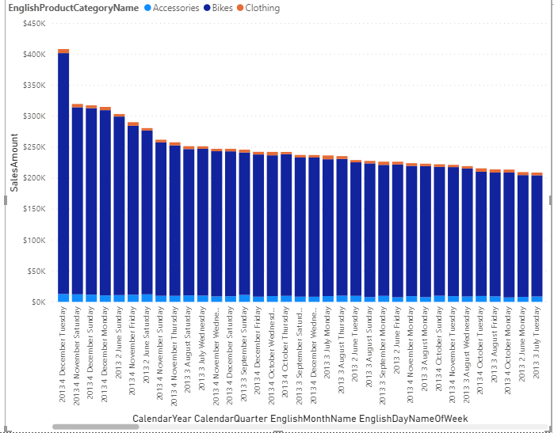
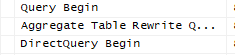

<!-- wp:paragraph -->

One of the first things I did after joining the Power BI Desktop team is catching up to reality - the speed of innovation in this team is amazing and I had a lot of reading to do. One of the first things on my list were aggregations.

<!-- /wp:paragraph -->

<!-- wp:paragraph -->

Aggregations bring me back to the good old SSAS Multidimensional days. The days that I invariably built the aggregations tree the wrong way around, SSAS would complain, I would scream and eventually give in. 

<!-- /wp:paragraph -->

<!-- wp:paragraph -->

You can imagine that I was curious but skeptical when I tried <a href="https://docs.microsoft.com/en-us/power-bi/desktop-aggregations">aggregations in Power BI Desktop.</a> I was afraid of ending up in the same hate-but-need relationship that I had with SSAS multidimensional when it came to aggregations.

<!-- /wp:paragraph -->

<!-- wp:paragraph -->

The good news? It is not like that. At all. Once you have aggregations working, they are great. 

<!-- /wp:paragraph -->

<!-- wp:paragraph -->

The not so good news? It took me longer than I am willing to admit getting them working - primarily due to data types and creation of the aggregated table. More details in this blog post.

<!-- /wp:paragraph -->

<!-- wp:heading -->
<h2><strong>Why care about aggregations?</strong></h2>
<!-- /wp:heading -->

<!-- wp:paragraph -->

I see aggregations as pre-calculations - you identify datasets that you would need to return often and by pre-calculating the results and storing them performance is improved, resulting in a better end-user experience. The difference is dramatic, especially when dealing with big data. If the detail table you are aggregating over contains billions of rows and your aggregation table just mere millions, you and your users will benefit greatly. You leave your source in DirectQuery mode so you are not importing the huge table to Power BI and create the aggregation table in Import mode so it is included in the Power BI data model.

<!-- /wp:paragraph -->

<!-- wp:heading -->
<h2><strong>Setting up aggregations</strong></h2>
<!-- /wp:heading -->

<!-- wp:paragraph -->

The documentation explains about everything there is to know about <a href="https://docs.microsoft.com/en-us/power-bi/desktop-aggregations">aggregations in Power BI Desktop</a>. I suggest you read it before reading on. The devil, however, is in the detail, specifically with data types and creating the aggregation table itself. The documentation expects you to know how to create the aggregation table. I will explain how I did it later in this blog post.

<!-- /wp:paragraph -->

<!-- wp:heading {"level":3} -->
<h3><strong>Data types</strong></h3>
<!-- /wp:heading -->

<!-- wp:paragraph -->

First, the biggest problem I faced when working with aggregations: data types. Check your data types and check them again. Whenever you cannot select your detail column in the 'Manage Aggregations' screen you probably have a data type mismatch between the Aggregation Column and the Detail Column. I had, every time I ran into trouble here. 

<!-- /wp:paragraph -->

<!-- wp:image -->
<figure class="wp-block-image"></figure>
<!-- /wp:image -->

<!-- wp:heading {"level":3} -->
<h3>Creating the aggregation table</h3>
<!-- /wp:heading -->

<!-- wp:paragraph -->

Creating the aggregation table can either be done by writing a query against the source doing a group by or something equivalent or doing that in PowerQuery. I chose the last option and it was simple if you remember to include all the metrics you want included in your aggregations (duh) as well as any dimension column! It is not enough to just include the key to your date table if you want the aggregation to work on Month or Year level. You will have to include those levels as well (just like in SSAS multidimensional). 

<!-- /wp:paragraph -->

<!-- wp:paragraph -->

Using the AdventureWorks sample DWH I created an aggregation table that summarizes SalesAmount from FactInternetSales by product category, product subcategory, productname, month, quarter, and year and includes a row count.

<!-- /wp:paragraph -->

<!-- wp:image {"id":7632,"sizeSlug":"large"} -->
<figure class="wp-block-image size-large"></figure>
<!-- /wp:image -->

<!-- wp:paragraph -->

The quick-and-dirty PowerQuery query for this is:

<!-- /wp:paragraph -->

<!-- wp:preformatted -->

  
<pre class="wp-block-preformatted">let
Source = Sql.Databases(myserver),
AdventureWorksDW2017 = Source{[Name="AdventureWorksDW2017"]}[Data],
dbo_FactInternetSales = AdventureWorksDW2017{[Schema="dbo",Item="FactInternetSales"]}[Data],
#"Expanded DimDate(OrderDateKey)" = Table.ExpandRecordColumn(dbo_FactInternetSales, "DimDate(OrderDateKey)", {"EnglishMonthName", "CalendarQuarter", "CalendarYear"}, {"DimDate(OrderDateKey).EnglishMonthName", "DimDate(OrderDateKey).CalendarQuarter", "DimDate(OrderDateKey).CalendarYear"}),
#"Expanded DimProduct" = Table.ExpandRecordColumn(#"Expanded DimDate(OrderDateKey)", "DimProduct", {"EnglishProductName", "DimProductSubcategory"}, {"DimProduct.EnglishProductName", "DimProduct.DimProductSubcategory"}),
#"Renamed Columns" = Table.RenameColumns(#"Expanded DimProduct",{{"DimProduct.EnglishProductName", "ProductName"}}),
#"Expanded DimProduct.DimProductSubcategory" = Table.ExpandRecordColumn(#"Renamed Columns", "DimProduct.DimProductSubcategory", {"EnglishProductSubcategoryName", "DimProductCategory"}, {"DimProduct.DimProductSubcategory.EnglishProductSubcategoryName", "DimProduct.DimProductSubcategory.DimProductCategory"}),
#"Renamed Columns1" = Table.RenameColumns(#"Expanded DimProduct.DimProductSubcategory",{{"DimProduct.DimProductSubcategory.EnglishProductSubcategoryName", "Subcategory"}}),
#"Expanded DimProduct.DimProductSubcategory.DimProductCategory" = Table.ExpandRecordColumn(#"Renamed Columns1", "DimProduct.DimProductSubcategory.DimProductCategory", {"EnglishProductCategoryName"}, {"EnglishProductCategoryName"}),
#"Renamed Columns2" = Table.RenameColumns(#"Expanded DimProduct.DimProductSubcategory.DimProductCategory",{{"EnglishProductCategoryName", "Category"}}),
#"Grouped Rows" = Table.Group(#"Renamed Columns2", {"DimDate(OrderDateKey).CalendarYear", "ProductName", "Subcategory", "Category", "DimDate(OrderDateKey).CalendarQuarter", "DimDate(OrderDateKey).EnglishMonthName"}, {{"FactInternetSalesCount", each Table.RowCount(_), type number}, {"SalesAmount.1", each List.Sum([SalesAmount]), type number}}),
#"Changed Type" = Table.TransformColumnTypes(#"Grouped Rows",{{"FactInternetSalesCount", Int64.Type}, {"SalesAmount.1", type number}}),
#"Renamed Columns3" = Table.RenameColumns(#"Changed Type",{{"SalesAmount.1", "SalesAmount"}, {"DimDate(OrderDateKey).CalendarQuarter", "Quarter"}, {"DimDate(OrderDateKey).EnglishMonthName", "Month"}, {"DimDate(OrderDateKey).CalendarYear", "Year"}})
in
#"Renamed Columns3"</pre>
  

<!-- /wp:preformatted -->

<!-- wp:heading {"level":3} -->
<h3>Creating the aggregations</h3>
<!-- /wp:heading -->

<!-- wp:paragraph -->

Once you have your aggregation table created, right click on it and choose Manage aggregations. You can also click the table you are aggregating (FactInternetSales in my example) but then you will have to manually select the Aggregation table. 

<!-- /wp:paragraph -->

<!-- wp:paragraph -->

This is how I set it up:

<!-- /wp:paragraph -->

<!-- wp:table -->
<figure class="wp-block-table"><table><tbody><tr><td>Aggregation column</td><td>Summarization</td><td>Detail table</td><td>Detail column</td></tr><tr><td>Category</td><td>GroupBy</td><td>DimProductCategory</td><td>EnglishProductCategoryName</td></tr><tr><td>FactInternetSalesCount</td><td>Count table rows</td><td>FactInternetSales</td><td>N/A</td></tr><tr><td>Month</td><td>GroupBy</td><td>DimDate</td><td>EnglishMonthName</td></tr><tr><td>ProductName</td><td>GroupBy</td><td>DimProduct</td><td>EnglishProductName</td></tr><tr><td>Quarter</td><td>GroupBy</td><td>DimDate</td><td>CalendarQuarter</td></tr><tr><td>SalesAmount</td><td>Sum</td><td>FactInternetSales</td><td>SalesAmount</td></tr><tr><td>Subcategory</td><td>GroupBy</td><td>DimProductSubcategory</td><td>EnglishProductSubcategoryName</td></tr><tr><td>Year</td><td>GroupBy</td><td>DimDate</td><td>CalendarYear</td></tr></tbody></table></figure>
<!-- /wp:table -->

<!-- wp:image {"id":7633,"sizeSlug":"large"} -->
<figure class="wp-block-image size-large"></figure>
<!-- /wp:image -->

<!-- wp:quote -->
<blockquote class="wp-block-quote">
The biggest problem I faced when working with aggregations: data types. Check your data types and check them again.
</blockquote>
<!-- /wp:quote -->

<!-- wp:heading -->
<h2>Testing your aggregations</h2>
<!-- /wp:heading -->

<!-- wp:paragraph -->

To check your aggregation table makes sense you can create two measures as follows:

<!-- /wp:paragraph -->

<!-- wp:preformatted -->
<pre class="wp-block-preformatted">FactInternetSalesAggRowCount = COUNTROWS(FactInternetSalesAgg)
FactInternetSalesRowCount = COUNTROWS(FactInternetSales)</pre>
<!-- /wp:preformatted -->

<!-- wp:paragraph -->

In my sample I got from 60k rows in FactInternetSales (detail table) to 2k in FactInternetSalesAgg (aggregated table). Of course, I know 60k rows is not enough to warrant the use of aggregations in the first place.

<!-- /wp:paragraph -->

<!-- wp:paragraph -->

To test if the aggregations work as expected, <a href="https://docs.microsoft.com/en-us/power-bi/guidance/monitor-report-performance">you can connect SQL Profiler to the diagnostics port of Power BI Desktop</a> - to get the port, run the following command in an elevated prompt and look for the port used by <em>msmdsrv.exe</em>:

<!-- /wp:paragraph -->

<!-- wp:preformatted -->
<pre class="wp-block-preformatted">netstat -b -n</pre>
<!-- /wp:preformatted -->

<!-- wp:paragraph -->

In SQL profiler, connect to Analysis Services and use <em>localhost:[port recorded earlier]</em> to start the trace. You should be tracing these events: 

<!-- /wp:paragraph -->

<!-- wp:list -->
<ul><li>Queries Events\Query Begin</li><li>Query Processing\Vertipaq SE Query Begin</li><li>Query Processing\DirectQuery Begin</li><li>Query Processing\Aggregate Table Rewrite Query</li></ul>
<!-- /wp:list -->

<!-- wp:paragraph -->

Whenever your aggregations are used you will see the <em>Vertipaq SE Query Begin</em> event and whenever your aggregations are missed you will see <em>DirectQuery Begin</em>.

<!-- /wp:paragraph -->

<!-- wp:paragraph -->

I made a column chart that includes <em>SalesAmount</em> for <em>ProductCategory </em>per <em>CalendarYear</em>, <em>CalendarQuarter</em>, <em>EnglishMonthName </em>and <em>DateKey</em>. Using the drill-down feature and keeping a close eye on the SQL Profiler I was able to verify that the aggregation worked for all of the levels in the drilldown except the <em>DateKey</em>, as it was not included in the aggregation table. See the images below. Rest assured, even if you did not include the granularity of the data in your aggregation table, you will get a result since Power BI will 'just' query the original data source.

<!-- /wp:paragraph -->

<!-- wp:heading {"level":4} -->
<h4>Query hitting the aggregation table</h4>
<!-- /wp:heading -->

<!-- wp:paragraph -->

See below for a graph and trace that hit the aggregation table. Notice the <em>VertiPaq SE Query Begin</em> event.

<!-- /wp:paragraph -->

<!-- wp:image {"id":7637,"width":346,"height":284,"sizeSlug":"large"} -->
<figure class="wp-block-image size-large is-resized"></figure>
<!-- /wp:image -->

<!-- wp:image {"id":7634,"sizeSlug":"large"} -->
<figure class="wp-block-image size-large"></figure>
<!-- /wp:image -->

<!-- wp:heading {"level":4} -->
<h4>Query not using the aggregation table</h4>
<!-- /wp:heading -->

<!-- wp:paragraph -->

See below for a graph and trace that does not use the aggregation table. Notice the <em>DirectQuery Begin</em> event.

<!-- /wp:paragraph -->

<!-- wp:image {"id":7636,"width":350,"height":274,"sizeSlug":"large"} -->
<figure class="wp-block-image size-large is-resized"></figure>
<!-- /wp:image -->

<!-- wp:image {"id":7641,"sizeSlug":"large"} -->
<figure class="wp-block-image size-large"></figure>
<!-- /wp:image -->

<!-- wp:paragraph -->

It turns out the aggregations are working just fine. I hope this was helpful, let me know if you have any questions and ideas!

<!-- /wp:paragraph -->