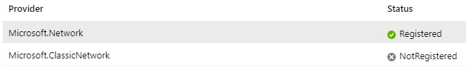

<!-- wp:paragraph -->

I am writing this post not to claim that I know everything there is to know about Azure Networking. Not even remotely. I am writing this partly for myself and hopefully to help others. Today I hit the following error while trying to write a PowerShell script to automate some Azure Networking related tasks (more on that soon!): 'Subscription [subscriptionID] is not registered with NRP'. In this short post I will explain how to fix this error.

<!-- /wp:paragraph -->

<!-- wp:paragraph -->

I searched online but could not find the solution anywhere. Then it hit me - NRP = Network(ing?) Resource Provider. The solution is straightforward:

<!-- /wp:paragraph -->

<!-- wp:list {"ordered":true} -->
<ol><li>Make a note of the subscriptionID from the error message.</li><li>In the Azure Portal go to Subscriptions and find the offending subscription.</li><li>Click on Resource Providers.</li><li>Search for 'Microsoft.Network'.</li><li>You will see that the status for that provider is 'NotRegistered'. Select 'Microsoft.Network' and click 'Register'. Wait for it to say 'Registered' (if you are as inpatient as I am you can click 'Refresh' to get the latest status).</li><li>Note that you do not need to register for 'Microsoft.ClassicNetwork'.</li></ol>
<!-- /wp:list -->

<!-- wp:image {"id":7655,"sizeSlug":"large"} -->
<figure class="wp-block-image size-large"></figure>
<!-- /wp:image -->

<!-- wp:paragraph -->

Done, now execute your script again and the error should disappear!

<!-- /wp:paragraph -->