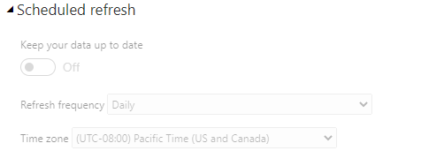

<!-- wp:paragraph -->

I do not claim that what is included in this post is the perfect way of doing things. However, some things related to <a href="https://azure.microsoft.com/en-us/services/sql-database/">Azure SQL</a> firewall settings for Power BI data refresh caught me by surprise recently so I figured I would just write it down...

<!-- /wp:paragraph -->

<!-- wp:heading -->
<h2>The scenario</h2>
<!-- /wp:heading -->

<!-- wp:paragraph -->

You have built a Power BI dashboard that takes data from Azure SQL and want to have this report automatically refreshed in the Power BI Service.

<!-- /wp:paragraph -->

<!-- wp:heading -->
<h2>Data refresh scenarios in Power BI</h2>
<!-- /wp:heading -->

<!-- wp:paragraph -->

There are two ways of refreshing data in Power BI: the classic Power BI refresh and the refresh using a Dataflow. I will discuss the options separately because they have separate impact on the firewall settings on your Azure SQL database. 

<!-- /wp:paragraph -->

<!-- wp:heading {"level":3} -->
<h3>'Classic' Power BI Refresh</h3>
<!-- /wp:heading -->

<!-- wp:paragraph -->

What I mean with 'classic' Power BI Refresh is the refresh that you can configure without using a Dataflow. You will find it on your dataset settings: 

<!-- /wp:paragraph -->

<!-- wp:image {"id":7659,"sizeSlug":"large"} -->
<figure class="wp-block-image size-large"></figure>
<!-- /wp:image -->

<!-- wp:paragraph -->

Now for this to work you will need to enter the credentials and allow Power BI to reach the Azure SQL database through the firewall. This is where the fun starts. If you have a new Azure SQL database you will not have touched the firewall at all or allowed your office IP through to be able to access it from Power BI Desktop and build a report.

<!-- /wp:paragraph -->

<!-- wp:paragraph -->

If you enter your credentials on the Dataset settings page in Power BI and try to refresh, you will get an error because Power BI is not allowed through the firewall. In order to allow this there are a couple of options:

<!-- /wp:paragraph -->

<!-- wp:list {"ordered":true} -->
<ol><li>Allow Azure services and resources access to the Azure SQL Server. You will find this button in the Azure Portal on the Azure SQL Server firewall configuration. Set it to 'Yes' and your refresh works. <a href="https://docs.microsoft.com/en-us/power-bi/service-admin-troubleshooting-scheduled-refresh-azure-sql-databases">This is what is recommended in the official documentation</a>. Sometimes, however, this is not an option since it opens the Azure SQL Database for more than just Power BI - it would allow any Azure Service to communicate to the database after authentication. For example, Azure Data Factory could now be used against this Azure SQL Database. This might be just what you want, or not, it depends on the security rules in your organization. It is the easiest and my preferred solution.</li></ol>
<!-- /wp:list -->

<!-- wp:image {"id":7661,"sizeSlug":"large"} -->
<figure class="wp-block-image size-large"></figure>
<!-- /wp:image -->

<!-- wp:list {"ordered":true} -->
<ol><li>Alternatively, you could use VNets and the Power BI Gateway (in a VM) to pull this off without opening up the firewall to all Azure Services, as it explained <a href="https://devblogs.microsoft.com/premier-developer/secure-access-to-azure-sql-servers-for-power-bi/">here </a>and <a href="https://azure.microsoft.com/en-us/blog/securing-the-connection-between-power-bi-and-azure-sql-database/">here</a>. This is more restrictive but has the downside of a more complex and less cost-effective solution since you have to set up a VNet and a Power BI Gateway in a VM.</li><li>Lastly you could figure out the IP addresses used by Power BI and allow those to go through the firewall. Downside is that those IP addresses can change without notice and you would have go in and manually make changes for the refresh to work. <a href="https://gist.github.com/nyanhp/ee2367de57c40c8d3ed3eb7dab6b1233">I would not recommend doing it, but if you want to try here is a script</a>.</li></ol>
<!-- /wp:list -->

<!-- wp:heading {"level":3} -->
<h3>Dataflows</h3>
<!-- /wp:heading -->

<!-- wp:paragraph -->

If you use Dataflows you can still use the options described above. However, there is a third and more hacky way of doing things: a script or Azure Automation Runbook.

<!-- /wp:paragraph -->

<!-- wp:paragraph -->

<a href="https://www.microsoft.com/en-us/download/details.aspx?id=56519">Azure publishes the IP address ranges used for some Azure Services here</a>. Unfortunately, Power BI 'classic' refresh uses IP ranges that are not documented here. Note that it is published per cloud - so if you are not in the public cloud you will need to download a different file. With this file you can do a manual update of the firewall (similar to #3 above) or try to do it automatically like I did below. If the IPs change you can use this file to retrieve the changes and make updates accordingly.

<!-- /wp:paragraph -->

<!-- wp:paragraph -->

For the automatic solution you could write a script or use <a href="https://azure.microsoft.com/en-us/services/automation/">Azure Automation</a>. I wrote a very hacky script which downloads the file mentioned above for public cloud, parses it and adds the rules for Data Flows to the Azure SQL firewall. Again, it is very hacky, but it works. You can either run this script manually, schedule it or plug this in Azure Automation to run it automatically. You can <a href="https://github.com/jeroenterheerdt/dutchdatadude/tree/master/AzureSQLFirewallSettingsForPowerBIRefresh">get the script here</a> or read it below. Remember to use this at your own risk. I am not responsible for you not being able to access your Azure SQL database anymore because of this script.

<!-- /wp:paragraph -->

<!-- wp:code -->
<pre class="wp-block-code"><code>#DutchDataDude.com
#Code is provided as is.
Install-Module Az.Network -Scope CurrentUser

#CONFIG
$resourcegroup = "&#91;ResourceGroupForAzureSQLDatabase]"
$server= "&#91;AzureSQLServerName]"
$subscriptionId = "&#91;SubscriptionID]"
$location = "&#91;LocationForResourceGroupAndAzureSQLServer]"

#this is the URL for public clouds, for other clouds use appropriate URL
$url = "https://download.microsoft.com/download/7/1/D/71D86715-5596-4529-9B13-DA13A5DE5B63/ServiceTags_Public_20200420.json"

#source: https://gallery.technet.microsoft.com/scriptcenter/Start-and-End-IP-addresses-bcccc3a9
function Get-IPrangeStartEnd 
{ 
    &lt;#  
      .SYNOPSIS   
        Get the IP addresses in a range  
      .EXAMPLE  
       Get-IPrangeStartEnd -start 192.168.8.2 -end 192.168.8.20  
      .EXAMPLE  
       Get-IPrangeStartEnd -ip 192.168.8.2 -mask 255.255.255.0  
      .EXAMPLE  
       Get-IPrangeStartEnd -ip 192.168.8.3 -cidr 24  
    #&gt;  
      
    param (  
      &#91;string]$start,  
      &#91;string]$end,  
      &#91;string]$ip,  
      &#91;string]$mask,  
      &#91;int]$cidr  
    )  
      
    function IP-toINT64 () {  
      param ($ip)  
      
      $octets = $ip.split(".")  
      return &#91;int64](&#91;int64]$octets&#91;0]*16777216 +&#91;int64]$octets&#91;1]*65536 +&#91;int64]$octets&#91;2]*256 +&#91;int64]$octets&#91;3])  
    }  
      
    function INT64-toIP() {  
      param (&#91;int64]$int)  
 
      return ((&#91;math]::truncate($int/16777216)).tostring()+"."+(&#91;math]::truncate(($int%16777216)/65536)).tostring()+"."+(&#91;math]::truncate(($int%65536)/256)).tostring()+"."+(&#91;math]::truncate($int%256)).tostring() ) 
    }  
      
    if ($ip) {$ipaddr = &#91;Net.IPAddress]::Parse($ip)}  
    if ($cidr) {$maskaddr = &#91;Net.IPAddress]::Parse((INT64-toIP -int (&#91;convert]::ToInt64(("1"*$cidr+"0"*(32-$cidr)),2)))) }  
    if ($mask) {$maskaddr = &#91;Net.IPAddress]::Parse($mask)}  
    if ($ip) {$networkaddr = new-object net.ipaddress ($maskaddr.address -band $ipaddr.address)}  
    if ($ip) {$broadcastaddr = new-object net.ipaddress ((&#91;system.net.ipaddress]::parse("255.255.255.255").address -bxor $maskaddr.address -bor $networkaddr.address))}  
      
    if ($ip) {  
      $startaddr = IP-toINT64 -ip $networkaddr.ipaddresstostring  
      $endaddr = IP-toINT64 -ip $broadcastaddr.ipaddresstostring  
    } else {  
      $startaddr = IP-toINT64 -ip $start  
      $endaddr = IP-toINT64 -ip $end  
    }  
      
     $temp=""|Select start,end 
     $temp.start=INT64-toIP -int $startaddr 
     $temp.end=INT64-toIP -int $endaddr 
     return $temp 
}

# Sign-in with Azure account credentials
Connect-AzAccount
$context = Set-AzContext -SubscriptionId $subscriptionId
$output = "$PSScriptRoot\servicetags.json"

#download the service tags and convert to Json
Invoke-WebRequest -Uri $url -OutFile $output

$j = Get-Content $output | ConvertFrom-Json

#remove all firewall rules for PowerQueryOnline
$existingrules = Get-AzSqlServerFirewallRule -ResourceGroupName $resourcegroup -ServerName $server
foreach ($rule in $existingrules) {
    if ($rule.FirewallRuleName -match "PowerQuery") {
        write-host "Removing rule " $rule.FirewallRuleName
        Remove-AzSqlServerFirewallRule -ResourceGroupName $resourcegroup -ServerName $server -FirewallRuleName $rule.FirewallRuleName -DefaultProfile $context
    }
}

$v = $j.values
foreach ($val in $v) {
    if ($val.name -match "PowerQuery") {
        $addresses = $val.properties.addressPrefixes;
        foreach($address in $addresses) {
            $split = $address.Split('/')
            $startend = Get-IPRangeStartEnd -ip $split&#91;0] -cidr $split&#91;1]
            $end = $startend.end
            $start = $startend.start
            $rulename = $val.name+":"+$start+"-"+$end

            #add rules
            write-Host "Adding " $rulename
            New-AzSqlServerFirewallRule -ResourceGroupName $resourcegroup -ServerName $server -FirewallRuleName $rulename -StartIpAddress $start -EndIpAddress $end -DefaultProfile $context
        }
    }
}

</code></pre>
<!-- /wp:code -->

<!-- wp:paragraph -->

I hope this helps. Let me know if I missed anything!

<!-- /wp:paragraph -->